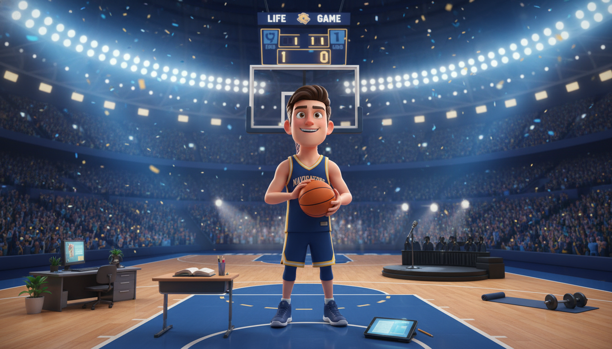

# Chapter 1: Life is a Sport

**[🏠 Back to Home](../README.md)** | **[📚 All Chapters](../README.md#-the-chapters)**

---

---

## The Whistle Just Blew

Picture this: You're standing at the free-throw line. Game tied. Three seconds left. The gym is silent except for your heartbeat pounding in your ears. Every practice session, every drill, every rep you've ever taken has led to this exact moment.

You take a breath. Block out the noise. Focus. Shoot.

Swish.

Now answer me this: When was the last time you brought that same energy to your math homework?

I'm serious. Think about it. You'll spend hours perfecting your jump shot, mastering a combo in your favorite game, or learning every lyric to a song you love. You'll practice, fail, practice again, and keep grinding until you get it right. You do this because the output matters to you. Because you want to win. Because you want to level up.

But then Monday morning hits, and you drag yourself to first period like you're walking through quicksand.

What if I told you that's because nobody ever taught you the truth?

**Your life is already a game. You're already playing. The whistle already blew.**

The only question is: Are you playing to win, or are you just showing up?

---

---

## The Game Nobody Told You About

Here's what nobody tells you when you're in middle school or high school: Life has rules. It has strategies. It has levels, stats, bosses, and ways to power up. Just like any sport. Just like any game you've ever played.

The difference? In basketball, the rules are clear. Make the shot, you get points. In video games, the quest markers tell you exactly where to go. But in life? The rules are hidden. Nobody hands you a playbook. Most people spend their entire lives never realizing they're even in the game.

But you? You're about to get the cheat codes.

Not the kind that make things easy – the kind that make things make sense.

Because here's the uncomfortable truth: **You're already playing whether you know it or not.** Every day you wake up, the scoreboard is running. Every choice you make is a play. Every hour you spend is a rep. The question isn't whether you're in the game – the question is whether you're going to play like you mean it.

### Why Sports Work (And Life Doesn't... Yet)

Think about why sports feel so much more engaging than, say, studying for a history test:

1. **Clear goals**: You know exactly what you're trying to accomplish. Score more points. Win the game.
2. **Immediate feedback**: You know right away if your shot went in or if you fumbled the ball.
3. **Visible progress**: Your stats improve. You level up. You can see yourself getting better.
4. **Challenge that matches your skill**: The game gets harder as you get better (we'll come back to this – it's huge).

Now think about school. Think about most of your daily life:

1. **Unclear goals**: "Do well in school" – what does that even mean?
2. **Delayed feedback**: You won't know if you learned the material until the test... next week.
3. **Invisible progress**: You can't see your "life stats" improving day by day.
4. **Challenge that ignores your skill**: Too easy and you're bored. Too hard and you're lost.

No wonder life feels harder than sports. **The game is poorly designed for players.**

But here's the secret: Once you understand the real rules, you can redesign the game to actually work for you.

---

---

## Rule #1: Output > Input (Results Beat Hours)

Let me ask you something: What matters more?

- Spending 3 hours on homework, or actually mastering the material?
- Showing up to practice, or getting better at your craft?
- Looking busy, or making real progress?

If you answered the second option every time, congratulations – you already understand the first rule of the game.

**Output matters more than input.**

Most people focus on inputs: "I studied for 2 hours." "I practiced for 30 minutes." "I went to the gym."

Winners focus on outputs: "I can now solve these problems without looking at my notes." "My free-throw percentage went from 60% to 75%." "I can run a mile 30 seconds faster than last month."

See the difference?

Inputs are tasks. Outputs are results.

Inputs make you feel productive. Outputs make you actually improve.

### The Reframe

This is the single most important shift you'll make in this entire book. Ready?

❌ **Task-Focused Thinking**: "I need to study for 2 hours tonight."

✅ **Output-Focused Thinking**: "I need to master this material so well that the test feels easy."

❌ **Task-Focused**: "Go to basketball practice."

✅ **Output-Focused**: "Get so good at my weak-hand layups that defenders can't predict which side I'll attack from."

❌ **Task-Focused**: "Do my homework."

✅ **Output-Focused**: "Understand this concept well enough to teach it to someone else."

The difference is everything. One mindset has you checking boxes. The other has you leveling up.

And here's the kicker: **The output-focused mindset is way more fun.** Because you're not just grinding through tasks anymore. You're playing the game. You're seeing your stats improve. You're actually winning.

---

---

## Rule #2: Discomfort = Growth (The Friction Principle)

Pop quiz: When do you learn the most?

a) When things are easy and comfortable
b) When things are hard and you're struggling

If you picked A, I've got bad news: you're lying to yourself.

If you picked B, you just unlocked one of life's most powerful secrets.

**The sooner you learn to be comfortable with being uncomfortable, the sooner you will win in life. When you are uncomfortable, that means you are learning.**

Think about it:

- The first time you tried to ride a bike, you fell. A lot. It was uncomfortable. But now? You don't even think about it.
- The first time you played your instrument, you sounded terrible. Your fingers hurt. But every awkward note was building muscle memory.
- The first day of school in a new place? Terrifying. But now some of those strangers are your best friends.

Every single skill you have – from walking to reading to playing your favorite game – came from pushing through discomfort.

Yet somewhere along the way, we started avoiding friction. We started thinking that if something feels hard, we must not be "good at it." We started quitting the moment things got uncomfortable.

**That's the biggest lie you've ever been told.**

### Learning Friction is Your Superpower

In sports and games, this concept is obvious. You don't level up by fighting enemies that are way too weak. You don't improve your vertical jump by practicing on a 6-foot hoop. You seek out challenges that push you just beyond your current ability.

That uncomfortable feeling? That's not a bug. **It's the feature.**

That friction – that struggle – is literally your brain rewiring itself. It's you getting stronger, smarter, faster, better. The hard way isn't the wrong way. **The hard way is the only way that creates real growth.**

Here's what the research shows (from sports psychology and neuroscience):

- Your brain physically changes when you learn new things – but only when you're pushing beyond what's comfortable
- The "sweet spot" for learning is when something is about 4% harder than your current skill level
- When you're in that zone – challenged but not overwhelmed – your brain releases dopamine, making the struggle feel good
- This is called "flow state," and athletes chase it because it's where peak performance happens

So the next time you're struggling with something and you think, "This is too hard, I'm not good at this":

**Stop. Reframe.**

"This is uncomfortable, which means I'm learning. This friction is making me better. This is exactly where I need to be."

### Why Failure Isn't Optional

Let me tell you something that might blow your mind:

**Failure is always, always on the path to success.**

Not sometimes. Not "if you're unlucky." Always.

Show me someone who's great at anything – sports, music, art, business, anything – and I'll show you someone who failed more times than most people even tried.

- Michael Jordan got cut from his high school basketball team.
- Simone Biles fell countless times before becoming the most decorated gymnast in history.
- Every single speedrunner you've ever watched failed thousands of runs before hitting their record time.
- MrBeast posted videos for years when barely anyone watched – now he's got 200+ million subscribers.

Failure isn't the opposite of success. **Failure is the admission price to success.**

The game isn't about avoiding failure. The game is about failing faster, learning quicker, and using every mistake as data to improve your strategy.

In sports, you understand this intuitively. You miss shots to learn your range. You lose games to figure out what doesn't work. You screw up plays to identify what needs more practice.

So why would life be any different?

The only difference between someone who's "successful" and someone who's "not there yet" is that the successful person failed more times and kept playing anyway.

---

---

## Rule #3: The Scoreboard is Internal (Preview)

Quick question: Who decides if you're winning?

Your parents? Your teachers? Your followers on social media? The college admissions board?

Wrong answer. Every time.

**You decide if you're winning.** Nobody else gets a vote.

We'll dive deeper into this in Chapter 3, but here's the preview: The scoreboard that actually matters is internal. It's based on your own values, your own goals, your own definition of success.

Because here's the thing: You can get straight A's and still feel like a failure if you're chasing someone else's definition of success. You can have a thousand followers and feel empty if you're living for external validation.

The game isn't about impressing other people. The game is about becoming the person you want to be.

And that's a game you can actually win.

---

---

## Rule #4: Compound Interest Applies to Everything

Here's a math lesson that actually matters:

If you improve by just 1% every single day for a year, you don't end up 365% better.

You end up **37 times better.**

That's not a typo. That's compound interest. And it doesn't just apply to money – it applies to everything.

Every rep you do, every concept you master, every small improvement you make builds on top of all the previous ones. Over time, those tiny gains stack into massive results.

This is why professional athletes don't just practice randomly. They track their stats obsessively. They measure every metric. They know that a 2% improvement in reaction time, compounded over a season, is the difference between good and elite.

We'll explore this more in Chapter 13, but for now, just understand: **Small, consistent actions compound into extraordinary results.**

The game isn't about massive, heroic efforts. The game is about showing up every day and getting 1% better.

---

---

## Know Your Position: The Stat Sheet Exercise

Alright, enough theory. Time for your first real play.

Athletes don't just show up and hope for the best. They know their stats. They know their strengths, their weaknesses, their tendencies. They study film. They analyze data.

You're about to do the same thing for your life.

Grab a piece of paper (or your phone, I'm not your parent). Answer these questions as honestly as you can:

### Your Current Stats

**1. What are you naturally good at?**

(Not what you think you *should* be good at – what actually comes easier for you than most people?)

Examples:

- Understanding how things work mechanically
- Remembering faces and names
- Making people laugh
- Noticing patterns in numbers or data
- Coming up with creative solutions
- Staying calm under pressure

**2. What feels hard right now?**

(This isn't bad news – this is your growth edge. This is where the game is challenging you.)

Examples:

- Staying focused when something doesn't immediately interest you
- Speaking up in groups
- Organizing your time
- Dealing with setbacks without giving up
- Asking for help when you need it

**3. What do you actually care about?**

(Not what you're "supposed" to care about – what genuinely fires you up?)

Examples:

- Building or creating things
- Competing and winning
- Helping people solve problems
- Understanding how things work
- Being recognized as the best at something
- Making people's lives better

**4. What does winning look like for YOU?**

(Not your parents' definition. Not society's definition. Yours.)

Examples:

- Having financial freedom to live how I want
- Being respected as an expert in my field
- Having time for hobbies and relationships that matter
- Making an impact that outlasts me
- Mastering a craft to the highest level possible

### Why This Matters

You can't improve what you don't measure. You can't win a game if you don't know the score.

This stat sheet is your baseline. Your starting point. The beginning of your playbook.

And here's the beautiful thing: **Knowing your current level doesn't mean you're stuck there.** It just means you know where to start.

A gamer who's level 5 doesn't feel bad about not being level 50 – they just focus on getting to level 6. Then 7. Then 8.

That's the game. That's how you win.

---

---

## Your First Play: The One-Week Challenge

Okay. You understand the game now. You know the rules. You've assessed your stats.

Now it's time to actually play.

Here's your challenge for this week:

**Pick ONE area of your life to treat like sports practice.**

Not three areas. Not "everything." One.

Maybe it's:

- A subject in school you want to actually master
- A physical skill you want to improve
- A creative project you keep putting off
- A relationship you want to invest in
- A habit you want to build

Now, here's the key: **Track your reps, not your hours.**

Don't say "I'll spend 30 minutes on this." Say "I'll complete 10 practice problems" or "I'll do 50 free throws" or "I'll write 500 words" or "I'll have 3 real conversations."

Output, not input.

At the end of the week, ask yourself:

- Did my stats improve?
- What felt uncomfortable? (That's where you grew.)
- What did I learn from failing?
- Am I better than I was seven days ago?

If the answer to that last question is yes, congratulations.

**You just won the game.**

---

---

## The Uncomfortable Truth (One More Time)

I'm going to leave you with the same truth I gave you at the start:

**The sooner you learn to be comfortable with being uncomfortable, the sooner you will win in life. When you are uncomfortable, that means you are learning.**

Every morning, the whistle blows. Game day. Every single day.

You're not just living anymore.

You're playing to win.

---

---

## Key Principle

**Life is a sport. The better you play, the more you win.**

You wouldn't show up to a basketball game without practicing. You wouldn't play a video game without learning the controls. So why would you show up to life without a game plan?

The game is already happening. The scoreboard is already running.

The only question is: Are you playing like you mean it?

---

---

## Next Play

Now that you know it's a game... do you know your stats?

**Next up: Chapter 2 – Know Your Stats**

You can't improve what you don't measure. Time to get scientific about your life.

---

---

## Action Items

✅ **This Week**: Complete your stat sheet. Pick ONE area to treat like sports practice. Track outputs, not inputs. Report back to yourself: Did you level up?

The game has begun.

Let's go.

---

[🏠 Back to Home](../README.md) | [📚 All Chapters](../README.md#-the-chapters) | [Next: Chapter 2 - Know Your Stats ➡️](chapter_02_know_your_stats.md)

