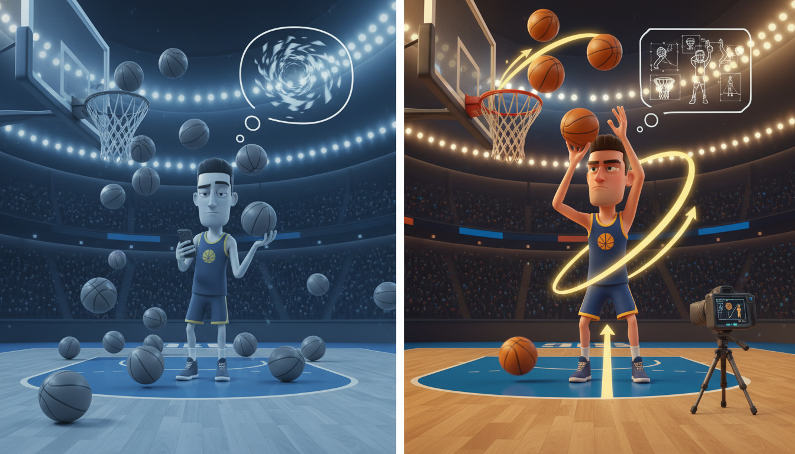

# Chapter 4: Practice Like a Pro

**[🏠 Back to Home](../README.md)** | **[📚 All Chapters](../README.md#-the-chapters)**

---

> [!NOTE]
> **💡 Key Insight**
> **Core Concept**: Hours don't make you better. The right kind of practice makes you better.
> **The Output**: Master any skill faster than you thought possible – not by practicing more, but by practicing deliberately.

---

---

## Two Players. Same Gym. Different Futures.

Picture this: Two basketball players walk into the same gym at the same time. Both stay for exactly one hour. Both shoot 100 free throws.

Player A scrolls through TikTok between shots. Doesn't really notice when the ball hits the rim left or right. Sometimes focuses, sometimes doesn't. An hour passes. 100 shots taken. Feels like practice.

Player B leaves their phone in the locker. Shoots 50 free throws instead of 100, but analyzes every single miss. Records video every 10 shots. Adjusts elbow position. Focuses entirely on form. Uncomfortable. Intense. Exhausting.

One month later, Player A's free throw percentage hasn't budged. Still 62%.

Player B? Up from 62% to 78%.

Same gym. Same amount of time. One of them got dramatically better.

The other one just repeated the same mistakes 3,000 times.

> [!NOTE]
> **💭 Key Insight**
> *The difference? It wasn't effort. It was method.*

Most people think practice is just repetition. Do something over and over, and you'll eventually get good at it.

That's not just wrong. It's the biggest lie standing between you and mastery.

Here's the truth nobody tells you: **You can practice something for 10,000 hours and barely improve. Or you can practice for 1,000 hours the right way and become elite.**

Welcome to deliberate practice – the cheat code to mastering anything faster.

---

---

## The 10,000 Hour Lie

You've heard it before. Maybe from a teacher. Maybe from a motivational poster. Definitely from someone who read a Malcolm Gladwell book and missed the point:

*"It takes 10,000 hours to become an expert at anything."*

Sounds inspiring, right? Put in your time, become a master.

Except it's not true.

Or rather, it's true the same way "eating food makes you healthy" is true. Technically accurate. Completely misleading.

### What the Research Actually Says

The 10,000-hour rule came from researcher Anders Ericsson's studies of elite performers. But here's what Gladwell left out:

> [!NOTE]
> **💭 Key Insight**
> *It's not 10,000 hours of ANY practice.*

> [!NOTE]
> **💭 Key Insight**
> *It's 10,000 hours of DELIBERATE practice.*

Huge difference.

Think about driving. Most adults have driven way more than 10,000 hours. Are they all expert drivers? Are they getting better every year?

Nope. Most people plateau after the first few months. They reach "good enough" and then coast. They've spent 20 years practicing driving, and they're not improving at all.

Or think about that kid in your class who's been playing guitar for 5 years but still sounds like they started last month. They practice. They play every day. But they're not getting better.

> [!NOTE]
> **💭 Key Insight**
> *Why? Because they're doing repetition, not practice.*

### Repetition vs. Deliberate Practice

Let's break this down because understanding this difference is worth more than a thousand hours of mindless grinding.

> [!NOTE]
> **💭 Key Insight**
> *Mindless Repetition:*

- Going through the motions on autopilot
- No specific focus on what needs to improve
- Comfortable, easy, familiar
- No immediate feedback on what's working or not
- Low friction, low growth

> [!NOTE]
> **💭 Key Insight**
> *Deliberate Practice:*

- Laser-focused on improving specific weakness
- Immediate feedback after every rep
- Pushes you just beyond your comfort zone
- Uncomfortable, mentally exhausting, effective
- High friction, high growth

Here's a real example:

> [!NOTE]
> **💭 Key Insight**
> *Mindless Guitar Practice:*

- Play songs you already know
- Feel good, sound decent
- Enjoy the feeling of playing
- Zero improvement

> [!NOTE]
> **💭 Key Insight**
> *Deliberate Guitar Practice:*

- Identify the exact chord transition you keep messing up
- Isolate just those two chords
- Practice that ONE transition 50 times
- Record yourself, listen back
- Adjust finger placement based on what you hear
- Uncomfortable, frustrating, and you'll improve more in 20 minutes than a week of mindless playing

See the difference?

One feels like practice. The other IS practice.

**Coach's Corner:**

> The uncomfortable truth: If practice feels comfortable and fun, you're probably not improving. Real practice should feel hard, awkward, and a little frustrating. That's your brain rewiring itself. That's growth happening in real time.

---

---

## First Principles: Breaking Skills Down to Basics

Before you can practice effectively, you need to understand what you're actually practicing.

This is where most people fail. They practice "getting better at math" or "improving at basketball." Way too vague. You can't improve something you haven't defined.

> [!NOTE]
> **🎯 Core Principle**
> Enter **first principles thinking** – breaking complex skills down to their fundamental building blocks.

### What is First Principles Thinking?

Instead of accepting "that's how it's done," you strip away assumptions and break things down to their fundamental components.

Here's how Elon Musk used it with SpaceX:

**Traditional thinking:** "Rockets are expensive because they've always been expensive."

> [!NOTE]
> **🎯 Core Principle**
> **First principles thinking:** "What are rockets actually made of? Aluminum, titanium, carbon fiber, copper... raw materials that cost way less than a finished rocket."

**Result:** Build rockets for a fraction of what everyone else charges. Revolutionize space travel.

You can apply the exact same thinking to learning anything.

### Applying First Principles to Practice

**Traditional approach:** "I need to get better at math."

Okay... how? What does that even mean? Where do you start?

> [!NOTE]
> **💭 Key Insight**
> *First principles approach:*

1. **Break it down:** What specific type of math? Algebra? Geometry? Calculus?
2. **Go deeper:** What specific skill within algebra? Factoring? Quadratic equations?
3. **Identify fundamentals:** What's the core concept I'm missing? Is it actually algebra, or is it the arithmetic that underlies it?
4. **Build from there:** Master the fundamentals before adding complexity.

Let's make this practical with an example everyone can visualize:

### Breaking Down a Free Throw (The Right Way)

**Don't practice:** "I'm going to shoot 100 free throws."

That's repetition. That's Player A from our opening story.

**Do practice:**

1. **Fundamental 1: Foot placement and balance**

   - 20 shots focusing ONLY on stance
   - Record video from the side
   - Analyze each shot: Did your weight stay balanced?

2. **Fundamental 2: Elbow positioning**

   - 20 shots focusing ONLY on keeping elbow in
   - Have someone watch or use video
   - Ignore whether the ball goes in – just focus on form

3. **Fundamental 3: Follow-through and wrist snap**

   - 20 shots focusing ONLY on completing the motion
   - Watch your hand – is it in the cookie jar?
   - Feel the ball roll off your fingers

4. **Fundamental 4: Mental routine and rhythm**

   - Develop a consistent pre-shot routine
   - Same number of dribbles, same breathing pattern
   - Build automaticity

5. **Integration: Put it all together**

   - Final 20 shots with everything combined
   - Now you're allowed to care about makes and misses
   - Track your percentage

Result: You just improved more from 80 focused shots than most people improve from 500 mindless ones.

### The Uncomfortable Reality

Breaking things down to fundamentals feels slow. It feels boring. It feels like you're going backward instead of forward.

> [!NOTE]
> **💭 Key Insight**
> *That's the friction. That's where the growth happens.*

---

Remember from Chapter 1: *"The sooner you learn to be comfortable with being uncomfortable, the sooner you will win in life."*

Deliberate practice is uncomfortable by design. You're working on what you suck at. You're failing repeatedly. You're isolating the exact skills that expose your weaknesses.

Most people avoid this. They keep shooting 100 free throws mindlessly because it feels productive and doesn't hurt their ego.

Elite performers do the opposite. They seek out the discomfort. They find their weakness and attack it relentlessly.

> [!NOTE]
> **💭 Key Insight**
> *That's the difference between good and unstoppable.*

---

---

## The Deliberate Practice Framework

Alright. You understand what deliberate practice is. You know why it works.

Now let's get specific. Here's the exact system elite performers use to improve faster than everyone else.

### Element 1: Specific Goals for Each Session

Vague practice produces vague results.

Elite practice requires laser-focused targets.

> [!WARNING]

> [!WARNING]
> <table>
> <tr>
> <th>❌ Avoid This</th>
> <th>✅ Do This Instead</th>
> </tr>
> <tr>
> <td>Bad:** "I'm going to practice piano for an hour."</td>
> <td>Good:** "I'm going to master the left-hand arpeggio in measures 12-16 of this piece until I can play it flawlessly at tempo 5 times in a row."</td>
> </tr>
> </table>

Now you have a target. Now you have a finish line. Now you know exactly what you're trying to accomplish.

**The key:** Your goal should be specific enough that someone else could verify whether you achieved it.

More examples:

- **Not:** "Study math"
- **Instead:** "Master factoring quadratic equations – complete 10 problems without looking at notes, getting 9/10 correct"

- **Not:** "Work on free throws"
- **Instead:** "Make 8 out of 10 free throws three times in a row"

- **Not:** "Get better at Spanish"
- **Instead:** "Hold a 3-minute conversation using only preterite tense verbs"

See how much more actionable those are?

### Element 2: Immediate Feedback

Here's a fact that will change how you practice everything:

> [!NOTE]
> **💭 Key Insight**
> *The faster you get feedback, the faster you improve.*

This is why video games are so addictive at teaching you – you die, you see exactly what killed you, you adjust, you try again. Instant feedback loop.

Most people practice with delayed feedback or no feedback at all. They study for hours and don't know if they learned anything until the test next week. They shoot free throws without tracking percentages. They write essays without getting feedback until days later.

That's like playing a video game where you don't find out if you died until next Tuesday.

> [!NOTE]
> **💭 Key Insight**
> *How to build immediate feedback into practice:*

> [!NOTE]
> **💭 Key Insight**
> *For Physical Skills:*

- Record yourself on video (your phone works fine)
- Use a mirror for form work
- Track stats immediately (makes vs. misses, time, reps)
- Get a coach, trainer, or friend to watch and give specific feedback
- Use technology (apps that track shooting percentage, running pace, etc.)

> [!NOTE]
> **💭 Key Insight**
> *For Mental Skills (studying, learning concepts):*

- Practice problems with answer key – check EACH problem before moving to the next
- Teach the concept to someone else (if you can't explain it, you don't know it)
- Use flashcards and self-testing (active recall)
- Write out the explanation, then compare to the source material
- Try to solve problems without notes, immediately check if you got it right

> [!NOTE]
> **💭 Key Insight**
> *For Creative Skills:*

- Set specific criteria before you create
- Compare your output to those criteria
- Get feedback from someone you trust who understands the craft
- Iterate based on specific feedback, not general encouragement

The pattern: **Find a way to know RIGHT AWAY if you did it right or wrong.**

### Element 3: Operating at the Edge of Your Ability

---

Remember how we talked about the 4% rule in Chapter 1?

> [!NOTE]
> **💭 Key Insight**
> *Flow state – that feeling of being in the zone – happens when challenge exceeds your skill by about 4%.*

Not 50% harder (you'll panic and shut down).

Not 4% easier (you'll get bored and zone out).

Right at the edge. Just uncomfortable enough to force growth. Just achievable enough to stay engaged.

This is the Goldilocks zone of practice.

**Too Easy:**
- You can do it on autopilot
- Feels comfortable, maybe even fun
- Zero growth happening

**Too Hard:**
- Way beyond current ability
- Feels overwhelming, leads to shutdown
- Zero growth happening (just frustration)

> [!NOTE]
> **💭 Key Insight**
> *Just Right (The Growth Zone):*

- You can do it, but just barely
- Requires full concentration
- Uncomfortable but achievable
- Maximum growth happening

> [!NOTE]
> **💭 Key Insight**
> *Here's what this looks like in practice:*

If you're shooting 60% from the free-throw line, don't practice trick shots or NBA three-pointers (too hard). Don't practice layups from under the basket (too easy).

Practice free throws with added pressure: "I have to make 8 out of 10 before I can leave." That's right at your edge.

If you're learning algebra and you've mastered basic equations, don't jump to calculus (too hard). Don't keep drilling the basics you already know (too easy).

Move to equations with variables on both sides. That's your 4% challenge.

> [!NOTE]
> **💭 Key Insight**
> *The rule: If you're not failing at least 20-30% of the time in practice, you're not practicing hard enough.*

### Element 4: Massive Repetition on Weak Points

This is where deliberate practice gets really uncomfortable.

Here's what most people do: They practice what they're already good at. It feels good to succeed. It's fun to do things you're already decent at.

Here's what elite performers do: **They identify their weakest link and attack it relentlessly.**

Real example from basketball:

- Player shoots 70% from the right side
- Player shoots 40% from the left side

**What most people practice:** Balanced shots from both sides. Feels fair. Feels like "complete" practice.

**What elite performers practice:** Almost exclusively left-side shots until that percentage matches the right side.

Why? Because the left side is the weakness. That's the leak in the boat. That's what's holding them back from the next level.

> [!NOTE]
> **💭 Key Insight**
> *This is deeply uncomfortable.*

Working on your weakness means failing a lot. It means exposing the thing you're worst at. It means looking bad, even in practice.

> [!NOTE]
> **🎯 Core Principle**
> But here's the truth: **Your ceiling is determined by your weakest skill, not your strongest.**

You could be the best dribbler on your team, but if you can't shoot from the left, defenders will force you left every time and shut you down.

You could be great at algebra but terrible at geometry, and your math grade is capped by your worst skill.

> [!NOTE]
> **💭 Key Insight**
> *The deliberate practice approach:*

1. Identify your actual weakness (be honest – this is just data)
2. Isolate it (work on JUST that skill, not mixed with everything else)
3. Drill it relentlessly (massive repetition with immediate feedback)
4. Don't move on until it's no longer your biggest weakness
5. Find the next weak link and repeat

This is how you go from good to elite.

**Coach's Corner:**

> Most people avoid their weaknesses their entire lives. That's why most people never reach their potential. Elite performers hunt for weaknesses like they're treasure – because they are. Every weakness you identify is a clear path to improvement. Every weakness you fix makes you unstoppable in a new way.

### Element 5: Intense Focus (No Multitasking)

Last element. This one's simple but non-negotiable.

> [!NOTE]
> **💭 Key Insight**
> *Real practice requires your full brain.*

Not your brain while scrolling Instagram between reps.

Not your brain while watching Netflix in the background.

Not your brain while texting your friend.

Your. Full. Brain.

Research is crystal clear on this: **Multitasking is a myth.** Your brain doesn't actually do two things at once. It switches rapidly between tasks, and every switch costs mental energy and reduces quality.

When you practice with divided attention, you're getting a fraction of the benefit.

**The data:**

- 30 minutes of intense, focused deliberate practice beats 3 hours of distracted repetition
- Flow state (peak performance) requires complete focus – it literally can't happen if you're multitasking
- Learning and skill development require focused attention to wire neural pathways effectively

> [!NOTE]
> **💭 Key Insight**
> *How to practice with full focus:*

- Phone in another room (not silent, not face-down – actually gone)
- Notifications off on everything
- Close all tabs except what you need
- Set a specific time block (even 20 minutes of focused practice is valuable)
- Tell people you're unavailable for this block
- Music maybe (depends on the task – instrumental works better than lyrics for complex learning)

> [!NOTE]
> **💭 Key Insight**
> *The mental contract:*

When you start a practice session, you're making a deal with yourself: "For the next X minutes, this is the only thing that exists."

If you can't commit to that level of focus, don't bother practicing. You'll just be wasting time feeling busy.

Real practice is hard. Real practice is mentally exhausting.

> [!NOTE]
> **💭 Key Insight**
> *That's why it works.*

---

---

## The Practice Session Template

Alright. You've got the five elements. Now let's put them together into a system you can use today.

Here's the exact template elite performers use for every practice session:

### Before Practice

> [!NOTE]
> **💭 Key Insight**
> *1. What SPECIFIC skill am I improving today?*

Not "basketball." Not "math." Not "guitar."

- The exact skill: "Left-hand crossover dribble at full speed"
- Or: "Solving systems of equations using substitution method"
- Or: "Clean chord transitions between G and C"

> [!NOTE]
> **💭 Key Insight**
> *2. How will I know if I'm improving?*

Define your feedback mechanism:

- Video recording every 10 reps to check form
- Tracking percentage of successful attempts
- Solving problems and checking answer key immediately
- Having someone listen and give specific feedback

> [!NOTE]
> **💭 Key Insight**
> *3. What's my target for success?*

Be specific and measurable:

- "Make 15 out of 20 free throws"
- "Solve 8 out of 10 problems correctly without notes"
- "Complete 5 clean transitions in a row without buzz"

Write these down. Seriously. Don't just think about them.

### During Practice

> [!NOTE]
> **💭 Key Insight**
> *1. Focus solely on your target skill*

Not on everything. Just the one thing you defined.

> [!NOTE]
> **💭 Key Insight**
> *2. Get feedback after EACH rep*

Not at the end. After each attempt.

- Did that shot go in?
- Did I get that problem right?
- Did that transition sound clean?

> [!NOTE]
> **💭 Key Insight**
> *3. Adjust based on feedback*

This is the key. Feedback is useless if you don't use it.

- Shot went left? Adjust elbow position.
- Got the problem wrong? Identify exactly where the logic broke down.
- Transition was sloppy? Slow it down, focus on finger placement.

> [!NOTE]
> **💭 Key Insight**
> *4. Repeat until success criteria is met*

Don't just do your reps and leave. Practice until you hit your target.

If your goal was 8/10 and you got 6/10, you're not done.

If you only have 20 minutes and you don't hit your target, that's fine – but now you know exactly what to work on next time.

### After Practice

> [!NOTE]
> **💭 Key Insight**
> *1. Did I hit my target?*

Yes or no. Simple.

> [!NOTE]
> **💭 Key Insight**
> *2. What specific thing improved?*

Not "I got better." What exactly improved?

- "My elbow stayed in 80% of shots instead of 50%"
- "I solved 7/10 instead of 5/10"
- "Transitions were clean at 80 BPM, up from 60 BPM"

> [!NOTE]
> **💭 Key Insight**
> *3. What's still my weakest link?*

Based on today's practice, what's still holding you back?

> [!NOTE]
> **💭 Key Insight**
> *4. What will I target next session?*

Lock it in. Write it down. Next time you practice, you know exactly where to start.

> [!TIP]
> **Example Practice Session: Math**
>

**Before:**
- Skill: Factoring quadratic equations with leading coefficient ≠ 1
- Feedback: Answer key, check each problem immediately
- Target: 8 out of 10 problems correct in under 20 minutes

**During:**
- Do problem 1, check immediately
- Got it wrong – identify where mistake happened
- Redo that step, check again
- Move to problem 2 only after getting problem 1 right
- Full focus, no phone, 25-minute block
- Track time and accuracy

**After:**
- Result: 7/10 correct in 22 minutes
- Improvement: Got 3 more right than last time, but still slow
- Weak link: Factoring when coefficient is negative
- Next target: Practice 10 problems with negative leading coefficient specifically

See how much more effective that is than "study math for an hour"?

> [!NOTE]
> **💭 Key Insight**
> *This is the difference between training and just showing up.*

---

---

## The Failure Factory: Why Practice Should Feel Terrible

Let's talk about something nobody wants to admit:

> [!NOTE]
> **💭 Key Insight**
> *Deliberate practice feels bad.*

Like, genuinely uncomfortable. Sometimes frustrating. Often discouraging.

And that's exactly how it's supposed to feel.

### Why Deliberate Practice Feels Terrible

Think about what you're actually doing:

- You're constantly working on what you suck at (not fun)
- You're failing way more than you're succeeding (ego hit)
- You're pushing at the edge of your ability (mentally exhausting)
- You can't coast or zone out (requires constant attention)
- You're exposing your weaknesses on purpose (uncomfortable)

Compare that to mindless practice:

- Work on what you're already decent at (feels good)
- Success more often than failure (ego boost)
- Comfortable, familiar, easy (low mental demand)
- Can zone out or multitask (feels relaxing)
- Hide from weaknesses (comfortable)

One feels better in the moment. The other makes you better.

> [!NOTE]
> **💭 Key Insight**
> *You have to choose.*

### The Three Zones

Here's a model that makes this crystal clear:

**Comfort Zone:**
- Things you can already do easily
- Feels good, low stress
- Zero growth happening

> [!NOTE]
> **💭 Key Insight**
> *Growth Zone (The Edge):*

- Things just beyond your current ability
- Feels uncomfortable, high effort
- Maximum growth happening

**Panic Zone:**
- Things way too hard for your current level
- Feels overwhelming, leads to shutdown
- Zero growth happening (just frustration)

> [!NOTE]
> **💭 Key Insight**
> *Deliberate practice lives in the growth zone.*

And the growth zone is, by definition, uncomfortable.

### Reframing Failure in Practice

Here's the shift that separates elite performers from everyone else:

> [!WARNING]

> [!WARNING]
> <table>
> <tr>
> <th>❌ Avoid This</th>
> <th>✅ Do This Instead</th>
> </tr>
> <tr>
> <td>Fixed mindset:** "I messed up again. I suck at this. Maybe I'm just not talented."</td>
> <td>Growth mindset:** "I messed up again. That's data showing me exactly what to adjust. One more rep closer to mastery."</td>
> </tr>
> </table>

Every failure in practice is:

- **Information** about what doesn't work
- **Opportunity** to make a specific adjustment
- **Progress** toward mastering the skill

Think about learning to ride a bike. You fell. A lot. Every fall gave you information about balance, momentum, steering.

You didn't think "I fell again, I'm not a bike person."

You thought "Okay, lean less next time" or "Turn the handlebars earlier."

> [!NOTE]
> **💭 Key Insight**
> *Same thing here. Just apply it to everything.*

### Practice vs. Performance: Know the Difference

This is huge. Listen up.

**Practice:** Where you fail and learn
**Performance:** Where you execute what you've learned

Most people treat every moment like performance. They avoid failure at all costs. They never take risks. They play it safe.

**What elite performers do:** Fail aggressively in practice so they can dominate in performance.

- Athletes deliberately attempt shots they're not good at in practice
- Musicians purposely play pieces too fast and mess up to find their limits
- Students do the hardest practice problems first to expose what they don't know

Then when it's game time, test time, performance time – they execute what they've already mastered through hundreds of failures in practice.

> [!NOTE]
> **🎯 Core Principle**
> **The rule:** Practice is where you seek out failure. Performance is where you avoid it.

If you're not failing regularly in practice, you're not practicing hard enough.

**Coach's Corner:**

> The best athletes I've ever coached hunt for mistakes in practice. They'll literally try new things just to see what fails. Why? Because it's better to find your ceiling in practice than in the championship game. Better to expose your weakness Tuesday afternoon than Friday night under the lights.

---

---

## The Feedback Loop: Faster Input, Faster Growth

Let's get nerdy for a second about why feedback timing matters so much.

> [!NOTE]
> **💭 Key Insight**
> *The Feedback Speed Hierarchy (Ranked by Effectiveness):*

### Immediate > Delayed

> [!NOTE]
> **💭 Key Insight**
> *Immediate feedback:*

- Video games tell you instantly if you died
- Basketball tells you immediately if the shot went in
- You learn fast because you can connect action to result

> [!NOTE]
> **💭 Key Insight**
> *Delayed feedback:*

- Study for hours, find out how you did on the test next week
- Practice skills, wait for the game to see if they work
- You learn slow because action and result are disconnected

**The fix:** Create immediate feedback loops even for delayed systems.

- Don't wait for the test – do practice problems with answer keys now
- Don't wait for the game – track your stats in practice
- Don't wait for the grade – self-test throughout studying

### Specific > General

> [!NOTE]
> **💭 Key Insight**
> *Specific feedback:*

- "Your left elbow drops 2 inches on your release"
- "You're solving for x correctly but making arithmetic errors in step 3"
- "Your finger is landing between frets, not on them"

> [!NOTE]
> **💭 Key Insight**
> *General feedback:*

- "Your form looks off"
- "You need to study harder"
- "Keep practicing"

Specific feedback tells you exactly what to fix. General feedback is useless.

**The fix:** Always ask "what specifically needs to improve?"

### Objective > Subjective

> [!NOTE]
> **💭 Key Insight**
> *Objective feedback:*

- Made 7 out of 10 free throws (measurable)
- Solved 8 out of 10 problems correctly (verifiable)
- Ran a mile in 7:32 (data-driven)

> [!NOTE]
> **💭 Key Insight**
> *Subjective feedback:*

- "You seemed to shoot pretty well today"
- "I think you're getting better"
- "That felt good"

Objective feedback gives you data. Subjective feedback gives you feelings.

**The fix:** Track numbers, not impressions.

### Creating Your Own Feedback Systems

You don't need a coach or expensive equipment. You need to be strategic.

> [!NOTE]
> **💭 Key Insight**
> *For Physical Skills:*

- **Phone camera:** Record yourself, watch immediately
- **Mirror:** Practice in front of it for real-time visual feedback
- **Stats tracking:** Simple tally marks (makes vs. misses, time, reps completed)
- **Friend feedback:** Give them one specific thing to watch for
- **Apps:** Tons of free apps for running pace, shooting percentage, workout tracking

> [!NOTE]
> **💭 Key Insight**
> *For Mental Skills (Studying/Learning):*

- **Answer keys:** Check each problem immediately before moving on
- **Teach it:** If you can explain it clearly to someone else, you know it
- **Flashcards:** Active recall with immediate verification
- **Practice tests:** Simulate the real thing, check answers right away
- **The Feynman Technique:** Explain concept in simple terms, find gaps in your understanding

> [!NOTE]
> **💭 Key Insight**
> *For Creative Skills:*

- **Criteria-based:** Define what "good" looks like before creating, then evaluate against those criteria
- **Peer feedback:** Find someone who actually knows the craft (not just encouragement)
- **Iteration:** Create, get specific feedback, adjust, create again
- **Compare:** Put your work next to expert work – where's the gap?

**The pattern:** Find ANY way to know if you're doing it right, and find out as fast as possible.

### The Uncomfortable Truth About Feedback

Real feedback tells you what you're doing wrong.

That's the entire point.

If all your feedback is positive, you're not pushing hard enough. You're not finding your limits. You're not identifying weaknesses.

> [!NOTE]
> **💭 Key Insight**
> *Positive feedback feels good. Negative feedback makes you better.*

Choose accordingly.

---

---

## Building Your Practice System: The 30-Day Skill Sprint

Enough theory. Time to put this into action.

Here's a framework you can use starting this week to dramatically improve at anything.

### The 30-Day Skill Sprint

> [!NOTE]
> **💭 Key Insight**
> *Pick ONE skill to improve dramatically in 30 days.*

Not three skills. Not "everything." One.

Examples:

- Free-throw shooting percentage
- Solving quadratic equations
- Conversational fluency in Spanish
- Left-hand dribbling at full speed
- Chess opening theory
- Clean chord transitions on guitar

**The commitment:**

- 30-45 minutes per day, 6 days per week (rest day matters)
- Deliberate practice only – full focus, no distractions
- Track specific metrics every session
- Adjust based on feedback daily

**The structure:**

### Week 1: Baseline Assessment + Identify Weak Link

> [!NOTE]
> **💭 Key Insight**
> *Day 1-2: Assess current level*

- Test yourself objectively
- Record your baseline numbers
- Identify specific weaknesses

Example (Free Throws):

- Shoot 50 free throws, track makes/misses
- Record video from multiple angles
- Baseline: 62% (31/50)
- Weak link: Inconsistent elbow position

> [!NOTE]
> **💭 Key Insight**
> *Day 3-7: Attack the weakest fundamental*

- Isolate that one skill
- Massive focused repetition with immediate feedback
- Track improvement daily

Example:

- 40 shots per day focusing ONLY on elbow position
- Don't care about makes/misses, only care about form
- Video every 10 shots to check elbow placement
- By day 7: Elbow position consistent 85% of shots (vs. 50% day 1)

### Week 2: Drill Fundamental #2

> [!NOTE]
> **💭 Key Insight**
> *Day 8-14: Second biggest weakness*

- You've fixed the first leak in the boat
- Now find and fix the second one

Example (Free Throws):

- New weak link: Follow-through inconsistent
- 40 shots per day focusing ONLY on wrist snap and follow-through
- Film from side angle, watch hand position
- By day 14: Consistent follow-through 90% of shots

### Week 3: Drill Fundamental #3

> [!NOTE]
> **💭 Key Insight**
> *Day 15-21: Third component*

- Continue the pattern
- Each week, you're fixing one specific weakness

Example (Free Throws):

- New focus: Pre-shot routine and rhythm
- Develop consistent routine: 3 dribbles, deep breath, focus on front rim
- Practice the routine without caring about makes/misses
- Build automaticity
- By day 21: Routine is automatic

### Week 4: Integration + Reassessment

> [!NOTE]
> **💭 Key Insight**
> *Day 22-28: Put it all together*

- Now practice the skill as a whole
- All fundamentals integrated
- Track performance metrics again

Example (Free Throws):

- Shoot 50 free throws with everything combined
- Full routine, perfect elbow, clean follow-through
- Track percentage
- Result: 78% (39/50) – up from 62% baseline

> [!NOTE]
> **💭 Key Insight**
> *Day 29-30: Test and reflect*

- Final assessment
- Compare to baseline
- Document specific improvements
- Identify next weak link for month 2

### The Rules of the Sprint

> [!NOTE]
> **💭 Key Insight**
> *1. Non-negotiable commitment*

30-45 minutes, 6 days per week. Block the time on your calendar like it's a job.

> [!NOTE]
> **💭 Key Insight**
> *2. Deliberate practice only*

If you can't give full focus, skip the session. Don't just go through the motions.

> [!NOTE]
> **💭 Key Insight**
> *3. Track everything*

Keep a simple practice log:

- Date
- What you worked on
- Metrics/numbers
- What improved
- What's still weak

> [!NOTE]
> **💭 Key Insight**
> *4. Adjust based on data*

If something isn't working after 3-4 sessions, change your approach. Be scientific.

> [!NOTE]
> **💭 Key Insight**
> *5. Rest day is mandatory*

Your brain consolidates learning during rest. Don't skip the off day.

### What to Expect

**Week 1:** Feels awkward, improvements are small, motivation is high

**Week 2:** Starting to see real progress, friction decreases, skill feels more natural

**Week 3:** Noticeable improvement, confidence builds, starting to internalize the skill

**Week 4:** Integration happens, skill becomes more automatic, dramatic improvement visible

**After 30 days:** You'll be shocked at how much you've improved – and you'll understand that most people never reach their potential because they never practice deliberately.

---

---

## From Practice to Performance

The goal of practice isn't to practice forever.

The goal is to perform when it matters.

So let's talk about the difference between practice mode and performance mode.

### Practice Mindset vs. Performance Mindset

> [!NOTE]
> **💭 Key Insight**
> *Practice Mindset:*

- Seek out failures and mistakes
- Focus on improvement, not outcome
- Slow down and analyze everything
- Experiment with new approaches
- High friction = high learning
- Question everything, adjust constantly

> [!NOTE]
> **💭 Key Insight**
> *Performance Mindset:*

- Execute what you've practiced
- Focus on outcome, not analysis
- Trust your training, let it flow
- Go with what works, no experiments
- Low friction = optimal execution
- Trust the process, don't overthink

Both are essential. But you have to know when to use which one.

### When to Switch Modes

> [!NOTE]
> **💭 Key Insight**
> *Practice Mode (90% of your time):*

- Training sessions
- Study time
- Skill development
- Homework and learning
- Low-stakes situations
- Scrimmages and rehearsals

> [!NOTE]
> **💭 Key Insight**
> *Performance Mode (10% of your time):*

- The actual game
- The test
- The presentation
- The audition
- The competition
- When stakes are high and execution matters

**The biggest mistake people make:** Being in performance mode 100% of the time.

They never practice deliberately. They never seek out failure. They never expose weaknesses.

Then when game time comes, they have nothing to execute.

**Second biggest mistake:** Being in practice mode during performance.

They overthink during the test. They analyze during the game. They can't turn off the analytical brain and just flow.

**The goal:** Practice like crazy. Fail aggressively. Build the skills.

Then when it's time to perform, trust your training and execute.

---

---

## The Compound Effect of Deliberate Practice

---

Remember the 1% improvement principle from Chapter 1?

> [!NOTE]
> **💭 Key Insight**
> *If you improve 1% every day for a year, you're 37 times better by year's end.*

That's compound interest. And deliberate practice is how you actually get those 1% gains.

Most people don't improve 1% daily because they're not practicing deliberately. They're just repeating what they already know. Staying in the comfort zone. Going through the motions.

Small, focused improvements every single day.

Over weeks: Noticeable difference.

Over months: Dramatic transformation.

Over years: You become unrecognizable compared to who you were.

> [!NOTE]
> **💭 Key Insight**
> *That's the power of deliberate practice.*

Not massive heroic efforts. Not "grind culture" working 80-hour weeks.

Just focused, intelligent practice. Every single day. Attacking weaknesses. Getting 1% better.

Compound interest does the rest.

---

---

## Your First Deliberate Practice Session

Alright. You've got the blueprint. You understand the system.

Now it's time to actually do it.

> [!NOTE]
> **💭 Key Insight**
> *This week's challenge:*

> [!NOTE]
> **💭 Key Insight**
> *1. Pick ONE skill you want to dramatically improve*

Be specific. Not "basketball" – pick "left-hand layups" or "free-throw percentage."

> [!NOTE]
> **💭 Key Insight**
> *2. Do ONE 30-minute deliberate practice session using the template*

Before:

- Define specific skill to improve
- Set up feedback mechanism
- Create measurable success target

During:

- Full focus (phone gone, notifications off)
- Get feedback after each rep
- Adjust based on feedback
- Work at edge of ability

After:

- Did you hit your target?
- What specifically improved?
- What's still your weak link?
- What will you target next time?

> [!NOTE]
> **💭 Key Insight**
> *3. Track your numbers*

Write them down. This isn't optional.

> [!NOTE]
> **💭 Key Insight**
> *4. Compare to your normal practice*

How different did that feel? How much more did you improve?

---

---

## The Truth About Practice

Most people never reach their potential.

Not because they don't practice. Because they practice wrong.

They put in hours. They go through the motions. They repeat the same mistakes over and over, getting marginally better or not improving at all.

Then they wonder why they plateau.

You now know what they don't:

> [!NOTE]
> **💭 Key Insight**
> *Hours don't matter. Method matters.*

> [!NOTE]
> **💭 Key Insight**
> *Repetition doesn't make you better. Deliberate practice makes you better.*

> [!NOTE]
> **💭 Key Insight**
> *Time spent doesn't equal improvement. Focused effort on weaknesses equals improvement.*

You have the cheat code now.

The question is: Will you use it?

Will you seek out the discomfort of deliberate practice?

Will you attack your weaknesses instead of avoiding them?

Will you track your progress and adjust based on data?

Or will you keep doing what everyone else does – going through the motions, staying comfortable, wondering why you're not improving faster?

> [!NOTE]
> **💭 Key Insight**
> *The game is already happening. The scoreboard is already running.*

Practice like a pro. Improve like you mean it.

---

---

## Post-Game Review

---

> [!TIP]
> ### Key Takeaways

1. **The 10,000-hour rule is misleading:** It's not about time, it's about the quality of practice. Deliberate practice beats mindless repetition every single time.

> [!NOTE]
> **🎯 Core Principle**
> 2. **First principles thinking breaks skills down:** Don't practice vague goals. Break skills into fundamental components and master each one systematically.

3. **The 5 elements of deliberate practice are non-negotiable:** Specific goals, immediate feedback, edge of ability, massive repetition on weak points, intense focus.

4. **Practice should feel uncomfortable:** If it feels easy and fun, you're probably not improving. Real growth happens in the friction.

5. **Track everything:** You can't improve what you don't measure. Objective data beats subjective feelings.

### Reflection Questions

1. What skill have you been practicing for years without really improving? What would deliberate practice look like for that skill?

2. When you practice, are you working on your strengths (comfortable) or your weaknesses (uncomfortable)? Be honest.

3. What's your actual weak link right now – the one skill that, if mastered, would unlock the next level for you?

4. How do you get feedback currently? Is it immediate or delayed? Specific or general? How could you improve your feedback loop?

5. What would a 30-day skill sprint look like for you? What skill would you choose?

### The Output Mindset

---

Remember: Don't think about "practicing more."

Think about **mastering skills faster than you thought possible.**

Focus on who you're becoming, not just what you're doing.

Every deliberate practice session is a vote for the elite performer you're building yourself into.

---

### Next Level

You know how to practice now. You've got the framework for improvement.

But here's the question: What's going on in your head while you do it?

How do you talk to yourself when you fail? How do you stay focused when it gets hard? How do you maintain confidence when you're deliberately working on what you suck at?

> [!NOTE]
> **💭 Key Insight**
> *Next up: Chapter 5 – Your Inner Coach*

The mental game is everything. Let's master it.

---

**Action Item:**

This week, complete ONE 30-minute deliberate practice session using the framework from this chapter. Pick one skill. Define specific goals. Get immediate feedback. Work at the edge of your ability. Track your metrics.

Then report back to yourself: How much more effective was that than your normal practice?

The game has begun. Time to practice like a pro.

Let's go.

---

[⬅️ Previous: Chapter 3 - The Scoreboard That Matters](chapter_03_the_scoreboard_that_matters.md) | [📚 All Chapters](../README.md#-the-chapters) | [Next: Chapter 5 - Your Inner Coach ➡️](chapter_05_your_inner_coach.md)

