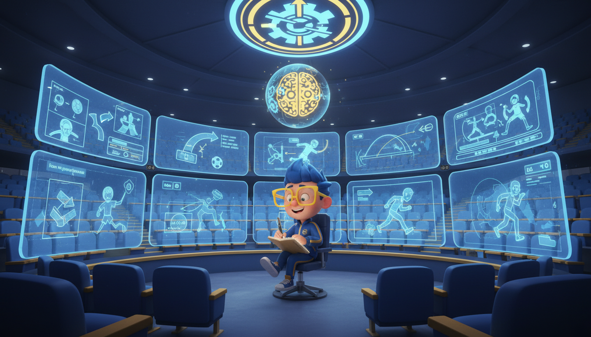

# Chapter 6: Losing is Learning

**[🏠 Back to Home](../README.md)** | **[📚 All Chapters](../README.md#-the-chapters)**

---

> [!NOTE]
> **💡 Key Insight**
> **Core Concept**: Failure isn't the opposite of success – it's the admission price. Every loss is a lesson if you're willing to learn from it.
> **The Output**: Transform every setback into a strategic advantage by extracting the lesson and bouncing back faster than your competition.

---

---

## Championship Game. Final Seconds. One Shot.

The ball leaves your hands. Perfect rotation. Clean release. Good arc.

It hits the rim. Bounces left. Falls away.

Buzzer sounds.

You lost.

Same gym. Same loss. Same scoreboard showing you came up short.

Here's where two completely different futures start:

**Player A's reaction**: "I'm a failure. I choked. I let everyone down. I can't handle pressure. Maybe I'm just not good enough."

**Player B's reaction**: "Okay. I now know exactly what I need to practice. My release was rushed. I got into my head. Next time I'm in this situation, I'll be ready."

Same loss. Same disappointment. Same three seconds where everything mattered.

But one person just learned nothing. The other person just got better.

One will avoid that situation in the future. The other will seek it out to prove their improvement.

**The scoreboard said they both lost.**

**The real scoreboard says Player B just won.**

Here's what nobody tells you about losing: it's only a loss if you don't learn from it. Otherwise, it's expensive data. And data is exactly what winners use to get better.

---

---

## The Scoreboard Lied to You

Let's talk about the biggest lie society's been telling you since kindergarten:

Winning = good. Losing = bad.

Pass = success. Fail = failure.

Got it right = you're smart. Got it wrong = you're not.

This is the stupidest, most destructive, most growth-killing mindset possible. And yet it's everywhere.

**In school**: F = bad person. A = good person. As if your identity is determined by whether you memorized the right facts for a test.

**In sports**: Win = success. Loss = failure. As if the outcome of one game defines your worth as an athlete.

**In life**: Mess up = embarrassment. Succeed = validation. As if every mistake is a permanent mark against you.

Here's what this mindset creates: people who are terrified of trying anything they might fail at. People who play it safe. People who never take the shot because missing would be too painful.

In other words, it creates losers.

Not because they lose. But because they refuse to learn.

### What Winners See That Losers Don't

Elite performers look at the same losses you do. They see something completely different.

**External Scoreboard** (what losers see):
- You won or you lost
- You succeeded or you failed
- You're ahead or you're behind
- Your record defines you

**Internal Scoreboard** (what winners see):
- What specifically went wrong?
- What was within my control?
- What would I do differently next time?
- Am I better than I was before this experience?
- What skill do I need to develop?

See the difference? One is a judgment. The other is information.

**Coach's Corner:**

> The external scoreboard tells you WHAT happened. The internal scoreboard tells you HOW to improve. Losers obsess over what happened. Winners focus on how to get better.

### The Jeff Bezos Perspective

Let's talk about someone who's failed more than almost anyone on the planet: Jeff Bezos.

Amazon failures most people have never heard of:

- Fire Phone (billions of dollars, massive embarrassment)
- Amazon Auctions (failed eBay clone)
- Amazon Destinations (travel site that went nowhere)
- Endless.com (shoe site that didn't last)
- Dozens of other products and services that crashed and burned

Bezos himself said: **"I've made billions of dollars of failures at Amazon.com."**

But here's the thing: he's still worth over $100 billion. Amazon is one of the most successful companies in history. So what gives?

Bezos has what he calls a "Day 1 mentality":

- Always learning, always experimenting
- Failures are part of the process, not evidence you should quit
- Focus on what you're building long-term, not what failed this week
- Every experiment generates data, even when it doesn't work

He doesn't avoid failure. He expects it. Plans for it. Learns from it.

The Fire Phone was a disaster. But the technology and lessons from it led directly to Echo and Alexa – which became one of Amazon's most successful products.

**If you zoom in** (short-term view): Fire Phone = massive, embarrassing failure.

**If you zoom out** (long-term view): Fire Phone = necessary step on the path to Echo.

Most people judge their failures on a day or week timeline. Winners judge their failures on a 5 or 10-year timeline.

Same loss. Completely different interpretation.

---

---

## Failure is Just Expensive Data

Here's what separates winners from everyone else:

**Winners extract the lesson. Losers just feel the pain.**

Every failure contains information. Every loss shows you something. Every mistake reveals a gap in your skill or knowledge.

But most people never extract that information. They just feel bad and move on. Or worse – they quit.

That's like going to the gym, feeling sore, and deciding working out doesn't work. You paid the price for growth, but you didn't collect the benefit.

Don't waste your failures.

### The Film Room Review Framework

When you "fail" at something, here's what winners do:

**Step 1: Separate Outcome from Learning**

The outcome is binary. Did you get the result you wanted? Yes or no.

The learning is unlimited. What information did this experience give you? That's where the value is.

**Example:**
- Outcome: Got a D on the math test (didn't get result I wanted)
- Learning: Let me look at which problems I missed and figure out exactly what I don't understand yet

See? The grade sucks. But the grade is just one data point. The real value is in analyzing which specific skills you're missing.

**Step 2: Ask the Growth Questions**

After any failure, immediately ask yourself:

1. **What specifically went wrong?** (Not "everything" – be precise)
2. **What was within my control?** (Focus here, this is where you have power)
3. **What would I do differently next time?** (Create the game plan)
4. **What skill do I need to develop?** (Identify the weakness)
5. **What did I do well that I should keep doing?** (Don't throw out what works)

These questions transform failure from a verdict into a roadmap.

**Step 3: Convert to Action Plan**

This is where most people quit. They analyze what went wrong, feel bad about it, and... nothing changes.

Winners convert analysis into action.

**Not this**: "I'm bad at word problems."

**But this**: "I understand the math concepts, but I struggle translating words into equations. Action plan: Practice 5 word problems per day, focusing on identifying what the problem is actually asking. Track my accuracy and see if I improve by next week."

See the difference? One is a conclusion about your identity. The other is a specific practice plan.

> [!TIP]
> **Real Example: The Math Test Breakdown**
>

Let's say you got a D on a math test. Here's how two students respond:

**Loser Mindset:**

"I got a D. I'm terrible at math. I've always been bad at math. I'll never be good at this. Math just isn't my thing."

Result: Learned nothing. Gets D on next test. Eventually gives up on math. Limits future options because "I'm not a math person."

**Winner Mindset:**

"I got a D. Let me look at which problems I missed:

- Algebra problems: 8/10 correct (solid, keep doing what I'm doing)
- Word problems: 2/10 correct (this is the gap)
- Graphing problems: 6/10 correct (need some work but not urgent)

The data shows: I understand the math, I struggle translating words to equations.

Action plan:

- Practice 5 word problems daily for two weeks
- Focus on identifying what the problem is asking before trying to solve it
- Create a checklist: What's given? What am I solving for? What operation makes sense?
- Test this approach on practice problems and track improvement
- Retest my understanding before next exam"

Result: Identified specific weakness. Created focused practice plan. Will improve because effort is directed at the right target.

Same grade. One person stayed stuck. One person just got better.

**Coach's Corner:**

> Every test, every game, every performance gives you free diagnostic information about where you are versus where you want to be. Winners collect that data. Losers ignore it and wonder why they're not improving.

### The Uncomfortable Truth (Applied)

---

Remember from Chapter 2: **"The sooner you learn to be comfortable with being uncomfortable, the sooner you will win in life."**

Failure is uncomfortable. Extremely uncomfortable.

Analyzing your failures is even more uncomfortable. Nobody likes looking at their mistakes. It's easier to avoid them, blame something else, or just move on.

But that discomfort is the price of growth.

Winners pay it. Losers avoid it.

If you can learn to sit in the discomfort of analyzing what you did wrong, you'll improve faster than 95% of people. Because most people can't handle that feeling. They'd rather feel comfortable and stay stuck than feel uncomfortable and grow.

Which do you choose?

---

---

## Your Personal Film Room

Here's how elite athletes use failure: they watch the film.

After every game – win or lose, but especially after losses – athletes sit down and watch video of their performance. Not to feel bad about it. Not to relive the pain. But to extract the lesson.

They watch themselves make mistakes. They identify exactly where things went wrong. They analyze why it happened.

**The key: Ruthless honesty without self-judgment.**

"On play #23, I missed my defensive assignment. Why? I was watching the ball instead of my player. What do I need to practice? Keeping eyes on my assignment even when the ball moves."

That's it. No drama. No "I'm a terrible player." Just objective analysis and a practice focus.

You can do the same thing in every area of life.

### The Bounce-Back Framework

Here's your system for turning every loss into growth:

**Phase 1: The Reset** (0-24 hours)

This is the immediate aftermath. You're disappointed. Maybe angry. Maybe embarrassed.

**Allow the emotion without catastrophizing**
- It's okay to feel disappointed
- It's NOT okay to spiral into "I'm a failure" thinking
- Feel the feeling, don't become the feeling

**Practice your inner coach** (Chapter 5 callback)
- What would you say to a teammate in this situation?
- Talk to yourself with that same energy
- "This is one loss, not a permanent identity"

**Physical reset**
- Get sleep (seriously, everything feels worse when you're tired)
- Move your body (exercise literally changes your brain chemistry)
- Connect with people who support you

Don't make major decisions in the first 24 hours. Let the emotion settle.

**Phase 2: The Film Room Review** (24-72 hours)

Now you do the analysis:

**Objective review**
- What happened? (Just facts)
- What was in my control?
- What wasn't in my control?

**Extract the lesson**
- What's the one thing I learned?
- What specifically do I need to work on?

**Create action plan**
- What will I practice?
- How will I measure improvement?
- When will I test this?

Write this down. Seriously. Don't just think about it. Writing forces clarity.

**Phase 3: The Rebuild** (Week 1)

This is where you actually get better:

**Practice the specific skill that failed**
- Not general practice – targeted practice on the weakness
- Use the deliberate practice principles from Chapter 4
- Track your progress

**Build small wins**
- Don't expect to master it immediately
- Celebrate small improvements
- Stack small wins to restore confidence

---

**Remember: You're in the growth zone**
- The discomfort you feel = your brain rewiring
- This is what improvement feels like
- Most people quit here – you won't

**Phase 4: The Retest** (Ongoing)

Eventually, you'll face a similar situation:

**Apply the lessons**
- Use what you practiced
- Stay focused on your process

**Measure improvement**
- Did you do better than last time?
- Even small improvement counts

**Extract new lessons**
- What worked? What didn't?
- What's the next thing to improve?

**Repeat the cycle**

This is how you compound improvement over time.

> [!TIP]
> **Real Example: The Presentation That Bombed**
>

You had to give a presentation in class. You completely froze. Forgot what you were going to say. Stumbled through it. It was painful.

**Film Room Analysis**:
- What happened? I froze when I looked up and saw everyone watching me. I lost my train of thought and couldn't recover.
- What did I control? My preparation, my notes, my practice.
- What didn't I control? How people reacted, the classroom environment.
- What's the lesson? I didn't practice enough with simulated pressure. I knew the material but hadn't rehearsed dealing with the actual feeling of being watched.
- Practice focus: Record myself presenting to a camera. Practice making eye contact with objects. Rehearse my opening 5 times so I can start strong even if nervous.

Result: Next presentation, you're still nervous, but you don't freeze. You start strong because you've practiced that specific scenario. You improve.

The failure wasn't wasted. It showed you exactly what to practice.

---

---

## The Jeff Bezos Long Game

Let's zoom way out for a second.

Most people judge "failure" or "success" based on immediate results. This week. This month. This year.

That's like judging a basketball season based on the first quarter of the first game. It makes no sense.

Winners think long-term. They understand that most "failures" only look like failures because you're zooming in too close.

### Day 1 vs. Day 2 Mentality

Bezos talks about two types of companies (and people):

**Day 1 Mentality**:
- Always learning, always experimenting
- Failures are expected parts of the process
- Focus on what you're building over time
- Customer (or goal) obsession over short-term wins
- Willing to look stupid now to be smart later

**Day 2 Mentality**:
- Stop experimenting (to avoid failure)
- Play it safe, protect what you have
- Focus on not screwing up
- Short-term results over long-term growth
- Stagnation leads to irrelevance leads to death

Most high school students are in Day 2 mode without realizing it. They avoid classes that might hurt their GPA. They don't try out for teams they might not make. They play it safe.

And by playing it safe, they guarantee they'll never reach their potential.

**Winners stay in Day 1 mode**: Always learning. Always willing to fail. Always building toward something bigger.

### The Timeline Principle

Here's a mental shift that changes everything:

**Short-term timeline** (this week, this month):
- Failed the test = disaster
- Didn't make the team = embarrassment
- Got rejected = crushing blow

**Long-term timeline** (5 years, 10 years):
- Failed the test = identified gaps, improved study approach, learned more in the long run
- Didn't make the team = joined different activity, discovered new passion, met different people
- Got rejected = went different path, had different experiences, ended up somewhere better

Most "failures" only look like failures on a short timeline.

If you zoom out far enough, many of your biggest "failures" become the setups for your biggest wins.

**Example: College Rejection**

Short-term view: Devastating. The school you wanted said no. Feels like you're not good enough. Everyone will know you got rejected.

Long-term view: You go to a different school. You meet different people. You have experiences you wouldn't have had otherwise. Maybe you find a better program. Maybe you meet your future business partner. Maybe the "failure" redirected you to something better.

Ten years later, you might look back and think: "If I'd gotten into that first school, my life would be completely different – and probably worse."

**This doesn't mean failure doesn't hurt.** It absolutely does.

But it means the hurt is temporary, and the lesson is permanent.

**Coach's Corner:**

> Jeff Bezos asks: "Will I regret NOT trying this when I'm 80 years old?" The regret of not trying is worse than the regret of trying and failing. Because at least when you try and fail, you learned something.

### The Pattern Winners See

Here's what elite performers understand:

**Most "failures" are only failures if you stop there.**

The kid who didn't make the team... but kept training and made it next year? That's not a failure story. That's a success story with a setback in the middle.

The student who failed the test... but figured out what they didn't know and aced the next one? That's not failure. That's learning.

The startup that burned through money on a product that didn't work... but learned lessons that led to their next successful product? That's not waste. That's necessary R&D.

Failure becomes failure when you quit.

Failure becomes learning when you extract the lesson and keep going.

Your choice.

---

---

## The Failure Log Exercise

Here's a practice that changes everything:

**Keep a "Film Room Log."**

Every time you experience a significant failure or setback, write down:

**Date & Situation**: What happened?

**Objective Facts**: No emotional interpretation, just what happened

**Lesson Learned**: What did this teach me?

**Practice Plan**: What will I work on?

**Retest Result**: When I faced this again, did I improve?

Over time, this log becomes proof that you're learning from every loss. It's evidence that failure isn't wasted.

More importantly: it rewires your brain to see failures as data, not verdicts.

**Example Film Room Log Entry:**

Date: October 15
Situation: Missed game-winning free throws, lost championship game
Facts: Went 0/2 on free throws with 10 seconds left, down by 1. Shot fell short both times.
Lesson: I rushed my routine. Got in my head about the pressure instead of focusing on mechanics.
Practice Plan: Practice 50 free throws daily with full routine. Practice specifically "pressure" free throws where I imagine the game scenario.
Retest Result: (November 20) Hit 3/4 free throws in close game. Used my routine, stayed focused. Significant improvement.

See how powerful that is? You transformed a painful loss into measurable growth.

---

---

## When Failure Means You're Aiming Too Low

Here's a counterintuitive truth:

**If you're not failing regularly, you're not pushing yourself hard enough.**

Failure is a sign you're attempting things at the edge of your ability. It means you're in the growth zone, not the comfort zone.

Think about it:

**If you never fail**, it means:
- You're only doing things you already know how to do
- You're playing it safe
- You're not challenging yourself
- You're not growing

**If you fail constantly**, it means:
- You might be in over your head
- Challenges are too far beyond current skill
- Need to adjust difficulty (remember the 4% rule from flow)

**If you fail sometimes** (the sweet spot):
- You're pushing just beyond your current ability
- You're in the growth zone
- Maximum learning is happening
- This is where champions are built

### The "Good Failure" Test

Not all failures are equal. Some failures are productive. Some are just stupid.

**Good failures:**
- Happen when you're trying something new or challenging
- Teach you valuable lessons
- Are affordable (won't destroy you)
- Move you toward long-term goals
- Come from taking calculated risks

**Bad failures:**
- Happen from lack of effort or preparation
- Teach you nothing (because you don't analyze them)
- Repeat the same mistake without learning
- Come from ignoring obvious risks
- Result from not doing basics

**Example of Good Failure:**

You try out for the varsity team as a sophomore, even though you're probably not ready yet. You don't make it. But you learn exactly what level you need to reach, you get feedback on your skills, and you have a clear target for improvement.

**Example of Bad Failure:**

You show up to tryouts without practicing, unprepared, and don't make the team. You learn nothing because you didn't give yourself a real chance.

**Ask yourself**: "Am I failing because I'm pushing my limits, or because I'm not doing the basics?"

One is a sign of growth. The other is a sign you need to go back to Chapter 4 and practice deliberately.

---

---

## The Scoreboard That Actually Matters

Let's bring this home.

Your real record isn't wins vs. losses.

Your real record isn't grades or scores or stats.

**Your real record is lessons learned vs. lessons ignored.**

### The Real Stats to Track

**Don't track:**
- W-L record
- Grade percentage
- Success rate
- How many times you "failed"

**Do track:**
- Lessons learned from setbacks
- Specific improvements made after failures
- Weaknesses that became strengths
- Times you bounced back faster than before
- Situations you handled better the second time

These are the stats that actually predict long-term success.

Because here's the truth: everyone fails. Everyone loses. Everyone faces setbacks.

**The difference between winners and losers isn't that winners never fail.**

**It's that winners treat failure like a teacher, not a judge.**

### This Week's Game Plan

**Step 1: Identify one recent "failure" or disappointment**
- A bad grade, a missed opportunity, a performance that didn't go well

**Step 2: Do a Film Room Review**
- Use the Bounce-Back Framework from earlier
- Write it down (don't just think about it)

**Step 3: Extract the specific lesson**
- What exactly did you learn?
- What specific skill needs work?

**Step 4: Create your action plan**
- What will you practice?
- How will you measure improvement?

**Step 5: Track the retest**
- When you face a similar situation, did you do better?
- Even small improvement = you won

### The Growth Scorecard

At the end of each week, ask yourself:

1. **Did I learn something from my losses this week?**
2. **Did I bounce back faster than last time?**
3. **Did I convert a weakness into a practice focus?**
4. **Am I better than I was last week?**

If you can answer "yes" to these questions, you won – even if the external scoreboard says you lost.

Because you're playing a different game now.

You're not trying to avoid failure. You're trying to extract maximum learning from every experience.

You're not protecting your ego. You're building your capabilities.

You're not focused on this week's score. You're focused on who you're becoming over time.

**That's the game winners play.**

---

---

## Post-Game Review

---

> [!TIP]
> ### Key Takeaways

1. **Failure isn't the opposite of success – it's the admission price.** Every elite performer has failed more times than average people have tried. The difference is they learned from it.

2. **The only real failure is refusing to learn.** A loss is just expensive data. Winners extract the lesson. Losers just feel the pain and move on.

3. **Two scoreboards exist: external (what happened) and internal (what you learned).** Focus on the internal scoreboard. That's the one that predicts your future.

4. **The Film Room Review is your superpower.** After every setback: objective review, extract lesson, create action plan, practice the weakness, retest. This system turns every loss into growth.

5. **Long-term thinking changes everything.** Most "failures" only look like failures on a short timeline. Zoom out. Keep the Day 1 mentality. Stay in the game.

### Reflection Questions

1. **What's one failure you're still holding onto as evidence you're "not good enough"?** What if you reframed it as data about what you need to practice?

2. **When was the last time you actually analyzed a failure to extract the lesson?** Or did you just feel bad and move on?

3. **Are you failing enough?** If you never fail, you're playing it too safe. Where could you push yourself more?

4. **What's your bounce-back time?** How long does it take you to go from disappointment to productive analysis? Can you shorten that?

5. **If you looked at your last failure through Jeff Bezos's eyes (10-year timeline, Day 1 mentality), what would you see differently?**

### The Output Mindset

---

Remember: Don't think about "dealing with failure."

Think about **extracting maximum value from every experience, especially the painful ones.**

Don't focus on "not being a failure."

Focus on **becoming someone who gets better from every setback.**

You're not trying to avoid losses. You're trying to learn faster than your competition.

---

### Practice Drills

**Drill 1: The Film Room Entry**

This week, pick one mistake, failure, or disappointment. Write a Film Room Review:

- What happened? (Facts only)
- What did I control?
- What's the lesson?
- What's my practice plan?

**Why it works:** Writing forces clarity. You can't hide from the lesson when you write it down.

**Drill 2: Start Your Film Room Log**

Create your Film Room Log. You can use a notebook, a notes app, whatever works.

Start with one entry from something recent. Use the format:

- Date & Situation
- Objective Facts
- Lesson Learned
- Practice Plan
- Retest Result (fill this in later)

**Why it works:** Over time, this becomes proof you're learning. It rewires your brain to see failure as data.

**Drill 3: The Bounce-Back Timer**

Next time something goes wrong, time yourself:

- How long until you stop feeling sorry for yourself and start analyzing?
- How long until you have a specific practice plan?
- How long until you're back to work on improvement?

Track this. Try to get faster.

**Why it works:** Resilience is partly about speed. How fast can you convert disappointment into action? Winners bounce back faster.

---

### Weekly Check-In

Track your progress:

- ☐ **Day 1**: Identify a recent failure to analyze
- ☐ **Day 3**: Complete Film Room Review with action plan
- ☐ **Day 5**: Start practicing the specific weakness identified
- ☐ **Day 7**: Measure improvement – even small progress counts

**Pro Tip:**

> The faster you can go from "I failed" to "Here's what I learned and here's what I'm going to practice," the faster you'll improve. Winners don't spend days feeling sorry for themselves. They feel it, learn from it, and get back to work.

---

---

## Closing Power Move

Everyone loses. Everyone fails. Everyone faces setbacks.

That's not what separates winners from losers.

**The separation happens in the 24-48 hours after the loss.**

Do you wallow, make it about your identity, and quit?

Or do you analyze, extract the lesson, create a plan, and get better?

Do you see the loss as a verdict on your worth?

Or do you see it as expensive data that just told you exactly what to practice?

**Losers see failure and think: "This proves I'm not good enough."**

**Winners see failure and think: "This shows me exactly what I need to work on. Thank you for the feedback."**

Every loss is a lesson.

Every failure is data.

Every setback is a setup for a comeback.

**The only real failure is refusing to learn.**

Don't refuse.

---

### Next Level

You've learned to bounce back from losses. But how do you stay focused when distractions are everywhere and your phone is buzzing every 30 seconds?

That's what we're covering next.

**Coming up in Chapter 7**: Focus is a superpower. And you're about to learn how to turn yours on.

---

---

**Remember:** The sooner you learn to be comfortable with being uncomfortable, the sooner you will win in life. Failure is uncomfortable. Analyzing failure is uncomfortable. That discomfort is the price of growth. Winners pay it. Losers avoid it.

Which one are you?

---

[⬅️ Previous: Chapter 5 - Your Inner Coach](chapter_05_your_inner_coach.md) | [📚 All Chapters](../README.md#-the-chapters) | [Next: Chapter 7 - Focus Mode: On ➡️](chapter_07_focus_mode_on.md)

