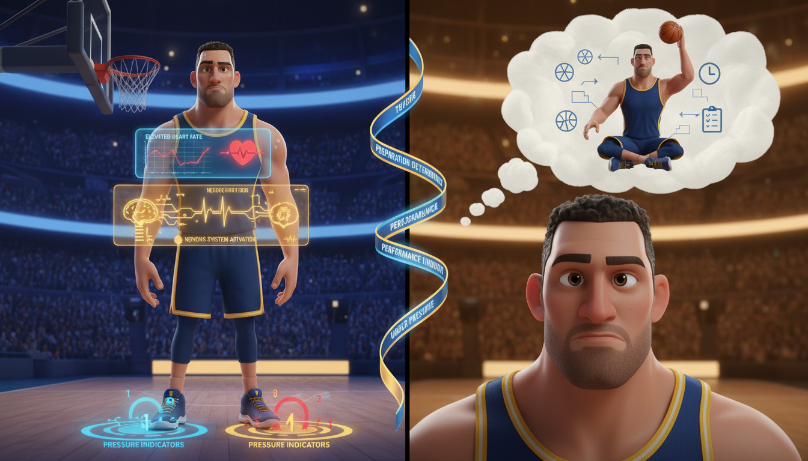

# Chapter 8: The Pressure Test

**[🏠 Back to Home](../README.md)** | **[📚 All Chapters](../README.md#-the-chapters)**

---

> [!NOTE]
> **💡 Key Insight**
> **Core Concept**: Pressure doesn't create who you are – it reveals who you've become through practice.
> **The Output**: Perform your best when the stakes are highest and everyone's watching.

---

---

## The Moment Everything Goes Blank

Final exam. Worth 40% of your grade. The one you've been studying for all week.

You walk into the classroom, sit down, and feel your stomach twist. Heart rate climbing. Palms already sweating. The teacher hands out the test, and you flip to the first page.

Your mind goes completely blank.

Everything you studied – gone. Every formula you memorized – vanished. Every concept you understood perfectly yesterday – now feels like a foreign language. You can literally feel your knowledge evaporating like water on hot pavement.

You're not failing because you didn't prepare.

You're failing because the pressure is eating you alive.

Or picture this: Free throw line. Championship game. Your team down by one. Two seconds left on the clock. You've practiced this shot ten thousand times. Made it in your sleep. Nailed it yesterday in practice without even thinking.

But right now? The gym is silent except for your heartbeat thundering in your ears. Every person in the bleachers is staring at you. Your hands are shaking. Your legs feel like jelly.

You shoot.

Clang. Off the rim.

Game over.

> [!NOTE]
> **💭 Key Insight**
> *Here's the brutal truth: Pressure reveals who you really are.*

Not who you think you are. Not who you are on a good day when nothing matters. Who you actually are when everything is on the line.

And if you're not ready for pressure? It will destroy you every single time.

But here's the good news: Pressure is a skill. You can train for it. You can practice it. You can become the person who thrives when everyone else is choking.

That's what this chapter is about.

---

---

## What Pressure Actually Does to Your Body

Let's start with what's happening inside your body when pressure hits. Understanding this is the first step to controlling it.

### Your Body's Pressure Response

The moment you sense high stakes, your nervous system activates. Automatic. You can't turn it off. Here's what starts happening:

> [!NOTE]
> **💭 Key Insight**
> *Physical Changes:*

- Heart rate increases (prepares you for action)
- Breathing gets shallow and fast
- Muscles tense up
- Blood flow redirects from brain to muscles
- Tunnel vision kicks in (narrow focus)
- Working memory decreases (harder to think clearly)
- Adrenaline floods your system

This is called the "fight or flight" response. Your body is literally preparing you to either fight a threat or run away from it.

Here's the problem: **This response was designed for survival, not performance.**

When a lion is chasing you, tunnel vision is great. You don't need to think about algebra. You need to run.

But when you're taking the SAT or shooting a free throw or giving a presentation? You need your brain working at full capacity. You need steady hands. You need clear thinking.

> [!NOTE]
> **💭 Key Insight**
> *And your body is doing the exact opposite.*

### The Two Interpretations

Here's where it gets interesting. That physical response – the racing heart, the sweaty palms, the nervousness – happens to everyone. Elite performers feel it. Average performers feel it. Everyone feels it.

The difference between someone who chokes and someone who thrives?

> [!NOTE]
> **💭 Key Insight**
> *How you interpret what's happening.*

> [!NOTE]
> **💭 Key Insight**
> *Pressure as Threat:*

- "I'm going to fail."
- "Everyone's watching me mess up."
- "I can't handle this."
- "Why is my heart racing? Something's wrong."
- **Result**: You choke. Performance drops. Worst-case scenario happens.

> [!NOTE]
> **💭 Key Insight**
> *Pressure as Challenge:*

- "This is what I've prepared for."
- "I get to show what I can do."
- "I've done hard things before."
- "My body is giving me energy to perform."
- **Result**: You execute. Performance peaks. Best-case scenario happens.

> [!NOTE]
> **💭 Key Insight**
> *Same physical response. Same racing heart. Same nerves. Completely different outcome.*

> [!TIP]
> **The Sam Altman Example**
>

Sam Altman, CEO of OpenAI (the company that created ChatGPT), has faced pressure most people can't even imagine.

November 2023: His board fired him. Publicly. The company he built nearly imploded overnight. Global headlines. Chaos. Everything he'd worked for potentially destroyed in a single weekend.

His response? Not panic. Not despair.

**His exact words**: "The hard moments define you. Panic helps no one. Focus on what you can control. Execute the next right move."

Within days, he was reinstated. The company stabilized. Why? Because when pressure hit maximum levels, he didn't waste energy on what he couldn't control. He focused on execution.

That's not talent. That's trained response under pressure.

> **Coach's Corner:**
>
> Your body can't tell the difference between excitement and nervousness. They're the same physiological state. The only difference is your interpretation. Next time you feel "nervous," try thinking "I'm excited." Same feeling. Different label. Different performance.

---

---

## You Don't Rise to the Occasion – You Fall to Your Level of Preparation

Here's a phrase you need to tattoo on your brain:

> [!NOTE]
> **💭 Key Insight**
> *"You don't rise to the occasion. You fall to your level of preparation."*

Let me prove it to you.

Imagine you've never practiced a free throw in your life. Not once. Then I put you at the free-throw line in the NBA Finals, game-winning shot, and tell you to just "believe in yourself."

You're going to miss. Probably by a lot.

Why? Because no amount of pressure will make you suddenly good at something you've never practiced.

> [!NOTE]
> **💭 Key Insight**
> *Pressure doesn't create ability. It reveals preparation.*

### The Practice vs. Performance Gap

Here's the uncomfortable truth most people don't want to hear:

> [!NOTE]
> **💭 Key Insight**
> *If you haven't practiced under realistic conditions, you will choke under real pressure.*

Most students study in perfect conditions:

- Quiet room
- Open notes
- No time limit
- Zero consequences if they get it wrong
- No one watching

Then test day arrives:

- Noisy classroom
- Closed notes
- Strict time limit
- Grade depends on performance
- 30 people in the room

Your brain goes: "Wait, this is nothing like what we practiced. I don't know how to do this."

> [!NOTE]
> **💭 Key Insight**
> *Of course you choke. You never trained for game conditions.*

Elite athletes don't make this mistake. Watch how they practice:

> [!NOTE]
> **💭 Key Insight**
> *What Most People Do:*

- Practice when they feel good
- Practice in low-pressure situations
- Never simulate game conditions
- Wonder why they choke in big moments

> [!NOTE]
> **💭 Key Insight**
> *What Elite Performers Do:*

- Practice when they're tired (game-day fatigue)
- Practice with people watching
- Simulate time pressure
- Make practice reps have consequences
- **Build pressure-performance muscle**

### The Harsh Reality Check

Let's do a quick audit. Think about your last high-pressure moment – big test, important game, crucial presentation, whatever.

Answer honestly:

1. Did you practice under conditions similar to the real thing?
2. Did you simulate time pressure?
3. Did you practice when tired or uncomfortable?
4. Did you practice with others watching?

If you answered no to most of those, then **you didn't actually prepare for pressure. You prepared for practice.**

And when game day arrived, your brain said, "This doesn't feel like what we practiced," and shut down.

> [!NOTE]
> **💭 Key Insight**
> *The fix? Train for pressure deliberately.*

---

---

## The 5-Step Pressure Protocol

Okay, so pressure is coming. It's unavoidable. The question is: Do you have a system for handling it?

Most people's "system" is hoping they don't choke and praying everything works out.

That's not a system. That's a wish.

Elite performers have a repeatable protocol they use every single time pressure shows up. Not complicated. But it works.

Here it is:

### Step 1: BREATHE (Physical Reset)

When pressure hits, your breathing goes shallow and fast. That's your body trying to pump more oxygen for the "fight or flight" response.

The problem? Shallow breathing actually sends a signal to your brain that you're in danger, which creates more anxiety, which makes breathing worse. Downward spiral.

> [!NOTE]
> **💭 Key Insight**
> *The fix: Box breathing.*

Here's how:

1. Inhale for 4 counts
2. Hold for 4 counts
3. Exhale for 4 counts
4. Hold for 4 counts
5. Repeat 3-4 times

Why this works:

- Activates your parasympathetic nervous system (the "calm down" system)
- Brings oxygen to your brain (you think clearer)
- Slows your heart rate
- Takes 30 seconds and significantly improves decision-making

**You can do this before a test, before a game, before a presentation, before anything.** Fastest way to reset your physical state.

### Step 2: REFRAME (Mental Reset)

---

Remember what we talked about earlier? Same physical response, different interpretation.

**Negative reframe**: "I'm so nervous. My heart is pounding. This is bad. I'm going to mess up."

**Positive reframe**: "My body is giving me energy to perform. This is activation, not fear. I'm ready for this."

Specific reframes that work:

❌ "I'm scared." → ✅ "I'm activated."

❌ "What if I fail?" → ✅ "This is what I trained for."

❌ "Everyone's watching." → ✅ "I get to show what I can do."

❌ "I don't know if I can do this." → ✅ "I've done hard things before."

**Your self-talk in pressure moments determines your performance.** Choose your words carefully.

### Step 3: FOCUS (Attention Reset)

When pressure spikes, your mind wants to think about everything at once:

"What if I fail this test? What will my grade be? What will my parents say? What if I don't get into college? What if—"

**Stop.**

That's outcome focus, and it destroys performance.

> [!NOTE]
> **💭 Key Insight**
> *The fix: Focus on the immediate next action.*

Not: "I need to ace this entire test."

But: "I'm going to read this first question carefully."

Not: "I need to make this free throw to win the game."

But: "I'm going to focus on my shooting form for this one shot."

> [!NOTE]
> **💭 Key Insight**
> *One play at a time. One question at a time. One action at a time.*

Elite performers never think about the outcome during performance. They think about the process. The outcome takes care of itself.

### Step 4: TRUST (Execution Reset)

This is where most people sabotage themselves.

Under pressure, your brain wants to overthink. It wants to try new strategies. It wants to second-guess everything you've practiced.

**Do not let it.**

When pressure hits, it's too late to learn something new. It's too late to change your approach. **The only thing that works now is what you've already practiced.**

> [!NOTE]
> **💭 Key Insight**
> *Trust your preparation.*

If you've practiced your free throw a thousand times, shoot it the same way you always shoot it. Don't suddenly try a different technique.

If you've studied the material, don't panic and change your test-taking strategy. Execute what you practiced.

> [!NOTE]
> **💭 Key Insight**
> *Muscle memory beats overthinking. Every. Single. Time.*

The time to experiment is in practice. The time to trust is in performance.

> [!IMPORTANT]
> ### Step 5: COMMIT (Full Action)

The final step is simple but crucial: **Commit fully to the action.**

No hedging. No hesitation. No holding back.

When you shoot, shoot with full confidence. When you answer, answer decisively. When you execute, execute completely.

Halfhearted action under pressure always fails. Your brain senses your doubt, and performance suffers.

> [!NOTE]
> **💭 Key Insight**
> *Full commitment = best chance of success.*

---

---

## Building Your Pre-Performance Checklist

Elite performers don't just wing it when pressure arrives. They have a routine. A checklist. A system that prepares them mentally and physically for execution.

Here's how to build yours:

### 30 Minutes Before Game Time

**Physical warm-up** (even for mental tasks):
- Get your body moving. Walk. Stretch. Do jumping jacks.
- Why: Burns off excess nervous energy. Activates your body so you're not going from zero to 100 instantly.

**Review key reminders** (not learning, just activating):
- Skim your notes. Review formulas. Look at key concepts.
- Why: You're not cramming. You're activating what you already know. Priming your brain to access information faster.

**Visualize successful execution**:
- Close your eyes. See yourself executing perfectly.
- Imagine the feeling of confidence. The smooth performance. The successful outcome.
- Why: Research shows visualization activates the same brain regions as actual practice. You're literally rehearsing success.

### 5 Minutes Before

**Box breathing** (from Step 1):
- 4 breaths, 16 counts each. Takes 90 seconds. Calms your system.

**Activation phrase**:
- Pick one sentence that fires you up. Examples:

  - "This is my moment."
  - "I'm ready for this."
  - "I've prepared for exactly this."
  - "Let's go."

- Say it out loud or in your head. Mean it.

**Focus on first action**:
- Not the whole test. Just the first question.
- Not the whole game. Just the first play.
- **Start strong, and momentum carries you.**

### During Performance

**Trust your training**:
- Execute the routine you practiced.
- Don't overthink. Don't second-guess.
- **Flow, don't force.**

**Stay present**:
- If your mind wanders to outcome ("What's my grade going to be?"), bring it back to process ("What's the next step?").

**Breathe between actions**:
- Between test questions, take one deep breath.
- Between plays, reset your breathing.
- **Micro-resets keep you calm throughout.**

> **Coach's Corner:**
>
> Your pre-performance routine should be the same every time. Same warm-up. Same breathing. Same self-talk. Why? Consistency creates calm. Your brain recognizes the routine and goes, "I know this. I've done this before. I'm ready." Novelty creates anxiety.

---

---

## The Pressure Practice Progression

You can't wait until game day to test your pressure performance. You need to practice being under pressure.

Here's how to progressively build your pressure tolerance:

### Week 1: Low-Stakes Pressure

> [!NOTE]
> **💭 Key Insight**
> *Practice with one friend watching.*

- Study and have a friend quiz you while sitting there.
- Practice free throws with one person watching.
- Give your presentation to one family member.

**Why start here**: Your nervous system needs to adapt to having someone watch. Start small. Build confidence.

### Week 2: Medium-Stakes Pressure

> [!NOTE]
> **💭 Key Insight**
> *Practice with small group watching.*

- Study group quiz where everyone watches each other answer.
- Practice with 3-5 friends watching.
- Present to a few classmates.

> [!NOTE]
> **💭 Key Insight**
> *Add a time limit:*

- Give yourself 60% of the time you'd normally use. Force faster thinking.

### Week 3: High-Stakes Pressure

> [!NOTE]
> **💭 Key Insight**
> *Practice with consequences.*

- If you miss the shot, you run a lap.
- If you get the answer wrong, you owe $1 to charity.
- If your presentation isn't great, you have to do it again.

**Why consequences matter**: Your brain needs to feel that "this matters" stress. Stakes create pressure. Pressure creates adaptation.

### Week 4: Game-Day Simulation

> [!NOTE]
> **💭 Key Insight**
> *Simulate the real thing as closely as possible.*

- Take a practice test in the same classroom at the same time of day.
- Wear the same clothes you'll wear on game day.
- Practice at the venue if possible.
- **Reduce variables = reduce surprises = reduce panic.**

**Your brain performs best in familiar environments.** The more your practice looks like game day, the calmer you'll be when it matters.

---

---

## The Clutch Mindset: Learning to Want Pressure

Some people hide from pressure. They hope someone else takes the final shot. They dread being called on in class. They avoid situations where they might fail publicly.

Other people actively seek pressure. They want the ball in the final seconds. They raise their hand first. They volunteer to go first.

> [!NOTE]
> **💭 Key Insight**
> *What's the difference?*

Not talent. Not natural ability.

**Mindset.**

### What Clutch Performers Think

> [!NOTE]
> **💭 Key Insight**
> *They reframe pressure as opportunity:*

- "This is my chance to prove myself."
- "I've prepared for this exact moment."
- "I want to be the one who decides this."

> [!NOTE]
> **💭 Key Insight**
> *They focus on what they control:*

- Not: "What if the other team is better?"
- But: "What's my best move right now?"

> [!NOTE]
> **💭 Key Insight**
> *They trust their training:*

- "I've made this shot a thousand times. One more time."

> [!NOTE]
> **💭 Key Insight**
> *They've succeeded before:*

- Small wins build confidence. Previous success under pressure creates expectation of future success.

### The Sam Altman Decision Framework

When facing massive pressure, Sam Altman uses a simple framework. You can use it too:

**Question 1: What are the stakes?** (Be realistic, not catastrophic)
- Not: "If I fail this test, my life is over."
- But: "This test is 15% of my grade. Important, but not life-ending."

**Question 2: What do I control?** (Focus here, ignore the rest)
- You control: Your preparation. Your focus. Your effort. Your response.
- You don't control: The difficulty of questions. Other people's performance. The outcome.

**Question 3: What's the worst realistic outcome?** (Usually not as bad as fear suggests)
- Not: "I'll fail and get kicked out of school and never succeed."
- But: "Worst case, I get a B- instead of an A. I can handle that."

**Question 4: What's my best move right now?** (Execute that)
- Not: "Let me think about 17 different strategies."
- But: "My best move is to breathe, focus, and answer the first question. Done."

**Question 5: Am I overthinking?** (If yes, trust training and commit)
- Pressure makes you want to overthink. Champions trust their preparation and execute.

---

---

## The Film Room: Learning from Pressure Moments

After every high-pressure performance – whether you crush it or choke – you need to do what elite athletes call "film room."

You analyze the tape. You break down what happened. You learn.

### Post-Performance Analysis (Do This Within 24 Hours)

> [!NOTE]
> **💭 Key Insight**
> *What did I do well under pressure?*

- Where did I execute my routine successfully?
- What mental skills worked?
- When did I stay focused on process instead of outcome?

> [!NOTE]
> **💭 Key Insight**
> *Where did I deviate from training?*

- Did I forget to breathe?
- Did I let my mind wander to outcome instead of process?
- Did I overthink instead of trusting my preparation?

> [!NOTE]
> **💭 Key Insight**
> *What would I do differently next time?*

- Be specific. "I'd breathe more" isn't helpful. "I'd do box breathing before each section of the test" is actionable.

> [!NOTE]
> **💭 Key Insight**
> *What did this teach me for next time?*

- Every pressure moment is data. Win or lose, you learned something. What was it?

> [!NOTE]
> **💭 Key Insight**
> *Do I need to adjust my training?*

- If you choked on a specific skill, practice that specific scenario under pressure this week.

> **Coach's Corner:**
>
> The most important film room sessions happen after you choke, not after you win. Winning feels great, but choking teaches more. The question isn't "Will I ever choke?" (you will). The question is "What will I learn when I do?"

---

---

## When Pressure Breaks You: The Bounce-Back Protocol

Let's be real: You're going to choke sometimes. Everyone does.

Kobe Bryant missed shots. Michael Jordan missed game-winners. Elite students fail tests. The best performers in any field have bad days under pressure.

> [!NOTE]
> **💭 Key Insight**
> *The difference between average and elite isn't avoiding failure. It's bouncing back faster.*

### If You Choked, Don't Do This:

> [!WARNING]
> ❌ **Catastrophize**: "I always choke." "I can't handle pressure." "I'm just not clutch."

> [!WARNING]
> ❌ **Avoid pressure going forward**: Hiding from pressure doesn't build pressure tolerance. It destroys it.

> [!WARNING]

> [!WARNING]
> <table>
> <tr>
> <th>❌ Avoid This</th>
> <th>✅ Do This Instead</th>
> </tr>
> <tr>
> <td>Make it your identity "I'm not a clutch performer" becomes a self-fulfilling prophecy.</td>
> <td>Objective analysis What specifically went wrong? Not "I suck under pressure." But "I forgot to breathe and my mind spiraled to outcome thinking."</td>
> </tr>
> </table>

> [!WARNING]
> ✅ **Identify the gap**: Was this a training issue (didn't prepare enough) or an execution issue (prepared but didn't execute the routine)?

> [!WARNING]
> ✅ **Adjust training**: Whatever went wrong, practice that specific scenario this week. Choked on time pressure? Practice with shorter time limits. Choked when people were watching? Practice with an audience.

> [!WARNING]
> ✅ **Retest soon**: Don't wait months to face pressure again. Seek out another pressure situation within days or weeks. You need to prove to yourself that you can handle it.

### The Bounce-Back Timeline

> [!NOTE]
> **💭 Key Insight**
> *Immediate (0-24 hours):*

- Feel the disappointment. It's okay to be upset.
- Don't make permanent conclusions from one performance.
- Practice self-compassion. "I had a bad performance. That doesn't make me a bad performer."

> [!NOTE]
> **💭 Key Insight**
> *Review (24-72 hours):*

- Film room analysis. What happened? Why? What to adjust?
- Identify the specific skill or mental technique that failed.
- Create a pressure training plan to address it.

> [!NOTE]
> **💭 Key Insight**
> *Rebuild (Week 1):*

- Practice the specific scenario that failed you.
- Start with low-stakes, gradually increase pressure.
- Build small wins. Confidence comes from recent success.

> [!NOTE]
> **💭 Key Insight**
> *Retest (Ongoing):*

- Seek out similar pressure moments.
- Execute your improved routine.
- Learn from the result, whether success or failure.
- **Repeat. Every pressure rep makes the next one easier.**

### The Growth Through Pressure

Here's the reframe that changes everything:

> [!NOTE]
> **💭 Key Insight**
> *Every pressure moment teaches you something valuable, even when you fail.*

- You learn what you're ready for.
- You learn what you need to practice more.
- You learn how your body responds to stress.
- You learn what routines work for you and what doesn't.

> [!NOTE]
> **💭 Key Insight**
> *Even the "failures" are data.*

The person who seeks out 100 pressure situations and chokes on 40 of them is way better off than the person who avoids pressure entirely.

Why? Because the first person is building a pressure-performance database. They know what works. They know what doesn't. They're becoming comfortable with discomfort.

The second person stays fragile. One high-pressure moment, and they shatter because they've never practiced handling it.

**Pressure mastery comes from volume.** The more reps, the better you get.

---

---

## The Long-Term Pressure Advantage

Here's something nobody tells you:

> [!NOTE]
> **💭 Key Insight**
> *The first time you face major pressure, it's terrifying. The 100th time? It's just Tuesday.*

Pressure adaptation is real. Your nervous system adjusts to repeated stress. What felt overwhelming in week 1 feels manageable in week 10.

### The Pressure Adaptation Curve

**First time**: Terrifying. Heart pounding. Mind racing. You probably choke.

---

**10th time**: Still nervous, but you're executing better. You remember your routine.

**50th time**: Pressure is familiar. Your body recognizes this state and knows how to handle it.

**100th time**: You actually seek pressure because you trust yourself. The nervousness becomes useful activation energy, not paralyzing fear.

> [!NOTE]
> **💭 Key Insight**
> *The people who seem "naturally clutch" aren't born different. They've just had more reps under pressure.*

### Building Your Pressure Portfolio

> [!NOTE]
> **💭 Key Insight**
> *The strategy is simple: Actively seek pressure situations.*

- Volunteer to present first in class
- Try out for the team (even if you're nervous)
- Take the challenging assignment (not the easy one)
- Compete in the tournament (even when you might lose)
- Raise your hand when you're not 100% sure of the answer
- Apply for the opportunity (even if rejection is likely)

**Why?** Because every pressure rep builds your confidence and skill.

**The person who volunteers first 20 times** becomes the person who's comfortable being first. They've trained that skill.

**The person who avoids pressure 20 times** becomes the person who panics when pressure finds them. Because it will.

You don't get to avoid pressure forever. Life will throw it at you – college applications, job interviews, big presentations, critical moments.

> [!NOTE]
> **💭 Key Insight**
> *The question is: Will you be ready?*

### The Altman Approach to Scaling Pressure

As your goals get bigger, the pressure gets bigger.

A middle school presentation? Low pressure.

A high school championship game? Medium pressure.

Testifying to Congress as CEO of a major company? Massive pressure.

> [!NOTE]
> **💭 Key Insight**
> *The stakes scale. But the principles stay the same.*

Sam Altman faces pressure most people can't imagine. Here's how he handles it:

> [!NOTE]
> **💭 Key Insight**
> *As stakes increase:*

- Your preparation must increase proportionally.
- Your routines must stay consistent (don't change what works just because stakes are higher).
- Your focus on controllables must intensify (ignore what you can't control, execute what you can).
- Your trust in training must deepen (pressure is not the time to doubt your preparation).

> [!NOTE]
> **💭 Key Insight**
> *Running a startup vs. testifying to Congress:*

- Same pressure principles apply.
- Different scale.
- Same routines work (breathe, reframe, focus, trust, commit).

> [!NOTE]
> **💭 Key Insight**
> *You don't need new skills for higher pressure. You need the same skills practiced more deeply.*

---

---

## Your Practice Drills

Alright, time to put this into action.

### Drill 1: Master the 5-Step Pressure Protocol

> [!NOTE]
> **💭 Key Insight**
> *What to do this week:*

1. Write down the 5 steps: Breathe, Reframe, Focus, Trust, Commit
2. Practice box breathing twice a day (morning and night) for 7 days
3. Identify one upcoming pressure moment (test, game, presentation, anything)
4. Before that moment, run through all 5 steps
5. After, do film room analysis

**Why this works:**
- You're building the routine before you need it under pressure.
- By day 7, box breathing becomes automatic.
- You'll have data on what works and what needs adjusting.

### Drill 2: Pressure Practice Progression

> [!NOTE]
> **💭 Key Insight**
> *Week 1-4 Challenge:*

Pick one skill you want to improve under pressure (free throws, presenting, test-taking, whatever).

- **Week 1**: Practice with one friend watching
- **Week 2**: Practice with 3-5 people watching
- **Week 3**: Practice with stakes (consequences for failure)
- **Week 4**: Full game-day simulation

> [!NOTE]
> **💭 Key Insight**
> *Track your performance:*

- Day 1: Baseline (no pressure)
- Week 1: Performance with low pressure
- Week 2: Performance with medium pressure
- Week 3: Performance with high pressure
- Week 4: Performance in simulation

> [!NOTE]
> **💭 Key Insight**
> *You should see: Initial drop in performance (pressure hits), then gradual improvement as your nervous system adapts.*

### Drill 3: Build Your Pre-Performance Checklist

> [!NOTE]
> **💭 Key Insight**
> *Create your personal routine:*

> [!NOTE]
> **💭 Key Insight**
> *30 minutes before:*

- What will you do to warm up physically?
- What will you review mentally?
- How will you visualize success?

> [!NOTE]
> **💭 Key Insight**
> *5 minutes before:*

- How many box breathing cycles?
- What's your activation phrase?
- What's the first action you'll focus on?

**During:**
- How will you stay present?
- What's your reset between actions?

> [!NOTE]
> **💭 Key Insight**
> *Write this down. Keep it in your phone. Execute it every time.*

Consistency builds calm. Your brain will start to recognize: "I've done this routine. I'm ready."

### Weekly Check-In

At the end of each week, answer:

1. How many pressure situations did I face this week?
2. How many times did I execute my 5-step protocol?
3. How many times did I bounce back from a mistake instead of spiraling?
4. Am I seeking pressure or avoiding it?
5. Am I better under pressure than I was last week?

**Progress, not perfection.** You're building a skill that compounds over time.

---

---

## The Uncomfortable Truth (Applied)

---

Remember the principle from Chapter 2:

> [!NOTE]
> **💭 Key Insight**
> *"The sooner you learn to be comfortable with being uncomfortable, the sooner you will win in life."*

> [!NOTE]
> **💭 Key Insight**
> *Pressure is the ultimate discomfort.*

Your heart races. Your stomach twists. Your brain screams at you to avoid this feeling.

But here's what champions know:

> [!NOTE]
> **💭 Key Insight**
> *Pressure is just discomfort. And discomfort means growth.*

The person who avoids pressure stays comfortable. They also stay average.

The person who seeks pressure feels uncomfortable often. They also become unstoppable.

> [!NOTE]
> **💭 Key Insight**
> *Every time you face pressure and survive, you're teaching your brain: "We can handle this."*

Every time you choke and bounce back, you're proving to yourself: "Failure doesn't destroy me."

Every time you execute your routine under stress, you're building a skill that most people never develop.

> [!NOTE]
> **💭 Key Insight**
> *Pressure tolerance is like any other muscle. Use it or lose it.*

The more you practice being uncomfortable under pressure, the more comfortable pressure becomes.

Not because pressure gets easier. But because you get stronger.

---

---

## Post-Game Review

---

> [!TIP]
> ### Key Takeaways

1. **Pressure reveals preparation**: You don't rise to the occasion. You fall to your level of preparation. Train for pressure deliberately, not accidentally.

2. **The 5-Step Protocol**: Breathe, Reframe, Focus, Trust, Commit. This is your system for every high-pressure moment. Memorize it. Use it.

3. **Train for pressure**: If you only practice in comfortable conditions, you'll choke under pressure. Simulate game-day conditions. Build pressure tolerance through volume.

4. **Clutch is a skill, not a talent**: People who want the ball in big moments have trained for those moments. They've built confidence through small wins. You can do the same.

5. **Bounce back faster**: You will choke sometimes. Elite performers don't avoid failure – they learn from it and retest quickly. Film room analysis + adjusted training = rapid improvement.

6. **Pressure adaptation is real**: The 100th pressure moment is easier than the 1st. Seek out pressure situations. Build your pressure portfolio. Volume creates mastery.

### Reflection Questions

1. **What's my current relationship with pressure?** Do I seek it or avoid it? Be honest.

2. **What's one upcoming pressure moment I can prepare for this week?** Test, game, presentation, audition – what's coming?

3. **What does my pre-performance routine look like?** Do I even have one? If not, create it now.

4. **When did I last choke under pressure?** What specifically went wrong? What would I do differently now?

5. **Am I practicing under pressure conditions, or just under practice conditions?** How can I make my training more game-day realistic?

### The Output Mindset

---

Remember: Don't think about "handling pressure."

Think about **performing your best when it matters most.**

Don't focus on "not choking."

Focus on **becoming the person who thrives in big moments.**

Don't hope pressure doesn't find you.

> [!NOTE]
> **💭 Key Insight**
> *Train so that when pressure arrives, you're ready to dominate.*

Pressure is coming. It's not optional. The only question is: Will you be ready?

Champions don't avoid pressure. They prepare for it. They practice their routines. They trust their training. They execute when it matters.

> [!NOTE]
> **💭 Key Insight**
> *And when they fail under pressure? They learn, adjust, and show up again.*

That's not talent. That's not luck.

> [!NOTE]
> **💭 Key Insight**
> *That's pressure mastery.*

And it's available to you – if you're willing to practice it.

---

### Next Level

You've learned how to perform when pressure hits. Now let's talk about the daily habits that make everything else possible.

Because consistency beats intensity. And the morning you create determines the day you have.

> [!NOTE]
> **💭 Key Insight**
> *Next up: Chapter 9 – Morning Warm-Up: Own Your Day Before It Owns You*

The game starts before you think it does. Let's make sure you're ready from the moment you wake up.

---

[⬅️ Previous: Chapter 7 - Focus Mode: On](chapter_07_focus_mode_on.md) | [📚 All Chapters](../README.md#-the-chapters) | [Next: Chapter 9 - Morning Warm-Up ➡️](chapter_09_morning_warm_up.md)

