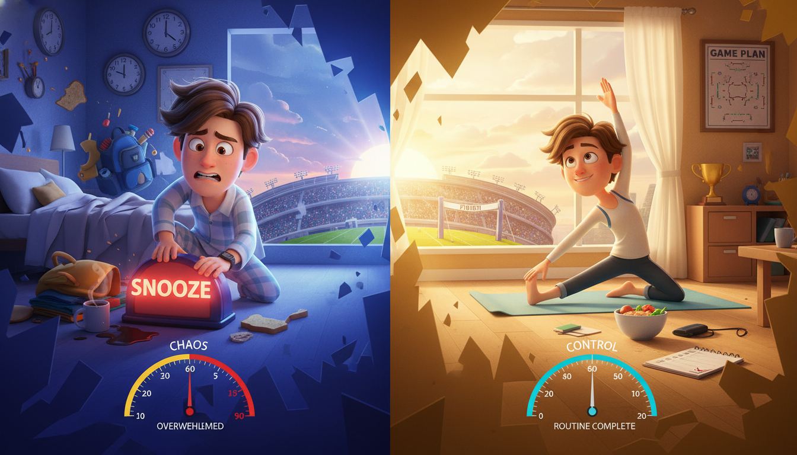

# Chapter 9: Morning Warm-Up

**[🏠 Back to Home](../README.md)** | **[📚 All Chapters](../README.md#-the-chapters)**

---

> [!NOTE]
> **💡 Key Insight**
> **Core Concept**: Your morning isn't about waking up early - it's about owning your day before distractions, demands, and chaos take control.
> **The Output**: Walk into school like you've already won three times before anyone else woke up.

---

---

## Two Students, Same 24 Hours

6:45am.

Student A's alarm goes off. Snooze. Five more minutes feels so good.

6:54am. Alarm again. Snooze. Just a little longer.

7:03am. Alarm. Fine. Grabs phone from nightstand. Scrolls Instagram. TikTok. Texts. Fifteen minutes disappear.

7:20am. Panic. Scrambles out of bed. No time for shower. Throws on whatever's closest. Races downstairs. No breakfast. Forgot to pack bag last night. Where are the car keys? Where's that assignment due today?

7:35am. Finally out the door. Already stressed. Already behind. Already losing.

The day hasn't even started, and Student A is playing catch-up.

---

Now Student B.

5:30am. Alarm rings. Feet hit the floor. No negotiation. Phone stayed in the other room where it slept last night.

5:35am. Quick face splash. Make the bed. Get dressed in the workout clothes laid out last night.

5:45am. Twenty-five minute workout. Nothing crazy. Just movement. Pushups. Squats. Some stretching. Blood flowing.

6:15am. Shower. Breakfast. Actually tastes the food instead of inhaling it.

6:35am. Ten minutes reviewing the day. What are the three priorities? What needs done? Where might problems pop up?

6:45am. Bag packed. Mind clear. Body awake. Everything ready.

7:00am. Leaves for school calm, prepared, and in complete control.

Student B walks through those school doors like they own the place. Because in a way, they already do.

---

Same school. Same classes. Same 24 hours in the day.

Completely different games.

The difference? One owned their morning. One got owned by it.

Here's the question nobody asks: What if the most important hour of your day is the first one?

---

---

## Why Your Morning Is Your Competitive Edge

Let's get real about something. Most people lose their day before it even starts.

They wake up at the last possible second. Check their phone immediately, which means they're already reacting to what everyone else wants from them. Rush through everything, which means they're stressed before they even leave the house. Never get ahead because they start behind.

You know this feeling. You've lived it.

Here's the uncomfortable truth: if you start your day reactive, you spend the entire day playing defense. You're responding to what comes at you instead of creating what you want.

That's not a morning routine problem. That's a life problem.

---

### The Control Window

When you first wake up, you have a window. A golden window.

Your mind is clear. You haven't checked social media yet, so you're not comparing yourself to everyone else. Haven't read the news, so you're not filled with whatever drama is happening in the world. Haven't started responding to texts and messages, so you're not in reaction mode.

You're just you. Fresh. Clear. Ready.

Your willpower is at its peak. Your decision-making ability is sharp. Your body has the most energy it'll have all day.

This window usually lasts about 60 to 90 minutes after you wake up. Maybe less if you immediately grab your phone and start scrolling.

The question is simple: Are you using this window, or are you wasting it?

---

### The Momentum Physics

You know how a basketball team that scores the first few baskets suddenly has all the energy? How momentum feels like it creates more momentum?

Your morning works the same way. An object in motion stays in motion.

Start your day with wins, and more wins follow. Start with discipline, and discipline gets easier. Start in control, and you stay in control.

Start your day behind, stressed, and reactive? That pattern continues. All day long.

> [!NOTE]
> **💭 Key Insight**
> *Here's the spiral when you lose your morning:*

Wake up late → Rush → Skip breakfast → Forget something → Stress increases → Bad mood → Worse decisions → Day keeps getting worse.

> [!NOTE]
> **💭 Key Insight**
> *Here's the spiral when you own your morning:*

Wake up with time → Calm start → Workout done → Priorities clear → Confidence builds → Better decisions → Day keeps getting better.

Same person. Different morning. Completely different day.

---

### The Uncomfortable Truth

"The sooner you learn to be comfortable with being uncomfortable, the sooner you will win in life."

Your bed is comfortable. Your phone is comfortable. Hitting snooze is comfortable. Sleeping until the last possible second is comfortable.

None of those things make you better.

Getting up when your alarm rings is uncomfortable. Working out when you're tired is uncomfortable. Doing hard things before breakfast is uncomfortable. Owning your morning when everyone else is sleeping is uncomfortable.

All of those things make you unstoppable.

Here's what nobody tells you: discomfort is the price of separation. Everyone else is choosing comfort. That's why everyone else gets average results.

You're building something different.

---

---

## Design Your Morning Like Jony Ive Designed the iPhone

You know what made the iPhone revolutionary? It wasn't that it did more things. It was that it did the right things perfectly.

Jony Ive, Apple's design genius, didn't create products by adding every possible feature. He created them by removing everything unnecessary. Every button served a purpose. Every line was intentional. Nothing was there by accident.

He designed with obsessive intentionality.

Your morning routine deserves the same approach.

---

### The Designer's Mindset

Think about the iPhone for a second. When you hold one, it feels inevitable. Like it couldn't be any other way. That's not accident. That's design.

Ive's philosophy was simple: every detail should serve a purpose. Remove everything that doesn't matter. Make the experience so clear that it feels natural.

> [!NOTE]
> **💭 Key Insight**
> *Applied to your morning, that means:*

- Every action should serve your goals
- Remove everything that doesn't move you forward
- Keep it simple enough that you can actually sustain it
- Design for how you want to FEEL, not just what you want to do
- Consistency creates mastery

You're not trying to build the most complex morning routine in the world. You're trying to build the most effective one.

---

### The Three Design Questions

Before you add anything to your morning routine, ask these three questions:

> [!NOTE]
> **💭 Key Insight**
> *1. "What's the output?"*

Don't think about "I'll meditate for 10 minutes." Think about "I'll arrive at school calm and focused instead of stressed and scattered."

See the difference? One is a task. One is an outcome.

Frame everything as what you'll achieve or become, not what you have to do.

> [!NOTE]
> **💭 Key Insight**
> *2. "Is this essential?"*

If removing something from your morning wouldn't impact your goals, cut it.

Your morning isn't a productivity Olympics. It's not about doing the most things. It's about doing the things that actually matter.

Every element should earn its place.

> [!NOTE]
> **💭 Key Insight**
> *3. "Can I sustain this?"*

A perfect morning routine you do twice doesn't change anything. A simple morning routine you do 300 times changes your life.

Design for consistency, not perfection.

If your routine requires waking up at 4am and doing a two-hour workout before school, and you're not an Olympic athlete, you're going to quit. That's not discipline failing you. That's bad design.

---

### Subtract to Add

Here's where Ive's philosophy gets really interesting. He didn't just ask what to add. He asked what to remove.

"It's not about adding more," he said. "It's about removing everything except what's essential."

> [!NOTE]
> **💭 Key Insight**
> *What to remove from your morning:*

- Phone scrolling first thing (immediately gives away your attention)
- Snooze button (trains your brain to ignore commitments)
- Checking email or messages (puts you in reactive mode)
- News and social media (fills your mind with other people's agendas)
- Rushed chaos (removes the control that makes mornings valuable)

> [!NOTE]
> **💭 Key Insight**
> *What you gain by removing those things:*

- Time for what actually matters
- Mental clarity
- Control over your day
- Competitive advantage
- The feeling of winning before 8am

Think about it. When Ive designed the iPhone, he removed the keyboard. Everyone thought he was crazy. But removing it created space for something better: the touchscreen.

Same principle. Remove what doesn't serve you, and you create space for what does.

---

### Design With Purpose

When Ive created a product, he didn't wing it. He didn't just throw things together and hope they worked. He designed systematically.

You should do the same with your morning.

> [!NOTE]
> **💭 Key Insight**
> *Here's the design process:*

**Step 1: Define the output.** How do you want to feel? What do you want done?

**Step 2: Prototype the routine.** Test what actually works for you.

**Step 3: Remove friction points.** Make it easier to do than not do.

**Step 4: Iterate based on results.** Adjust what doesn't work.

**Step 5: Lock in the system.** Once it works, make it non-negotiable.

This isn't about creating the perfect morning on day one. It's about building something that works and then refining it.

Creation is an act of care. When Ive designed, every detail mattered because the experience mattered. Your morning is the same. Design it with intention, and it becomes something more than a routine. It becomes a ritual that shapes who you are.

---

---

## The Science Behind Morning Wins

Let's talk about why mornings actually matter, beyond just "it feels good to be productive."

Your brain and body have biological reasons for why the morning is your advantage window.

---

### The Cortisol Advantage

When you wake up, your body naturally releases a hormone called cortisol. Not the stress cortisol everyone talks about. This is activation cortisol.

It peaks about 30 minutes after you wake up. Your brain is primed for focus and decision-making. Your willpower reserves are full. Your physical energy is at its highest.

This is your biological advantage window. Usually lasts for the first two to three hours after waking.

The problem? Most people waste it scrolling through their phones, rushing around stressed, or staying in bed hitting snooze.

It's like having a superpower that only lasts a few hours, and choosing not to use it.

---

### Decision Fatigue Is Real

Research shows you make about 35,000 decisions per day. Every single decision depletes your willpower a little bit.

By the afternoon, your decision quality tanks. That's why you make worse choices at night. That's why homework feels harder after practice. That's why you're more likely to skip the gym after school than before.

Your morning is when your decision-making is sharpest. Use it for things that matter. Handle priorities while your brain is still fresh.

Don't waste that decision energy negotiating with yourself about whether to hit snooze.

---

### The Habit Formation Sweet Spot

Morning routines stick better than other habits. Here's why:

- Fewer variables (your environment is consistent every morning)
- Less decision fatigue (you're fresh)
- Immediate reward (the feeling of winning early creates motivation)
- Automatic cue (waking up triggers the routine)
- Daily repetition (you get to practice every single day)

James Clear, who wrote *Atomic Habits*, found that environment-based habits have a two to three times higher success rate than willpower-based habits.

Your morning is the most controllable environment you have. Nobody's making demands yet. Your schedule hasn't blown up. It's just you.

That's why morning routines work when other habits fail.

---

### Flow State Foundation

---

Remember learning about flow state? That zone where time disappears and everything clicks?

Your morning sets up your ability to enter flow later. Starting calm and focused makes flow possible. Starting stressed and reactive makes flow nearly impossible.

A good morning isn't just about the morning. It primes your brain for peak performance all day.

---

> **Coach's Corner:**
>
> Your brain in the morning is like a clean whiteboard. You can write whatever you want on it. By noon, everyone else has already written all over it. Use that clean space while you have it.

---

---

## Building Your Morning System

You can't copy someone else's morning routine. What works for a professional athlete training for the Olympics won't work for you. What works for a CEO running a company probably won't either.

You need to design yours based on your goals, your life, and what actually works for you.

But every effective morning routine has the same four core elements.

---

### The Four Core Elements

> [!NOTE]
> **💭 Key Insight**
> *Element 1: ACTIVATION (Physical Wake-Up)*

**Purpose:** Transition from sleep mode to actually awake.

**Options:** Cold water face splash, pushups, stretching, short walk, shower, making your bed.

**The Output:** Your body is actually awake, not zombie mode.

Look, you can't go from unconscious to crushing your day in zero seconds. Your body needs a transition. Activation is that bridge.

It doesn't need to be extreme. You don't need to jump into an ice bath. You just need something physical that tells your body "we're up now."

---

> [!NOTE]
> **💭 Key Insight**
> *Element 2: INTENTION (Mental Clarity)*

**Purpose:** Set direction for the day. Get clear on what matters.

**Options:** Journaling, visualization, goal review, gratitude practice, planning the day.

**The Output:** You know what your priorities are. You're not just going through motions.

This is where you move from "I'm awake" to "I know what I'm doing today." Five minutes of clarity saves hours of confusion later.

What are the three most important things today? What could derail you? What's the win you're aiming for?

Answer those, and you've already separated from 95% of people who just react all day.

---

> [!NOTE]
> **💭 Key Insight**
> *Element 3: MOVEMENT (Physical Readiness)*

**Purpose:** Burn nervous energy, build discipline, get your body ready.

**Options:** Workout, run, yoga, sport-specific practice, even just a walk around the block.

**The Output:** Endorphins flowing, discipline practiced, body primed for the day.

Movement in the morning does something chemical to your brain. It releases endorphins, which improve your mood. Burns off anxiety and restless energy. Proves to yourself that you can do hard things before breakfast.

Plus, getting your workout done early means nothing can derail it later. No "I'm too tired after practice" excuses. It's done.

---

> [!NOTE]
> **💭 Key Insight**
> *Element 4: PREPARATION (Tactical Setup)*

**Purpose:** Handle the logistics so nothing gets forgotten or rushed.

**Options:** Review schedule, pack bag, eat breakfast, prep materials for the day.

**The Output:** Nothing forgotten. No scrambling. You're ready to perform.

This is the boring but essential stuff. The things that cause chaos when you skip them. Eating actual food. Making sure your homework is in your bag. Knowing when your first class or practice starts.

Seems basic, right? But how many times have you gotten to school and realized you forgot something? That's what this prevents.

---

> [!NOTE]
> **💭 Key Insight**
> *You need all four elements. The specifics depend on you.*

Some people need 10 minutes of movement and 30 minutes of intention. Some people need the opposite. That's fine. But if you're missing an entire element, your morning system has a hole in it.

---

### The Minimum Viable Morning

If you're starting from zero, don't try to build the perfect 90-minute routine on day one. That's bad design. That's setting yourself up to quit.

Start here. The MVM. Minimum Viable Morning.

> [!NOTE]
> **💭 Key Insight**
> *Total time: 30 minutes*

**5 minutes - Activation:** Cold water on face, make your bed, get dressed.

**10 minutes - Movement:** 20 pushups, 20 squats, 2-minute plank, quick stretch. Nothing fancy.

**10 minutes - Preparation:** Review your day, eat something, pack your bag.

**5 minutes - Intention:** Write down three priorities for today.

That's it. Thirty minutes. Nothing complex.

But here's what this beats:

- Sleeping until the last second
- Scrolling your phone for an hour
- Rushing out the door in chaos
- Starting the day already behind

The MVM gives you all four elements. It's simple enough that you can actually do it. And once it becomes automatic, you level up from here.

---

### The 60-Minute Power Morning

Once the MVM feels easy, here's the next level.

> [!NOTE]
> **💭 Key Insight**
> *Total time: 60-75 minutes*

**5 minutes - Activation:** Water, make bed, quick stretch.

**25 minutes - Movement:** Full workout. Strength or cardio or sport-specific training.

**10 minutes - Preparation:** Shower, breakfast, pack everything.

**15 minutes - Intention:** Journal, review goals, visualize success.

**10 minutes - Learning:** Read, listen to podcast, study something.

**5 minutes - Review:** Check schedule, confirm priorities, mentally ready.

This is championship-level morning design.

The output? You walk into school like you've already won three times before anyone else woke up.

Because you have.

---

### Design Your Own System

Here's the framework for building YOUR morning routine.

> [!NOTE]
> **💭 Key Insight**
> *Step 1: Define Your Outputs*

- How do I want to FEEL when I start my day? (Calm? Energized? Confident? Ready?)
- What do I want DONE before distractions hit? (Workout? Studying? Priorities clear?)
- Who do I need to BE to have a great day? (Focused? Disciplined? Prepared?)

Answer those questions first. Everything else flows from that.

---

> [!NOTE]
> **💭 Key Insight**
> *Step 2: Work Backward From Your Wake-Up Time*

When do you NEED to leave for school or practice or work?

Add 30 to 75 minutes before that. That's your morning window.

That number becomes your alarm time.

Example: Need to leave at 7:15am? If you want a 60-minute routine, alarm goes at 6:00am. If you want the 30-minute MVM, alarm goes at 6:30am.

Simple math. Non-negotiable time.

---

> [!NOTE]
> **💭 Key Insight**
> *Step 3: Map Your Four Elements*

For each element, choose your specific actions:

- Activation: How will you wake your body up?
- Intention: How will you get mental clarity?
- Movement: What physical activity will you do?
- Preparation: What logistics do you need to handle?

Write it down. Be specific. Not "work out" but "20 pushups, 20 squats, 2-minute plank."

Vague plans create vague results.

---

> [!NOTE]
> **💭 Key Insight**
> *Step 4: Prototype for One Week*

Test your design. See what actually works.

Maybe 25 minutes of movement is too much when you're starting. Maybe you need 10. That's fine. Adjust.

Maybe journaling doesn't do anything for you, but reviewing your goals does. Change it.

This is the iteration phase. You're allowed to refine.

---

> [!NOTE]
> **💭 Key Insight**
> *Step 5: Lock It In*

Once you've found what works, make it non-negotiable.

Same routine, every day. Yes, even weekends. Maybe 30 minutes later on Saturday, but still the same routine.

Consistency is what creates the transformation.

---

### Environment Design: Remove the Friction

Here's where Ive's design thinking really shows up. Make the right behavior the easiest behavior.

> [!NOTE]
> **💭 Key Insight**
> *The night before:*

- Lay out your workout clothes (zero decisions tomorrow morning)
- Prep breakfast if possible (removes friction)
- Pack your bag (one less thing to think about)
- Set alarm and put phone across the room (you have to get up to turn it off)
- Go to bed on time (you can't win mornings if you're exhausted)

> [!NOTE]
> **💭 Key Insight**
> *Morning environment:*

- Clothes are visible immediately (visual cue to get dressed)
- Phone is NOT in your bedroom (removes the biggest distraction)
- Water is ready to drink (hydration matters)
- Clear space for movement (no obstacles or excuses)
- Plan is written somewhere visible (no "what do I do?" moments)

You're designing the environment so the right behavior becomes automatic. That's how you remove willpower from the equation.

---

> **Coach's Corner:**
>
> If your morning routine requires willpower to execute, it's designed wrong. Willpower is limited. Systems are unlimited. Design a system that works even when motivation is low.

---

---

## The Alarm Clock Moment

Everything we just talked about means nothing if you can't get out of bed when your alarm rings.

Let's talk about the moment that determines everything. The first five seconds after your alarm goes off.

---

### The 5-Second Window

When your alarm rings, your brain immediately starts negotiating.

"Just five more minutes."

"I can skip the workout today."

"I'll start tomorrow."

Your bed feels incredible. Warm. Comfortable. Safe. The day ahead feels hard. Uncomfortable. Demanding.

You have about five seconds before you talk yourself out of getting up.

What you do in these five seconds determines everything that follows.

---

### The 5-4-3-2-1 Rule

Mel Robbins, a motivational speaker who studied habit formation, created something called the 5-Second Rule. It's stupid simple. And it works.

> [!NOTE]
> **💭 Key Insight**
> *Here's the technique:*

Alarm rings.

Count backward: 5-4-3-2-1.

MOVE. Feet hit the floor.

No negotiation. No "just one snooze." Physical movement before mental negotiation.

**Why it works:**

Counting interrupts the negotiation pattern your brain starts. Counting backward creates urgency. Forward counting doesn't. 1-2-3-4-5 gives you time to chicken out. 5-4-3-2-1 doesn't.

Five seconds isn't enough time to rationalize quitting. By the time you hit 1, you move.

Physical action beats mental resistance every single time.

Practice this. Seriously. It's the difference between people who own mornings and people who don't.

---

### The Snooze Button Is Training You to Quit

Every time you hit snooze, you're not just getting a few more minutes of sleep. You're training your brain that commitments are negotiable.

You're teaching yourself that comfort beats goals. You're practicing quitting. Yes, quitting on yourself.

You're starting the day with a loss.

**Here's the math:**

Hit snooze three times every morning? That's three small quits before your day even starts.

Do this daily? That's 1,095 quits per year.

You're literally practicing being someone who doesn't follow through.

---

**Now flip it.**

Every time you get up on the first alarm, you're training your brain that you do what you say. You're proving comfort doesn't control you. You're practicing discipline.

You're starting the day with a win.

**The math:**

Get up immediately every morning? That's one small win before your day starts.

Do this daily? That's 365 wins per year.

You're literally practicing being someone who executes.

Which person do you want to be?

---

### The Pre-Commitment

Here's a trick that makes the alarm moment easier. The night before, tell yourself what's going to happen.

Say it out loud or write it down:

"When my alarm rings, I'm getting up. No snooze. No negotiation."

"5-4-3-2-1, feet hit the floor."

"I'm someone who does what they say they'll do."

Why does this work? Because you've already made the decision. You're not deciding in the moment when you're tired and your bed is warm. You decided last night.

The alarm is just the cue. The decision is already made.

---

### The First 60 Seconds

After your feet hit the floor, keep moving.

Don't check your phone. Don't sit back down. Don't give yourself time to reconsider.

Go straight to your first action. Water. Bathroom. Get dressed. Whatever is first in your routine.

Keep moving. Motion creates energy. Standing still lets resistance creep back in.

The first 60 seconds after your alarm determines the next 60 minutes. Win those seconds, win your morning.

---

---

## Making It Stick

Starting a morning routine is easy. Everyone's motivated on day one.

Sustaining it when motivation fades, when you're tired, when it's raining, when your friends are all sleeping in? That's where most people fail.

Here's how to actually make it last.

---

### The 30-Day Reality Check

Let's be real about what happens.

**Days 1-3:** This is exciting. You're motivated. You feel like a champion. Everything is possible.

**Days 4-10:** The novelty is wearing off. It's getting harder. Your bed feels really good.

**Days 11-21:** This is where most people quit. The excitement is gone. It just feels hard. You miss a day. Then another. Then you stop completely.

**Days 22-30:** If you make it this far, something shifts. It starts feeling natural. Automatic. Like this is just what you do now.

The critical period is Days 11-21. That's the make-or-break window.

---

### Strategy for the Critical Period

**Track your streak.** Put X's on a calendar. Use a habit app. Whatever. Just make it visible.

---

**Focus on the output, not the routine.** Remember why you're doing this. You're not waking up early for fun. You're doing it to own your day, build discipline, and separate from everyone who's choosing comfort.

**Allow imperfect execution.** Did your 60-minute routine turn into 30 minutes because you were exhausted? That still counts. Done beats perfect.

**Never miss twice.** One skip is recovery. Two skips is a new pattern. If you miss Monday, you absolutely cannot miss Tuesday.

---

### The Weekend Test

Most morning routines die on weekends.

Why? No external pressure. Everyone else is sleeping in. "I deserve a break" mentality kicks in. The routine feels optional.

Here's the truth: Elite athletes don't take weekends off from being elite. Your competition doesn't sleep in. Discipline is what you do when nobody's making you do it.

Weekends are when you separate from the pack.

> [!NOTE]
> **💭 Key Insight**
> *Weekend strategy:*

- Same alarm, maybe 30 to 60 minutes later if you want (not three hours)
- Abbreviated routine is fine (30 minutes instead of 60)
- Non-negotiable on at least one weekend day
- Use the extra morning time for what matters to YOU, not scrolling TikTok

---

### The Accountability System

Make it harder to quit than to continue.

> [!NOTE]
> **💭 Key Insight**
> *Option 1: Public Commitment*

Tell people you're doing this. Post your streak. Check in with a friend who's doing the same thing. External accountability works.

> [!NOTE]
> **💭 Key Insight**
> *Option 2: Physical Tracking*

Calendar X's. Don't break the chain. Habit tracker apps like Streaks or Way of Life. Journal logging. Something visible that you'd hate to break.

> [!NOTE]
> **💭 Key Insight**
> *Option 3: Consequence Design*

If you don't do your morning routine, you lose something. Maybe no phone that evening. Maybe you owe your friend five bucks. Make it real enough to matter.

The principle: Externalize your commitment. Don't rely on willpower alone.

---

### When You Fail (And You Will)

You will miss a morning. Maybe you're actually sick. Maybe you had a terrible night's sleep. Maybe life just happened.

It's okay. Elite performers aren't perfect. They're just better at bouncing back.

**When you miss:**

**Don't catastrophize.** "I ruined my streak, I'm terrible at this" doesn't help.

**Don't quit completely.** "Well, I missed one day, might as well give up" is how average people think.

**Don't make it your identity.** "I'm just not a morning person" is a story you tell yourself, not a fact.

**Do acknowledge what happened.** Objectively, not emotionally. Why did you miss? What was the gap?

**Do adjust the system.** Was it sleep? Alarm placement? Routine too long? Fix the friction point.

> [!NOTE]
> **🎯 Core Principle**
> **Do start again tomorrow.** One miss doesn't erase 10 good days. The 48-hour rule: get back on track within two days.

---

### The Long-Term Compound Effect

After 30 days, your routine feels automatic. You've built 30 small wins. Your baseline discipline is higher. Other people start noticing something different about you.

After 90 days, your identity has shifted. You're someone who owns mornings. You can't imagine going back to snooze-button chaos. The outputs are undeniable. Better grades. Better fitness. More confidence. Separation from your peers.

After 365 days, you've practiced discipline 365 times. You've stacked 365 morning wins. The competitive advantage is massive.

But here's what really changed: It's not about mornings anymore. It's about who you've become.

Someone who does what they say. Someone who controls their environment instead of being controlled by it. Someone who chooses discomfort when everyone else chooses easy.

That's the real output. Not a good morning. A better you.

---

---

## Champions Build in the Dark

Let's look at what this actually looks like in real life. Morning routines aren't theory. They're what separate good from great.

---

### Kobe Bryant: The 4am Advantage

Kobe's alarm went off at 4:00am. Not 5:00am. Not 6:00am. 4:00am.

While everyone else was sleeping, he was in the gym. First workout from 4:30am to 6:00am. Then team practice. Then a second workout from 9:00am to 11:00am.

"If I start my day this way," he said, "by the time everyone else wakes up, I'm already ahead."

**The output:**

Five NBA championships. Two Olympic gold medals. A reputation as the most disciplined player in the league. He became unstoppable because he outworked everyone in the hours nobody saw.

> [!NOTE]
> **💭 Key Insight**
> *What you can learn:*

Your morning creates separation from your competition. What you do when nobody's watching matters more than what you do when everyone's looking. Discipline compounds over years.

You don't need to wake up at 4am to win. But the principle is the same. Use the time when others are choosing comfort.

---

### Michelle Obama: The Non-Negotiable Hour

As First Lady, Michelle Obama had an impossible schedule. Constant demands. Zero privacy. Pressure from every direction.

Her alarm went off at 4:30am.

She worked out from 4:30am to 5:30am. Every single day. Non-negotiable.

"No matter what chaos the day brings," she said, "I've already won."

**The output:**

She handled one of the most demanding jobs in the world without burning out. She stayed physically and mentally strong under constant pressure. She modeled discipline for her daughters. She controlled the one hour she could control.

> [!NOTE]
> **💭 Key Insight**
> *What you can learn:*

Your morning is yours. Before demands hit, before people need things from you, you get to decide how you spend that time. Physical movement builds mental strength. Consistency matters more than intensity.

---

### The Ordinary Student Who Got Extraordinary Results

This one's about someone like you. High school senior. Not a professional athlete or celebrity. Just a regular student who changed the game.

> [!NOTE]
> **💭 Key Insight**
> *Before the morning routine:*

Waking up 10 minutes before leaving. No time for breakfast or exercise. Always forgetting something. Getting to school stressed. GPA: 3.2. Constantly behind.

> [!NOTE]
> **💭 Key Insight**
> *After implementing a 60-minute morning routine:*

Alarm at 6:00am. Gave himself 90 minutes before leaving. 30-minute workout. 20 minutes for breakfast and reviewing notes. 10 minutes to prep and pack.

> [!NOTE]
> **💭 Key Insight**
> *Results after six months:*

GPA jumped to 3.7. Same kid. Better preparation. Made varsity because he got stronger from daily training. Got recruited for college because consistency built skill. Felt confident instead of anxious.

**What changed?**

Not talent. Not luck. His morning system.

You don't need to be Kobe or Michelle Obama to benefit. Ordinary people plus elite morning system equals extraordinary results.

---

---

## Your Morning Playbook

Now you build your system. Here's the step-by-step playbook to design, launch, and lock in your morning routine.

---

### Week 1: Design Phase

> [!NOTE]
> **💭 Key Insight**
> *Monday-Tuesday: Data Collection*

Track your current mornings. What time do you wake up? What time do you need to leave? Where does your morning time currently go? What's stealing your attention? Phone? Snooze? Chaos?

Be honest. You can't fix what you don't measure.

> [!NOTE]
> **💭 Key Insight**
> *Wednesday-Thursday: Output Definition*

Answer these questions:

- How do I want to FEEL starting my day?
- What do I want DONE before distractions hit?
- What would make me feel like I already won by 8am?

Write it down. This is your north star.

> [!NOTE]
> **💭 Key Insight**
> *Friday-Sunday: Routine Design*

Map your Four Elements. Activation, Intention, Movement, Preparation. What specific actions for each?

Decide: 30-minute MVM or 60-minute Power Morning?

Set your alarm time. Work backward from when you need to leave.

Design your environment. Lay out clothes. Prep breakfast. Put phone across the room.

---

### Week 2-3: Launch Phase

Your mission: 14 consecutive days. No misses.

**Daily Protocol:**

1. Night before - Prep everything
2. Alarm rings - 5-4-3-2-1-MOVE
3. Execute routine (imperfect execution beats no execution)
4. Track completion (X on calendar, journal entry, habit app)
5. Note what worked and what didn't

**Troubleshooting:**

Too tired? Sleep earlier. You can't win mornings on five hours of sleep.

Can't get up? Phone across room. You have to stand to turn it off.

Running out of time? Cut one element. Better to do three out of four than zero out of four.

---

Losing motivation? Review your output goals. Remember why this matters.

---

### Week 4: Lock-In Phase

Your mission: Make it automatic.

> [!NOTE]
> **💭 Key Insight**
> *Refinement questions:*

What parts of the routine feel natural now? What still feels forced? What's your biggest friction point? What output are you actually seeing?

> [!NOTE]
> **💭 Key Insight**
> *Lock-in checklist:*

- [ ] Same alarm time daily (including weekends)
- [ ] Environment designed (no-friction setup)
- [ ] Routine takes 30-60 minutes consistently
- [ ] Tracking system in place
- [ ] Commitment made to someone or something
- [ ] Bounce-back plan for misses (never miss twice)

---

### The 30-Day Challenge

Here's your commitment:

30 consecutive days of morning routine. No perfect execution required. Done beats perfect. Track daily with calendar X's. One skip allowed if genuinely sick. Anything else, power through.

Journal weekly: What changed? What got easier? What output are you seeing?

**The reward:**

You'll be someone different on Day 31. Not motivation-dependent anymore. Your identity shifted. "I'm someone who owns mornings." You have a competitive advantage that almost nobody has.

---

### The Morning Routine Cheat Sheet

Print this. Put it where you'll see it.

---

> [!NOTE]
> **💭 Key Insight**
> *MY MORNING SYSTEM*

**Alarm Time:** _____ (non-negotiable)

**When alarm rings:** 5-4-3-2-1-MOVE

**Activation (5 min):** _____________

**Movement (15-30 min):** _____________

**Preparation (10 min):** _____________

**Intention (5-10 min):** _____________

**Output Goals:**
- Feel: _____________
- Complete: _____________
- Become: _____________

---

**If I want to quit:** Remember why I started. One day at a time. Never miss twice.

---

---

---

## The Morning Advantage

Owning your morning isn't about waking up early. It's about taking control of your life before anything else can.

---

### What You Really Gain

This isn't about the morning routine. It's about:

**Control.** You dictate the day. It doesn't dictate you.

**Discipline.** Daily practice of doing hard things. That skill transfers everywhere.

**Momentum.** Starting with wins creates more wins. Physics applies to life.

**Separation.** Most people are sleeping or scrolling. You're improving. That gap compounds.

**Confidence.** You've already won before your day officially starts. That changes how you walk into every room.

**Identity.** You become someone who executes, not just talks. That's the real transformation.

Your morning routine is training for life.

---

### The Uncomfortable Truth Revisited

"The sooner you learn to be comfortable with being uncomfortable, the sooner you will win in life."

Your alarm going off is uncomfortable.

Getting out of bed when it's cold and dark is uncomfortable.

Working out when you're tired is uncomfortable.

Doing hard things before breakfast is uncomfortable.

That discomfort is the price of separation.

Everyone else is comfortable. Sleeping in. Hitting snooze. Taking it easy. Choosing what feels good in the moment.

And everyone else is getting average results.

You? You're building something different.

---

### The Long Game

In one week, you'll feel the difference. More energy. More control. More confidence.

In one month, your routine will feel automatic. You won't need motivation. It's just what you do.

In six months, people will ask what changed about you. You'll look different. Carry yourself different. Perform different.

In one year, you won't recognize your old self. The person who hit snooze five times and rushed out the door stressed? That feels like a different lifetime.

In five years, your morning routine will have compounded into a completely different life. Different opportunities. Different results. Different person.

All because you decided to own your mornings instead of letting them own you.

---

### The Choice

Champions aren't built in games. They're built in the mornings nobody sees.

In the workouts before sunrise. In the discipline when everyone else hits snooze. In the choice to own their day before the world wakes up.

Your competition is sleeping. Your distractions are waiting. Your excuses are ready.

But your alarm is about to ring.

What are you going to do?

5.

4.

3.

2.

1.

Move.

---

---

## Post-Game Review

---

> [!TIP]
> ### Key Takeaways

1. **Your morning creates momentum for everything that follows.** Win the morning, win the day. Lose the morning, spend all day playing catch-up.

2. **Design your morning like Jony Ive designed products.** Every element serves a purpose. Remove everything unnecessary. Keep it simple enough to sustain. Design for the output, not just the task.

3. **The Four Core Elements are non-negotiable.** Activation, Intention, Movement, Preparation. You need all four. The specifics depend on you.

4. **The 5-4-3-2-1 Rule beats the snooze button every time.** Five seconds of counting. Then movement. Physical action beats mental negotiation.

5. **Discomfort is the price of separation.** Everyone else is choosing comfort. That's why everyone else gets average results. You're building something different.

### Reflection Questions

1. What would be different about your life if you owned your first 90 minutes every day?

2. What's currently stealing your morning time? Phone? Snooze? Rushing? Be specific.

3. If you could feel one specific way starting your day, what would it be? That's your output target.

4. What's one thing you could do before school that would make you feel like you already won?

5. Who do you know who owns their mornings? What can you learn from them?

### Practice Drills This Week

> [!NOTE]
> **💭 Key Insight**
> *Drill 1: The Alarm Test*

Set your alarm 10 minutes earlier than usual. Practice the 5-4-3-2-1-MOVE technique. Feet hit the floor. No negotiation. Do this seven days straight.

> [!NOTE]
> **💭 Key Insight**
> *Drill 2: The MVM (Minimum Viable Morning)*

30-minute routine this week. Activation, Movement, Preparation, Intention. All four elements. Done beats perfect. Build from here once it's consistent.

> [!NOTE]
> **💭 Key Insight**
> *Drill 3: The Environment Design*

Tonight, lay out tomorrow's clothes. Put your phone across the room. Prep breakfast if possible. Pack your bag. Go to bed on time. See how much smoother your morning flows when you remove the friction.

### Next Level

You've mastered your morning. Now let's talk about the fuel that makes everything else possible. Sleep. Nutrition. Recovery. The things that determine whether you're running on premium gas or fumes.

Next up: **Chapter 10: Fuel Your Engine** - How to eat, sleep, and recover like an athlete.

---

> [!NOTE]
> **💭 Key Insight**
> *The morning is yours. What are you going to build with it?*

---

[⬅️ Previous: Chapter 8 - The Pressure Test](chapter_08_the_pressure_test.md) | [📚 All Chapters](../README.md#-the-chapters) | [Next: Chapter 10 - Fuel Your Engine ➡️](chapter_10_fuel_your_engine.md)

