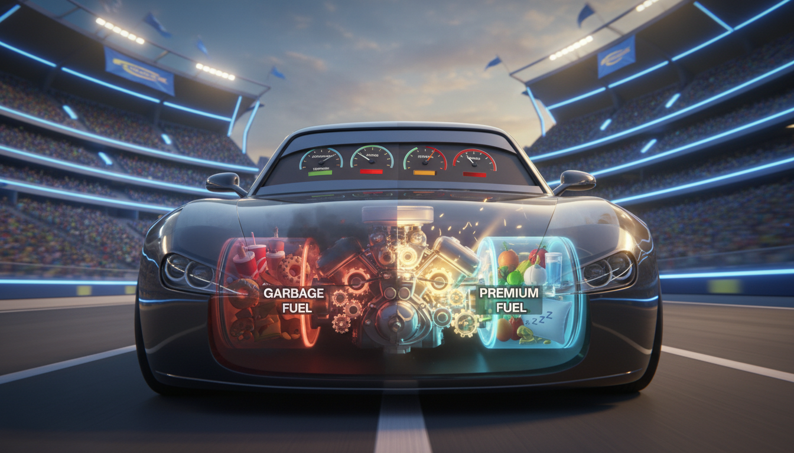

# Chapter 10: Fuel Your Engine

**[🏠 Back to Home](../README.md)** | **[📚 All Chapters](../README.md#-the-chapters)**

---

> [!NOTE]
> **💡 Key Insight**
> **Core Concept**: Your body is the engine that powers everything you want to achieve.
> [!NOTE]
> **💡 Key Insight**
> **The Output**: Consistent energy, razor-sharp focus, and a body built to dominate for the next 70 years.

---

## The 2pm Crash

It's Tuesday. 2:15pm. History class.

Your teacher is talking about the Treaty of Versailles or the Industrial Revolution or something important, but you can't focus. Your brain feels like it's moving through mud. Your eyelids are heavy. All you want to do is put your head down.

But here's the thing—you were fine at 10am. You crushed your math test. You were locked in during English. What changed?

You grab your phone under the desk. Maybe scrolling will wake you up. It doesn't. You reach for your third energy drink of the day. Twenty minutes later, you're buzzing but still can't concentrate. Your leg won't stop bouncing. You feel anxious and exhausted at the same time.

Now it's game day. Different scenario, same problem.

First quarter, you're everywhere. Dominating. Making plays. Feeling unstoppable.

Third quarter? You can barely keep up. Your legs feel like concrete. Your mind is foggy. You're a step behind on every play. Coach is yelling. Your teammates are looking at you like, "What happened?"

What happened is simple: **Your engine ran out of fuel.**

And here's the uncomfortable truth nobody wants to hear: mental toughness doesn't fix an empty tank. Discipline doesn't override biology. You can't think your way through exhaustion or focus your way past hunger.

Your body quit on you. And no amount of "try harder" changes that.

**So here's the real question**: What if the reason you're not performing at your best has nothing to do with talent, work ethic, or mental strength—and everything to do with how you're fueling your engine?

What if you've been trying to win with an engine running on garbage?

---

## Your Body is the Engine

Let's get something straight: your body isn't separate from your goals. It's not this thing you have to deal with while you chase what you want.

Your body IS the vehicle for everything you want to achieve.

Better grades? You need a brain that can focus for hours.
Athletic performance? You need a body that's strong, fast, and doesn't break down.
More energy? You need fuel that actually powers you through the day.
Better mood? You need chemistry that works in your favor, not against you.

Think of it like this: your body is a high-performance engine. A Ferrari engine. A sports car that can do incredible things—if you treat it right.

Give it premium fuel? It runs smooth, powerful, reliable.
Give it garbage fuel? It sputters, breaks down, underperforms.
Skip maintenance? Everything falls apart eventually.
Push it without recovery? The engine burns out.

You wouldn't put Mountain Dew in your gas tank and expect your car to work. But somehow we think we can fuel our bodies with energy drinks, Hot Cheetos, and four hours of sleep—and still perform at our best.

That's not how engines work.

### The Three Fuel Systems

Everything comes down to three systems. Get these right, and you'll have more energy, focus, and physical capacity than 95% of people your age. Ignore them, and you'll always be running on fumes.

**1. Nutrition (What You Put In)**

Food determines everything. Your energy levels. Your ability to concentrate. Your mood. Whether your body builds muscle or breaks it down. Whether you feel like a champion or a zombie at 2pm.

Not all calories are equal. A 300-calorie breakfast of eggs and oatmeal does something completely different in your body than 300 calories of Pop-Tarts and Red Bull.

One fuels you. The other crashes you.

**2. Sleep (When You Recover)**

Sleep isn't downtime. It's when the magic happens. Your brain consolidates everything you learned that day—transferring it from short-term to long-term memory. Your muscles repair and rebuild. Your immune system strengthens. Your emotions regulate.

Skip sleep, and you're not just tired. You're literally blocking your brain from learning and your body from improving.

You can't upgrade your operating system while it's running. You need to shut down, update, and restart. That's sleep.

**3. Movement (How You Maintain)**

Here's the paradox: moving your body doesn't drain energy—it creates it. Regular physical activity builds your engine's capacity. It improves mental health. It increases energy levels even though it feels like it should do the opposite.

Sitting all day makes you tired. Moving makes you powerful.

**These three systems aren't separate**. They compound. Good nutrition improves sleep quality. Quality sleep makes you want to move. Movement helps you sleep better and crave better food.

It's a performance cycle. Feed it, and you level up. Ignore it, and you break down.

### The Empathy Framework

Microsoft CEO Satya Nadella talks about empathy as the ultimate leadership tool. But empathy doesn't just apply to understanding other people. It applies to understanding yourself—specifically, your body.

When Nadella took over Microsoft in 2014, he inherited a toxic culture that glorified overwork and burnout. People were exhausted. Creativity was dead. Innovation had stopped.

His fix? He taught people to have empathy for themselves.

You can't pour from an empty cup. You can't innovate when you're burned out. You can't perform at your best when you're running on fumes.

Sleep, nutrition, and recovery aren't weakness. They're strategic advantages.

**Here's what empathy for your body looks like:**

You recognize that hunger impacts your mood, focus, and decision-making. You're not weak for needing food—you're human.

You acknowledge that your body isn't trying to sabotage you with tiredness. It's giving you data. Listen to it.

You understand that recovery isn't optional. It's when improvement actually happens.

You respect that your body is the platform for everything you want to achieve. Taking care of it isn't selfish—it's smart.

**The opposite of empathy is ignoring the signals:**

Pushing through exhaustion like it's a badge of honor.
Skipping meals because you're "too busy."
Treating your body like the enemy instead of your most valuable teammate.

Elite performers have empathy for their bodies. They fuel intentionally. They sleep strategically. They recover deliberately.

Not because it's easy. Because it works.

### Output Focus: What Are You Building?

Let's reframe this the way we reframe everything in this book.

❌ **Task-focused thinking**: "I need to eat healthy."
✅ **Output-focused thinking**: "I need consistent energy from 7am to 10pm so I can dominate my day."

❌ **Task-focused thinking**: "I should get 8 hours of sleep."
✅ **Output-focused thinking**: "I need to wake up with mental clarity and physical energy so I'm ready to perform."

❌ **Task-focused thinking**: "I have to work out."
✅ **Output-focused thinking**: "I'm building a body that's strong, fast, and doesn't break down when it matters."

See the difference? One feels like a chore. The other feels like power.

You're not "eating healthy" to follow rules. You're fueling an engine that carries you through every challenge, every opportunity, every moment that matters.

You're not "getting sleep" because adults told you to. You're giving your brain and body the time they need to upgrade.

You're not "exercising" to check a box. You're building physical capacity that makes everything in life easier.

**The question isn't**: "Is this food healthy?"

**The question is**: "Will this fuel help me perform at my best for the next four hours?"

That's the output focus. That's how champions think.

---

## The Fuel That Powers Performance

Alright, let's talk about food. Real talk, no BS.

Most nutrition advice is overwhelming, contradictory, and designed to sell you something. Cut carbs. No wait, carbs are fine. Eat six meals a day. No wait, intermittent fasting. Organic everything. Supplements. Cleanses. Detoxes.

Forget all of it.

Here's what actually matters: the fuel you put in your body determines how you feel and perform. That's it. Not complicated. Not mysterious. Just chemistry.

### What Actually Gives You Energy

**Complex carbs** (whole grains, oats, brown rice, sweet potatoes): Slow, sustained energy release. No spike, no crash. Your brain runs on glucose—these provide it steadily.

**Protein** (eggs, chicken, fish, beans, Greek yogurt): Building blocks for everything. Keeps you full. Helps muscles repair and grow. Stabilizes blood sugar so you don't crash.

**Healthy fats** (nuts, avocado, olive oil, salmon): Brain fuel. Sustained energy. Helps absorb vitamins. Makes you feel satisfied, not constantly hungry.

**Water** (just... water): Literally everything in your body needs it. Your brain is 75% water. Even 2% dehydration cuts performance by 20%. Most people are chronically slightly dehydrated and don't even know it.

That's the good stuff. The fuel that makes your engine purr.

### What Steals Your Energy

**Sugar crashes** (candy, soda, most processed snacks): Massive spike in blood sugar. Your body panics, dumps insulin, overcorrects. Now your blood sugar is lower than when you started. You're exhausted, cranky, and craving more sugar. It's a trap.

**Heavy processed foods** (fast food, fried foods, most packaged meals): Your body has to work so hard to digest this stuff that it drains your energy. Ever feel like you need a nap after eating? That's why.

**Energy drinks** (the ones promising you'll feel "limitless"): Temporary spike, brutal crash, dependency cycle. Your body adapts, needs more to feel normal. You're not gaining energy—you're borrowing it from tomorrow and paying interest.

**Skipping meals** (the "I'm too busy to eat" move): Forces your body into survival mode. Metabolism slows. Focus dies. Mood tanks. You think you're being productive, but you're running on empty.

Look, you don't need a nutrition degree. You need to understand the game: some foods fuel you, some drain you.

Choose accordingly.

### The Performance Plate Framework

Here's your simple, practical, no-BS guide to eating for performance. No calorie counting. No meal prep insanity. Just the formula that works.

#### Breakfast: Fuel for Morning Dominance

**The Formula**: Protein + Complex Carb + Fruit

**Examples**:
- Eggs (scrambled, fried, whatever) + oatmeal + berries
- Greek yogurt + granola + banana
- Whole grain toast + peanut butter + apple slices
- Breakfast burrito with eggs, beans, whole wheat tortilla, salsa

**The Output**: Energy and focus from 7am to noon. No mid-morning crash. Brain working at full capacity.

**Why it works**: Protein keeps you full and stabilizes blood sugar. Complex carbs provide sustained energy. Fruit gives you quick-access vitamins and fiber.

#### Lunch: Fuel for Afternoon Performance

**The Formula**: Protein + Veggies + Complex Carb

**Examples**:
- Chicken + brown rice + broccoli
- Turkey sandwich (whole grain bread) + side salad
- Burrito bowl with chicken, rice, beans, lettuce, salsa
- Pasta with meat sauce + side of mixed vegetables

**The Output**: No 2pm energy crash. Sustained focus through afternoon classes or practice. Mental clarity when everyone else is fading.

**Why it works**: Balanced macros mean steady energy. Veggies provide micronutrients that support brain function. Protein prevents the blood sugar rollercoaster.

#### Snacks: Bridge the Gaps

**The Formula**: Protein + Healthy Fat OR Fruit + Nuts

**Examples**:
- Apple + peanut butter
- Trail mix (nuts, dried fruit—watch portions)
- String cheese + whole grain crackers
- Protein bar (real ingredients, not candy in disguise)
- Greek yogurt + handful of almonds

**The Output**: Consistent energy between meals. No desperate vending machine runs. No "I'm so hungry I can't think" moments.

**Why it works**: Combining protein/fat with carbs slows digestion, maintains steady blood sugar, keeps you satisfied.

#### Dinner: Fuel for Recovery

**The Formula**: Protein + Veggies + Moderate Carb

**Examples**:
- Salmon + sweet potato + green beans
- Spaghetti with meat sauce + side salad
- Chicken stir-fry with vegetables and rice
- Tacos with ground beef, beans, lettuce, tomatoes

**The Output**: Muscle repair overnight. Quality sleep. Wake up ready to dominate tomorrow.

**Why it works**: Protein repairs muscles and tissues damaged during the day. Moderate carbs help you sleep. Veggies provide the micronutrients your body needs to recover.

**Coach's Corner:**
> The Performance Plate isn't about restriction. It's about construction. You're not removing "bad" foods—you're adding fuel that makes you unstoppable. Build the foundation first. Everything else is bonus.

### The Hydration Non-Negotiable

Water is your baseline fuel. Not optional. Not something to "remember" to do. Non-negotiable.

Your brain is 75% water. Your muscles are about 75% water. Your blood is mostly water. When you're dehydrated, everything suffers.

**The numbers**: 2% dehydration = 20% performance decrease. That's not a typo. One-fifth of your capability—gone—because you didn't drink enough water.

And here's the kicker: most people are chronically slightly dehydrated and don't even realize it. They think brain fog, fatigue, and headaches are normal. They're not. They're symptoms of an engine running dry.

#### The Simple Hydration System

**Morning** (within 30 minutes of waking): 16oz of water. Your body just went 7-8 hours without water. Rehydrate immediately. Before coffee. Before anything. This alone will change your mornings.

**Throughout the day**: Sip consistently. Don't chug huge amounts all at once. Keep a water bottle with you. Refill it. Sip between classes, during study sessions, while you're doing anything.

**Before activity** (practice, game, workout): 16-20oz about 30 minutes before. You want to start hydrated, not play catch-up.

**During activity**: 7-10oz every 15-20 minutes. If you're sweating, you're losing water. Replace it in real-time.

**After activity**: 16-24oz for recovery. Rehydrate and help your muscles repair.

**The output goal**: Light yellow or clear urine. Consistent energy all day. No afternoon headaches. Better focus. Better mood.

**Simple rule**: If you feel thirsty, you're already dehydrated. Don't wait for thirst. Hydrate proactively.

### What About "Bad" Foods?

Real talk: you don't have to be perfect. You don't have to eat like a professional athlete. Pizza, burgers, ice cream, chips—none of these foods are evil.

The goal isn't perfection. It's performance.

Here's the rule that actually works: **80/20**.

**80% of the time**: Eat for performance. Fuel your engine with the stuff that makes it run smooth. The Performance Plate. Real food. Stuff that powers you through your day.

**20% of the time**: Eat whatever you want. Enjoy the pizza. Get ice cream with friends. Eat the birthday cake. Live your life.

The 80% creates the foundation. The 20% keeps you sane, social, and sustainable.

**The question isn't**: "Is this food healthy?" That's too vague. Too moralistic.

**The question is**: "Will this food help me perform at my best for the next four hours?"

Before a big game, important test, or intense practice? Choose fuel that powers performance.

Friday night hanging with friends? Enjoy yourself. You earned it.

The elite performers aren't the ones who never eat pizza. They're the ones who understand context. They fuel strategically when it matters. They relax intentionally when it doesn't.

That's sustainable. That's smart. That's the long game.

---

## The Recovery That Changes Everything

Let's talk about the most underrated performance enhancer on the planet.

Not a supplement. Not a workout program. Not a productivity hack.

Sleep.

And no, I'm not about to bore you with "sleep is important" platitudes. I'm about to show you why sleep is the ultimate competitive advantage—and why the people crushing it in every area of life treat it like the non-negotiable it is.

### The Sleep Science That Actually Matters

Here's what happens when you sleep. Not metaphorically. Literally. In your brain and body.

**Memory consolidation**: Everything you learned today—that chemistry formula, that basketball play, that conversation with your friend—lives in short-term storage. Sleep transfers it to long-term memory. No sleep = you can study for hours and still won't remember it tomorrow.

**Physical repair**: Your muscles don't grow in the gym. They grow during sleep. Tissues heal. Immune system strengthens. Hormones that repair your body get released. Sleep is when your body upgrades.

**Emotional regulation**: Your brain processes emotions while you sleep. It reduces stress reactivity. It helps you handle difficult situations without losing it. Ever notice everything feels worse when you're tired? That's not coincidental.

**Cognitive reset**: Your working memory clears out. Attention restores. Decision-making improves. Your brain is like a computer—it needs to close background apps and clear the cache. That's sleep.

Now here's what happens when you don't sleep enough:

Learning capacity drops by 40%. You literally can't absorb information as effectively. Studying while sleep-deprived is like pouring water into a cup with holes in it.

Reaction time slows dramatically. Athletic performance tanks. You're getting beat to plays you'd normally make.

Emotional control disappears. Everything feels harder. You snap at people. Small problems feel overwhelming.

Immune system weakens. You get sick more often. Recovery takes longer.

Focus and attention crater. Can't concentrate in class. Can't lock in during games. Your brain is running on 30% battery.

Sleep isn't a luxury. It's a performance multiplier.

### The Sleep Reality Check

**How much sleep you actually need:**

Ages 13-18: 8-10 hours. Not a suggestion. A biological requirement.
Ages 18+: 7-9 hours. Still not negotiable if you want peak performance.

"But I function fine on 6 hours."

No. You've adapted to underperforming. You don't know what optimal feels like anymore.

Studies show people can't accurately judge their own sleep deprivation. You think you're functioning fine because you've forgotten what great feels like. You've normalized running on fumes.

And here's the competitive reality: you're not competing against your tired self. You're competing against people who ARE getting enough sleep. Who's going to win?

**The person running at 100% capacity or the person running at 60%?**

It's not even close.

### The Sleep System

Forget everything complicated. Here's the system that actually works.

#### 1. Consistent Sleep Schedule

Same bedtime. Same wake time. Every day. Yes, even weekends. I know, it sucks. Do it anyway.

Your body runs on circadian rhythm—an internal clock that regulates when you feel sleepy and when you feel alert. When you go to bed at midnight on weekdays and 3am on weekends, you're constantly jet-lagging yourself.

Consistency trains your body. After a few weeks, you'll start getting tired at bedtime naturally. You'll wake up without an alarm. That's your body running on rhythm instead of fighting it.

**The output**: Wake up naturally with energy. Fall asleep quickly. Actually feel rested.

#### 2. The Wind-Down Protocol (60 Minutes Before Bed)

Your body can't go from 100mph to sleep instantly. You need a runway.

**Dim the lights**: Bright light signals your brain it's daytime. Dim light signals melatonin production—the hormone that makes you sleepy.

**No screens**: Blue light from phones, tablets, computers, TVs destroys melatonin production. It tells your brain "stay awake." You're literally fighting your body's sleep system while trying to sleep.

**Do this instead**: Read (actual book, not screen). Stretch. Journal. Light conversation. Shower. Anything calm and non-stimulating.

**Lower the temperature**: Cool room = better sleep. Somewhere between 65-68°F is optimal. Your body temperature needs to drop to fall asleep.

**The output**: Fall asleep within 15 minutes. Not lying there for an hour scrolling and stressing.

#### 3. The Sleep Environment

Your bedroom is your recovery chamber. Treat it like one.

**Dark**: Blackout curtains or a sleep mask. Even small amounts of light disrupt sleep quality.

**Cool**: 65-68°F. Use a fan if needed. Kick off blankets if you're too warm.

**Quiet**: Earplugs or white noise machine if your environment is loud. Silence is ideal, but consistent sound is better than random noise.

**Comfortable**: Good pillow. Clean sheets. These seem small but they matter.

**The output**: Stay asleep through the night. Wake up in the same position you fell asleep in. Deep, restorative rest.

#### 4. What to Avoid

**Caffeine after 2pm**: Caffeine stays in your system 6-8 hours. That afternoon coffee is still in your blood when you're trying to sleep. Half-life of caffeine means even decaf late in the day can mess you up.

**Heavy meals 3 hours before bed**: Your body's trying to digest while also trying to sleep. Pick one. Big meals before bed = poor sleep quality.

**Intense exercise 3 hours before bed**: Raises your body temperature and adrenaline. Both fight sleep. Morning or afternoon workouts are ideal. Light stretching before bed is fine.

**Phone/screen time 60 minutes before bed**: Destroys melatonin. Stimulates your brain. Shows you content designed to keep you scrolling. It's a sleep killer.

Put the phone in another room. Seriously. Not on airplane mode. Not face-down on your nightstand. Different room. You'll sleep better and wake up better.

**Coach's Corner:**
> The athletes getting recruited? The students getting scholarships? The creators building massive followings? They're not superhuman. They're well-rested. They're performing at their actual capacity while everyone else is fighting exhaustion. Sleep is the cheat code hiding in plain sight.

### The Nap Strategy (For Real)

Strategic napping is a weapon if you use it right. Most people nap wrong and wake up feeling worse.

#### Power Nap (15-20 minutes)

**Best for**: Mid-afternoon energy boost.
**Sweet spot**: Between 1-3pm.
**The rule**: Set an alarm. Don't go longer or you'll enter deep sleep and wake up groggy.
**The output**: 2-3 hours of restored alertness. Mental clarity. Better focus.

This is your afternoon reset button. Twenty minutes can save the rest of your day.

#### Recovery Nap (60-90 minutes)

**Best for**: After a terrible night's sleep or brutal workout.
**Why 60-90 minutes**: That's a full sleep cycle. Includes REM sleep. Lets you wake up at a natural transition point instead of in the middle of deep sleep.
**The output**: Significant physical and mental recovery. Feels like you got several hours of night sleep.

**Not recommended**: 30-45 minute naps. You'll wake up during deep sleep and feel like a zombie. Either go short (20 min) or long (90 min). Nothing in between.

Elite performers nap strategically. LeBron James naps every day. Cristiano Ronaldo takes multiple 90-minute naps. They're not lazy. They're smart. Recovery is when improvement happens.

---

## Movement as Fuel

Here's a paradox that seems wrong but is absolutely true:

Moving your body doesn't drain energy. It creates energy.

Sounds backwards, right? If you're tired, shouldn't you rest?

Not exactly.

### The Movement Paradox

**What seems true**:
"I'm too tired to work out."
"Exercise will make me more exhausted."
"I need to save energy for important stuff."

**What's actually true**:
Regular movement increases your overall energy levels—not decreases them.
Exercise improves sleep quality, which means more energy tomorrow.
Physical activity reduces stress and anxiety, which drain more energy than any workout.
Movement literally creates more mitochondria in your cells—the power plants that produce energy.

You're not spending energy. You're building your engine's capacity to produce it.

### The Three Types of Movement

You don't need to become a gym rat or a marathon runner. You just need to understand that your body was designed to move—and when you don't, everything suffers.

#### 1. Daily Movement (The Non-Negotiable Baseline)

30-60 minutes of walking per day. Not all at once. Throughout your day.

Take the stairs. Walk to places instead of getting rides. Move during breaks between classes. Walk while you're on the phone.

This isn't "exercise." This is just being a human who moves instead of sitting for 16 hours straight.

**The output**: Better mood. Sustained energy. Clearer thinking. Reduced stress. Better sleep.

**Why it works**: Movement increases blood flow to your brain. It regulates stress hormones. It keeps your metabolism active. It prevents the physical breakdown that comes from constant sitting.

#### 2. Strength Training (2-3x per week)

Building muscle, bone density, physical resilience.

Doesn't have to be a gym. Bodyweight exercises work: push-ups, squats, planks, pull-ups. Or lift weights if you have access. Or use resistance bands. Or do CrossFit. Or rock climbing. Whatever builds strength.

30-45 minutes per session. Two or three times a week.

**The output**: A stronger body. Better posture. Injury prevention. Increased metabolism. Confidence that comes from being physically capable.

**Why it works**: Your body adapts to stress. When you stress your muscles, they rebuild stronger. You become more physically resilient. That translates to everything—sports, daily activities, long-term health.

#### 3. Cardio/Sport (3-4x per week)

Whatever you enjoy: running, basketball, swimming, soccer, biking, dancing, martial arts.

30-60 minutes per session. Get your heart rate up. Breathe hard. Push yourself.

**The output**: Increased stamina. Stress relief. Better cardiovascular health. Athletic performance. Mental health improvement.

**Why it works**: Cardio strengthens your heart and lungs. It increases your VO2 max—your body's ability to use oxygen. It floods your brain with endorphins and BDNF (brain-derived neurotrophic factor), which literally helps your brain grow and learn better.

### The Minimum Effective Dose

Look, if you do nothing else, do this:

**20 minutes of movement per day.**

That's it. Can be a walk. A bike ride. Pickup basketball. A home workout. A YouTube exercise video. Doesn't matter what. Just move.

Consistency matters more than intensity. Twenty minutes every single day beats one brutal two-hour workout per week.

**The output**: 80% of the benefits with minimal time investment. Better mood, more energy, improved sleep, reduced stress, clearer thinking.

This is the floor. The baseline. The minimum to keep your engine from breaking down.

### Movement for Mental Health

Here's something the research is crystal clear on:

20 minutes of exercise is as effective as antidepressants for treating mild to moderate depression. Regular movement significantly reduces anxiety. Physical activity improves mood, resilience, and stress response.

Translation: Moving your body makes your brain work better.

Exercise increases BDNF—brain-derived neurotrophic factor. It's literally a growth hormone for your brain. More BDNF = better learning, better memory, better cognitive function.

You're not just building a stronger body. You're building a better brain.

**The uncomfortable truth**: Sitting around when you're stressed or anxious makes it worse. Moving breaks the cycle. It burns off stress hormones. It produces chemicals that make you feel better.

Your brain is begging you to move. Listen to it.

### Sustainable Performance: The Nadella Principle

Satya Nadella's philosophy when he took over Microsoft: long-term health beats short-term hustle.

He saw a company full of burned-out people pushing themselves to exhaustion. Innovation had stopped. Creativity was dead. People were physically falling apart.

His fix? Build systems that support human needs instead of ignoring them.

You can't lead if you're burned out. You can't innovate if you're exhausted. You can't perform at your best if you're running on empty.

Physical well-being equals mental well-being equals better performance. It's not three separate things. It's one system.

**Apply this to your life:**

You're not building a body for one season. You're building a body for the next 70+ years.

Sustainable beats sprinting until you break. Consistency beats intensity that you can't maintain.

Movement and recovery compound over time. The habits you build now echo for decades.

**Empathy for your body means**:
Recognizing it needs to move—not as punishment, but as maintenance.
Understanding that rest days are part of the plan, not failures.
Accepting that sustainable performance requires balance, not constant grinding.

You're playing the long game. Build accordingly.

---

## The Recovery Room Mindset

Let's revisit the core principle of this entire book:

**"The sooner you learn to be comfortable with being uncomfortable, the sooner you will win in life."**

Here's how it applies to fueling your engine:

Physical discomfort = growth. But only if you recover.

**The pattern**:
- Hard workout → muscles tear → they rebuild stronger (IF you recover properly)
- Challenging practice → neural pathways form → skills improve (IF you sleep)
- Mental effort → brain adapts → capacity increases (IF you rest)

**Without recovery**: Stress + more stress = breakdown, not breakthrough.

### The Performance Cycle

Every elite performer understands this cycle:

**1. Stress** (workout, practice, studying, competition)
**2. Recovery** (sleep, nutrition, rest, light movement)
**3. Adaptation** (body and brain get stronger, faster, smarter)
**4. Repeat** (at a slightly higher level)

If you skip step 2, there's no adaptation. You're just accumulating damage. You're breaking down instead of building up.

Recovery isn't weakness. It's strategy.

### Active Recovery Strategies

Active recovery doesn't mean doing nothing. It means intelligent rest.

#### Low-Intensity Movement

Light walk, easy bike ride, swimming, yoga.

**Why it works**: Promotes blood flow, which speeds healing. Reduces muscle soreness. Maintains mobility without adding stress.

You're moving blood and nutrients to tired muscles without breaking them down further.

#### Stretching and Mobility Work

10-15 minutes daily. Can be done while watching TV or listening to music.

**Why it works**: Prevents injury. Improves performance. Reduces tightness and soreness. Keeps your body functional.

Tight muscles are weak muscles. Inflexible joints are injury waiting to happen. Mobility work is insurance.

#### Mental Recovery

Time without performance pressure. Hobbies. Socializing. Nature time.

Not more screen time. That's not recovery—that's just different stimulation.

Your brain needs actual rest. Time when it's not trying to achieve, perform, or optimize anything. Just... being.

### The Weekly Recovery Plan

You can't go 100% seven days a week. Your body doesn't work that way. Build recovery into the plan from the start.

**Sample Week Structure:**

**Monday-Tuesday**: High intensity (hard practices, heavy studying, max effort)
**Wednesday**: Medium intensity + extra focus on nutrition and sleep
**Thursday-Friday**: High intensity again
**Saturday**: Active recovery day (light movement, catch up on sleep, mental rest)
**Sunday**: Mix of recovery and preparation for next week

The principle: Strategic recovery makes high intensity sustainable. You're not being lazy. You're being smart.

### Warning Signs You Need More Recovery

Your body gives you signals. Most people ignore them. Don't.

**Physical signals**:
- Constant soreness that doesn't improve
- Getting sick frequently (immune system is compromised)
- Injuries that won't heal
- Performance declining despite training hard

**Mental signals**:
- Irritability and mood swings
- Can't focus or concentrate
- Loss of motivation
- Everything feels harder than it should

If you're experiencing these, you don't need more effort. You need more recovery.

Rest isn't giving up. It's regrouping. Champions know the difference.

**Coach's Corner:**
> Elite performers aren't the ones who never rest. They're the ones who rest strategically so they can push harder when it counts. Recovery is part of the training plan, not an interruption to it.

---

## Building Your Fuel System

Theory is useless without practice. Here's your step-by-step system to fuel your engine properly.

### The 4-Week Fuel Plan

#### Week 1: The Foundation (Awareness)

**Track**: What you're eating, when, and how you feel after.
**Goal**: Awareness, not perfection. You can't improve what you don't measure.
**Add**: 8oz more water per day than you currently drink. Just add it. Don't replace anything yet.

**The output**: Understanding your baseline patterns. Where are you actually starting from?

Use your phone notes or a journal. Write down:
- What you ate and when
- Energy levels (1-10 scale) at different times of day
- How you felt after eating (energized, tired, focused, foggy)
- Sleep quality and duration
- Movement/activity

No judgment. Just data.

#### Week 2: The Performance Plate

**Implement**: One solid performance meal per day.
**Focus on**: Breakfast. It sets up your entire day.
**Add**: Protein + complex carb + fruit or veggie.

**Examples you can actually make**:
- Scrambled eggs + oatmeal + berries (10 minutes)
- Greek yogurt + granola + banana (5 minutes)
- Whole grain toast + peanut butter + apple slices (5 minutes)

**The output**: More consistent morning energy. No mid-morning crash. Better focus in first few hours of your day.

Keep tracking. Add this one change. Nothing else yet.

#### Week 3: The Sleep System

**Set**: Consistent bedtime. Same time every night, even weekends.
**Create**: Wind-down routine 60 minutes before bed.
**Remove**: Screens from bedroom. Phone goes in different room.

**Sample wind-down routine**:
- 9:00pm - Dim lights in room, no more screens
- 9:00-9:30pm - Shower, brush teeth, prep for tomorrow
- 9:30-10:00pm - Read, stretch, journal, or quiet conversation
- 10:00pm - Lights out

**The output**: Actually feeling rested when you wake up. Falling asleep faster. Better energy throughout the day.

#### Week 4: The Movement Habit

**Add**: 20 minutes of daily movement. Non-negotiable. Every single day.
**Track**: How movement affects your energy and mood.

**Options** (pick what you'll actually do):
- Morning walk before school
- Bike ride after school
- Pickup basketball with friends
- Home workout (YouTube has thousands)
- After-dinner walk with family
- Sports practice (if you're already doing this, add a second activity on off days)

**The output**: Sustained energy throughout day. Better mood. Better sleep quality. Physical capacity increasing.

### The Daily Fuel Checklist

Copy this. Put it on your phone. Check off items daily.

#### Morning:
- [ ] 16oz water within 30 minutes of waking
- [ ] Performance breakfast (protein + carb + fruit/veggie)
- [ ] 15-20 minutes of movement (even just a walk)

#### Throughout Day:
- [ ] Sipping water consistently (aim for clear or light yellow urine)
- [ ] Performance lunch (protein + veggies + carb)
- [ ] Healthy snacks between meals if needed
- [ ] No caffeine after 2pm

#### Evening:
- [ ] Performance dinner (protein + veggies + moderate carb)
- [ ] Light movement (walk after dinner if possible)
- [ ] 60-minute wind-down routine starting at same time
- [ ] In bed 8-9 hours before you need to wake up

**Output goal**: Consistent energy. Clear focus. Quality sleep. Wake up ready to dominate.

### The 80/20 Application

This is how you make it sustainable for life.

**80% of the time**:
- Performance-focused nutrition
- Consistent sleep schedule
- Regular movement
- Strategic recovery

**20% of the time**:
- Eat the pizza with friends
- Stay up late on special occasions
- Skip the workout when life happens
- Enjoy yourself

The 80% creates the foundation. The 20% keeps you sane, social, and human.

You're not a robot. You're not a professional athlete with a personal chef and trainer. You're a student building a system you can maintain for decades.

Perfection isn't the goal. Consistency is.

### The Empathy Framework (Nadella's Approach)

Every day, ask yourself with empathy:

**"What does my body actually need right now?"**
Not what you feel like. What you need. There's a difference.

**"Am I fueling for performance or just out of habit/boredom?"**
Are you eating because you're hungry and need energy? Or because it's there?

**"Am I getting enough sleep to learn and grow?"**
Not "can I function." Can I perform at my best?

**"Am I moving my body enough to feel good?"**
Physical and mental health are connected. Are you taking care of both?

**This is empathy**: Caring about future you, not just present you.

**This is NOT empathy**: "What do I feel like eating right now?" / "What's the minimum sleep I can get away with?" / "Can I skip the workout today?"

Empathy means treating your body like your most important teammate. Because it is.

---

## The Long-Term Engine

The habits you build now determine what your body is capable of for the next 70+ years.

Let that sink in.

You're not fueling for this season. You're not even fueling for this year. You're building the engine that carries you through every challenge, every opportunity, every moment that matters for the rest of your life.

### The Compound Effect of Fuel

**30 days of consistent fueling**:
- Energy levels stabilize
- Focus and concentration improve
- Athletic performance increases
- Mood and resilience strengthen
- Sleep quality improves

You'll feel the difference. People around you will notice.

**1 year of consistent fueling**:
- Body composition changes (stronger, leaner, more capable)
- Athletic capacity dramatically increases
- Cognitive performance at peak (better grades, better learning)
- Immune system stronger (sick less often, recover faster)
- Mental health significantly better

You'll look back and barely recognize the person you were.

**10 years of consistent fueling**:
- A body that feels decades younger than your peers
- Energy that doesn't decline with age
- Cognitive function that stays sharp when others' fades
- Physical capability that enables everything you want to do
- Quality of life that's incomparable

You'll be 25, 30, 35 and performing like an elite athlete while your peers are already breaking down. That's the long game.

### The Nadella Long-Term Perspective

Satya Nadella talks about "playing the infinite game." No finish line. Just continuous improvement.

That's how you build a body for life.

Not crash diets. Not extreme programs that burn you out. Not six-week challenges.

**Sustainable habits that compound.**
**Empathy for your body's real needs.**
**Long-term thinking that pays dividends for decades.**

Your body at 25, 35, 45, 65 will be exactly what you built with your daily choices. Every Performance Plate. Every night of good sleep. Every day you moved your body instead of staying sedentary.

The habits you create now echo forever.

Taking care of your engine isn't optional if you want to keep driving.

### The Weekly Challenge

This week, commit to these five things:

**1. Track your current fuel patterns** (food, sleep, movement)
Write it down. Be honest. No judgment—just awareness.

**2. Implement ONE performance meal per day**
Start with breakfast. Protein + carb + fruit/veggie.

**3. Add 30oz more water than you currently drink**
Fill up a water bottle. Refill it. Finish it again.

**4. Go to bed 30 minutes earlier than usual**
Set an alarm for your bedtime, not just your wake-up.

**5. Add 15 minutes of movement daily**
Walk, workout, play a sport—just move.

**Journal these questions**:
- How does your energy change?
- How does your focus change?
- How does your mood change?
- What becomes easier with better fuel?

One week. Five commitments. Track the results.

You'll be shocked at the difference.

---

## Post-Game Review

### Key Takeaways

**1. Your body is the engine for everything you want to achieve**. Premium fuel = peak performance. Garbage fuel = you're done before you start. Choose wisely.

**2. The Performance Plate isn't about restriction—it's about construction**. Protein + carbs + veggies + hydration. 80% fuel for performance, 20% enjoy your life.

**3. Sleep is the ultimate competitive advantage**. 8-10 hours for teens. Consistent schedule. Wind-down routine. No screens 60 minutes before bed. Recovery is when improvement happens.

**4. Movement creates energy, it doesn't drain it**. 20 minutes daily minimum. Strength training 2-3x week. Cardio/sport 3-4x week. Your body was designed to move.

**5. Recovery is strategy, not weakness**. The cycle is: stress → recovery → adaptation → repeat. Skip recovery and you just accumulate damage.

**6. Empathy for your body means respecting its needs**. You can't perform at your best when you're running on empty. Taking care of your engine isn't selfish—it's smart.

**7. You're playing the long game**. The habits you build now determine your capacity for the next 70+ years. Sustainable beats extreme. Consistency beats intensity.

### Reflection Questions

1. **What's one fuel habit you know is holding you back?** (Be honest. Is it skipping breakfast? Staying up until 2am? Never drinking water?)

2. **What output do you want to achieve in the next 30 days that requires better fuel?** (Better grades? Athletic performance? More energy? Improved mood?)

3. **If you treated your body like the high-performance engine it is, what would you change immediately?** (What's the one thing you know you should do but aren't doing?)

4. **How does your energy, focus, and mood change when you're well-fueled vs. running on empty?** (Think about specific examples. What patterns do you notice?)

5. **What's your biggest obstacle to fueling properly—and what's one small step you can take this week to overcome it?** (Not "I don't have time." What's really stopping you? And what's the smallest possible improvement you can make?)

### The Output Mindset

Remember: Don't think about "eating healthy" or "getting enough sleep" or "working out."

Think about:
- **Having consistent energy to dominate every day**
- **Building mental clarity that makes everything easier**
- **Creating a body that's strong, fast, and doesn't break down**
- **Developing the physical and mental capacity to achieve everything you want**

Focus on who you're becoming, not just what you're doing.

You're not checking boxes. You're building an engine.

---

## Closing Power Move

Your body isn't separate from your dreams. It's the vehicle for achieving them.

You can have all the talent in the world.
You can have all the discipline in the world.
You can have all the strategy in the world.

But if your engine is running on empty, you're not going anywhere.

Elite performers know this. They fuel intentionally. They sleep strategically. They recover deliberately.

Not because it's easy.
Not because it's fun.

Because it works.

And because the body you build today is the body that carries you through every challenge, every opportunity, every moment that matters for the next 70 years.

**The uncomfortable truth**: Taking care of your body requires discipline. It means making choices your friends won't make. It means going to bed when everyone else is still up. It means choosing water over energy drinks. It means moving when you'd rather sit.

That's the discomfort. That's the growth.

The sooner you learn to be comfortable with being uncomfortable—with choosing what you need over what you want—the sooner you'll win.

Because while everyone else is running their engines into the ground, you'll be operating at peak capacity.

While they're exhausted, you'll be energized.
While they're foggy, you'll be sharp.
While they're breaking down, you'll be getting stronger.

That's not luck. That's fuel.

**Fuel your engine like your future depends on it.**

**Because it does.**

---

**Next Level**: You've learned to fuel your engine. But what about the inevitable injuries, setbacks, and moments when everything feels like it's falling apart? Next up: how to build a recovery mindset that turns obstacles into comebacks. (Chapter 11: The Recovery Room)

---

**Your Action Items This Week**:

1. **Track your current fuel patterns for 3 days** - Food, water, sleep, movement. Just awareness.

2. **Implement one Performance Plate meal daily** - Start with breakfast. Protein + carb + fruit/veggie.

3. **Add 30oz of water per day** - Carry a water bottle. Refill it. Finish it.

4. **Set a consistent bedtime and create your 60-minute wind-down routine** - Same time every night. No screens.

5. **Add 15-20 minutes of movement daily** - Walk, workout, sport. Anything. Just move.

6. **Journal: How does better fuel change your performance?** - Energy, focus, mood, physical capability. Track the difference.

One week. Six commitments. Your engine will thank you.

---

[⬅️ Previous: Chapter 9 - Morning Warm-Up](chapter_09_morning_warm_up.md) | [📚 All Chapters](../README.md#-the-chapters) | [Next: Chapter 11 - The Recovery Room ➡️](chapter_11_the_recovery_room.md)

