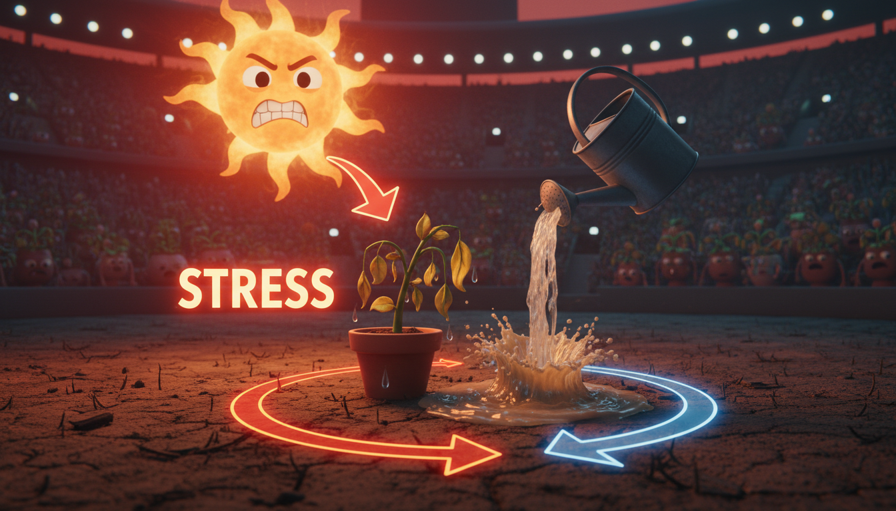

# Chapter 11: The Recovery Room

**[🏠 Back to Home](../README.md)** | **[📚 All Chapters](../README.md#-the-chapters)**

---

> [!NOTE]
> **💡 Key Insight**
> **Core Concept**: Elite athletes don't train 24/7 - they train hard, then recover harder. Rest isn't the opposite of work. It's what makes the work actually work.
> **The Output**: Perform at your highest level consistently by mastering recovery as a skill.

---

## The Collapse

Sarah had the perfect resume.

Varsity soccer. Student council vice president. Straight A's in three AP classes. Volunteer coordinator at the local animal shelter. Club team on weekends. SAT prep on Tuesday and Thursday nights.

Her Instagram showed the hustle. 5am workouts. Late-night study sessions with #noexcuses. Every post was about the grind, the push, the work.

Everyone thought she was crushing it.

Then came the Tuesday morning she couldn't get out of bed.

Not "didn't want to." Couldn't. Her body just... quit on her.

The doctor called it "complete physical and mental exhaustion." Sarah's mom called it burnout. Sarah called it failure.

She'd been running on empty for six months. Her immune system crashed. She'd gotten sick four times in three months. Her grades started slipping despite studying more. Her coach noticed her performance declining even though she was training harder than anyone else.

The doctor said something that stopped her cold: "Your body treated rest like weakness. So it forced you to rest by shutting everything down."

Two weeks in bed. Six weeks to feel normal again. An entire season lost.

Here's what nobody told Sarah: recovery isn't weakness. It's when champions are built.

The difference between athletes who burn out sophomore year and athletes who go pro isn't talent. It's not work ethic. It's understanding that rest is part of training, not a break from it.

Let's talk about the most underrated performance enhancer in existence: strategic recovery.

---

## The Burnout Reality

Let's get real about what burnout actually is.

It's not just "being tired." It's not "having a bad week." It's your body and mind systematically shutting down because you've been running them into the ground.

Your phone battery dies when you drain it without charging. Your body does the same thing. Except instead of going to 0%, it forces a shutdown. And the recovery time is way longer than plugging in for an hour.

### What Burnout Actually Looks Like

**Physical burnout:**
- You're exhausted no matter how much you sleep
- You get sick all the time (your immune system basically rage-quits)
- Injuries that won't heal or keep coming back
- Your performance tanks even though you're working harder
- Headaches, stomach problems, constant muscle tension

**Mental burnout:**
- You can't focus on anything, even stuff you used to love
- Your motivation just... disappears
- Everything feels pointless (that's your brain waving a white flag)
- Making even tiny decisions feels impossible
- Anxiety and depression symptoms show up

**Emotional burnout:**
- You're irritable with everyone
- The activities you loved now feel like obligations
- You feel detached and numb
- "What's the point?" becomes your default response
- You've got nothing left to give anyone, including yourself

Sound dramatic? It is. Because burnout is serious.

### The Trap Nobody Warns You About

Here's how it happens:

You work hard. You see results. That feels good.

So you work even harder. More results. Even better.

You start cutting "unnecessary" stuff. Rest days. Fun activities. Sleep. Social time.

Short term? You're still performing. Maybe even better.

Medium term? Your performance plateaus. You're working more but not seeing the same gains.

Long term? Complete breakdown.

**The cruel irony**: The harder you push without recovery, the worse you perform. You're working more to achieve less. It's like trying to drive a car out of gas by pressing the pedal harder. Doesn't matter how hard you press. The tank is empty.

### The Research Reality

**Overtraining syndrome in athletes** can take six months to two years to fully recover from. Six months to two years. Some athletes never get back to their previous level. It's career-ending for people who don't recognize it early.

**Academic burnout** works the same way. Students who study longer hours without proper recovery actually perform worse. Their grades drop. Their memory gets fuzzy. Information doesn't stick. Some drop out not because they can't do the work, but because they burned out trying.

### The Output Reframe

Here's where we flip the script.

Don't think: "I should take a break."

That sounds passive. Guilty. Weak.

Think: "I'm strategically recovering to perform at higher levels consistently."

That's active. Intentional. Performance-focused.

Recovery isn't what you do when you're too weak to work. Recovery is what enables you to work at elite levels.

**Coach's Corner:**
> Your body doesn't get stronger during the workout. It gets stronger during recovery after the workout. Training breaks down muscle. Recovery rebuilds it stronger. No recovery means no growth - just breakdown. This applies to your brain too.

---

## How Growth Actually Happens

You need to understand something that changes everything: you don't actually improve during the work. You improve during recovery.

**You don't get stronger during the workout. You get stronger during recovery.**

**You don't learn during the study session. You learn when your brain consolidates the information during sleep.**

**You don't develop skills during practice alone. You develop them when your nervous system adapts during downtime.**

### The Athletic Truth

When you lift weights, you're literally tearing muscle fibers. The workout creates tiny damage.

During recovery - sleep, rest days, proper nutrition - your body repairs that damage. And it doesn't just repair it to the same level. It rebuilds it stronger.

That's adaptation.

No recovery? No adaptation. Just more damage. Eventually, injury.

### The Academic Parallel

When you study, you're exposing your brain to new information. That creates opportunity for learning.

But the actual learning - the part where information moves from short-term to long-term memory - happens during sleep. Your brain literally consolidates memories while you sleep.

Cramming without sleep? Poor retention. You might pass the test but forget everything by next week.

Spaced practice plus quality sleep? Strong retention. The information actually sticks.

### The Recovery-Performance Cycle

**The winning pattern:**
1. **Stress** (training, practice, hard work)
2. **Recovery** (rest, sleep, downtime)
3. **Adaptation** (body and mind get stronger)
4. **Higher performance capacity**
5. **Repeat with higher intensity**

That's how you actually get better. It's a cycle. Leave out recovery and the cycle breaks.

**The losing pattern:**
1. **Stress** (training, practice, hard work)
2. **More stress** (no recovery, just more work)
3. **Even more stress** (push through the fatigue)
4. **Breakdown** (injury, burnout, collapse)
5. **Forced recovery** (but now you're behind and broken)

Which pattern are you in?

### Sleep: The Ultimate Performance Enhancer

Let's talk about the most powerful performance tool you have: sleep.

**What sleep actually does:**
- Consolidates memory (this is literally when learning happens)
- Repairs muscle tissue
- Regulates hormones
- Clears toxins from your brain
- Processes emotions
- Strengthens your immune system

Sleep isn't downtime. Sleep is when your body and brain do their most important work.

**What happens when you don't get enough sleep:**
- Your reaction time decreases (research shows it's equivalent to being drunk)
- Your decision-making ability crashes
- You can't regulate emotions (everything feels overwhelming)
- Injury risk increases dramatically
- You get sick more often
- Your performance drops 20-30% across every single metric

**The high-performer reality:**
- LeBron James gets 12 hours of sleep per night during season
- Jeff Bezos prioritizes 8 hours because he makes better decisions
- Elite military operators treat sleep as part of mission prep, not optional
- Top students who get consistent sleep have higher GPAs than students who pull all-nighters

The best in the world prioritize sleep. That's not a coincidence. That's strategy.

### The Uncomfortable Truth Applied

Remember our core principle? "The sooner you learn to be comfortable with being uncomfortable, the sooner you will win in life."

Here's the uncomfortable part about recovery: it requires being comfortable with the discomfort of feeling like you "should" be working.

You'll see other people posting their grind sessions. You'll feel guilty for resting. You'll worry you're falling behind.

That discomfort? That's growth. You're learning that rest is work. You're training yourself to think long-term instead of short-term. You're building the mental strength to make the right choice even when it doesn't feel productive.

Elite performers have learned to be comfortable with the discomfort of rest. They know it's what keeps them elite.

---

## The Netflix Approach to Sustainable Performance

Reed Hastings built Netflix into one of the most successful companies in the world. But here's what's interesting: Netflix culture isn't about hustle 24/7. It's about sustainable high performance.

Hastings figured out something most people miss: burnout helps no one. Not you, not your team, not your mission.

### The Netflix Culture Philosophy

Hastings created policies that seem radical but are actually just smart:

**"We're a team, not a family."**

Translation: High standards, but you don't sacrifice your life. We want you performing at your best, which requires recovery.

**"Unlimited vacation - and we actually want you to use it."**

Most companies with unlimited vacation see people take less time off. Netflix actively encourages it. Why? Because rested people perform better.

**"We don't track hours. We track results."**

They don't care if you worked 60 hours this week. They care about what you accomplished. This removes the incentive to just look busy and rewards actual output.

**"No hero culture."**

They don't celebrate people who work all night. They celebrate people who produce excellent results sustainably.

### Why This Approach Wins

Think about it like this:

**Short-term hustle culture:**
- Year 1: High output (people are burning their energy reserves)
- Year 2: Declining performance (reserves depleted)
- Year 3: Turnover, burnout, mediocre work
- Result: Inconsistent results, high cost to replace burned-out people

**Sustainable performance culture:**
- Year 1: Strong output (people working at a sustainable pace)
- Year 2: Consistent high output (people are recovered and sharp)
- Year 3: Even better output (skills compounded, no burnout)
- Result: Sustained excellence, people stay and improve, culture of innovation

Which one actually wins over time?

### The Hastings Decision-Making Framework

When deciding whether to push harder or recover, most people ask the wrong question.

**Bad question**: "Can I physically do more work right now?"

The answer is almost always yes. Until you collapse. Then the answer is no, but it's too late.

**Good question**: "Will doing more work right now help me perform better over the next three months?"

See the difference? The second question forces long-term thinking.

**Academic version:**
- Don't ask: "Can I study for six more hours tonight?"
- Ask: "Will studying six more hours tonight help me perform better on the test and over the next three months?"
- Answer: No. You need sleep for memory consolidation and long-term brain function.

**Athletic version:**
- Don't ask: "Can I practice for two more hours?"
- Ask: "Will two more hours of exhausted practice help me perform better in the next game and throughout the season?"
- Answer: No. Sloppy practice builds bad habits. Rest and come back sharp.

### The Culture You're Creating

Hastings understood something that applies to your life right now:

You're not just building your own habits. You're creating a culture.

**If you glorify burnout:**
- You'll burn out
- Your friends will burn out trying to keep up
- You'll normalize unsustainable habits
- You'll crash (it's not if, it's when)
- You'll teach people that rest is weakness

**If you model sustainable performance:**
- You'll perform consistently at high levels
- Your friends will learn healthy patterns from you
- You'll build habits that last decades
- You'll actually achieve your long-term goals
- You'll show people that elite performance includes rest

Which culture do you want to create?

**Coach's Corner:**
> Elite performers optimize for years, not weeks. The person who can maintain 80% effort with proper recovery will outperform the person who gives 100% until they burn out. Consistency beats intensity when intensity isn't sustainable.

---

## The Recovery Protocol System

Recovery isn't just "take a break when you feel like it." It's a system. A skill you can learn and practice.

Here's your framework for building recovery into your life in a way that actually enhances performance.

### The Three Types of Recovery

You need all three. Leave one out and your system breaks down.

### 1. Micro-Recovery (Throughout the Day)

**What it is:** Brief moments of rest between intense efforts.

**Why it works:** Your brain can only sustain peak focus for 50-90 minutes. After that, performance tanks. Micro-recoveries reset your attention so you can go hard again.

**How to do it:**
- Between study sessions: 5-minute walk or stretch (not scrolling your phone)
- Between practice sets: Actually rest (sit down, breathe, let your heart rate come down)
- During school day: Deep breaths between classes, look out a window
- After intense focus: Close your eyes for 60 seconds, let your brain reset

Think of it like a basketball game. You don't play all 40 minutes without breaks. You have timeouts. Halftime. Substitutions. Same principle applies to your day.

**The science:** Your prefrontal cortex - the part handling focus, decision-making, and self-control - burns energy fast. Micro-recoveries give it time to replenish so you can focus hard again.

### 2. Daily Recovery (Every Single Day)

**What it is:** Structured downtime and quality sleep every day.

**Why it works:** Your body and brain need daily maintenance. Skip it and you're accumulating debt that compounds with interest.

**How to do it:**
- **7-9 hours of sleep** (non-negotiable for peak performance; teens actually need 8-10)
- **30-60 minutes of non-productive activity** (walk, hobby, hang out with friends, read for fun)
- **One meal without screens** (give your brain actual rest)
- **Evening wind-down routine** (prepares you for quality sleep)

**The science:** Sleep deprivation is cumulative. You can't "catch up" on weekends. Your brain needs consistent daily recovery to consolidate memories, regulate emotions, and maintain cognitive function.

### 3. Weekly Recovery (Once Per Week Minimum)

**What it is:** A full day of significantly reduced intensity.

**Why it works:** Your nervous system needs complete recovery to adapt to the stress you've been putting on it. One day of lower intensity allows that adaptation to happen.

**How to do it:**
- **One day with no structured training or intense practice**
- **Significantly reduced academic work** (light review is fine, grinding is not)
- **Activities you actually enjoy** (not "productive" hobbies, actual fun)
- **Social connection** (reduces stress, increases well-being)
- **Active recovery** (light movement, not training - easy walk, gentle swim, stretching)

**The science:** Elite athletes take 1-2 full rest days per week. Not because they're soft. Because their bodies need it to adapt and get stronger. Your body works the same way.

**Coach's Corner:**
> Rest days aren't days off. They're when adaptation happens. The athlete who trains 5 days a week with proper recovery will outperform the athlete who trains 7 days a week without it. Same applies to your academic and mental performance.

### The Sleep Optimization System

Let's get specific about the single most important recovery tool: sleep.

**Target: 7-9 hours per night** (teens need 8-10, but let's be realistic about your schedule)

**Phase 1: Sleep Timing (Non-Negotiable Foundation)**
- Set a consistent bedtime (even on weekends, within one hour)
- Set a consistent wake time (builds your natural sleep rhythm)
- No "I'll catch up on weekends" - sleep debt doesn't actually work like that

**Phase 2: Evening Wind-Down (90 Minutes Before Bed)**
- Dim the lights (signals your brain to produce melatonin)
- Screens off or blue light filter on (blue light kills melatonin production)
- No intense exercise (raises cortisol, makes it harder to sleep)
- No stressful content (arguments, intense games, drama, news)
- Light reading, stretching, calm music, journaling

**Phase 3: Sleep Environment**
- Room temperature cool (65-68°F is optimal)
- Room as dark as possible (blackout curtains or eye mask)
- White noise if you need it (blocks disruptive sounds)
- Phone out of reach (not on your nightstand where you can grab it)

**Phase 4: Morning Light Exposure**
- Get outside within 30 minutes of waking up (sets your circadian rhythm)
- Natural sunlight signals "day time" to your brain
- Makes it easier to fall asleep that night

Implement these phases in order. Master one before adding the next.

### The Active Recovery Methods

Not all rest is lying on the couch. Active recovery can actually speed up your adaptation.

**Light movement:**
- Easy walk (not a workout, conversation pace)
- Gentle swimming (no hard sets)
- Yoga or stretching
- Bike ride at easy pace

**Why this works:** Increases blood flow without adding stress. Speeds up muscle repair and waste removal. Keeps you moving without breaking you down.

**Mental active recovery:**
- Meditation (5-10 minutes of focused breathing)
- Journaling (process your day, get thoughts out of your head)
- Creative hobby (drawing, music, writing - different mental mode)
- Nature time (proven to reduce stress hormones)

**Why this works:** Engages your mind in low-stakes, restorative ways. Reduces cortisol (stress hormone), increases well-being, processes emotions.

### Sample Weekly Recovery Day

**Saturday Recovery Protocol:**
- Sleep in if your body wants it (listen to what it's telling you)
- Morning: Easy walk or light movement
- Midday: Social time or hobby you genuinely enjoy
- Afternoon: Light activity or actual rest
- Evening: Light prep for the week (don't overdo it)
- Night: Normal sleep routine

**What you're NOT doing:**
- Intense training or practice
- Cramming for tests
- Grinding on big projects
- Stressing about everything coming up
- Scrolling social media for hours (that's not rest, that's brain drain)

**The output you're building:** A nervous system that's recovered, a mind that's sharp, a body that's ready to perform at high levels all week.

---

## The Balance Framework

Let's talk about balance. But first, what balance isn't.

### What Balance Isn't

**The myth:** "Spend equal time on school, sports, social life, family, hobbies, rest, etc."

**Why this fails:** You have 24 hours in a day. Equal distribution is mathematically impossible and strategically unwise.

**The reality:** Balance is dynamic, seasonal, and strategic. It changes based on what matters most right now.

### The Netflix Approach to Balance

Hastings figured out that high performers don't balance everything equally. They get clear on priorities and go deep on what matters.

**Priority clarity:**
- What are your 2-3 most important goals right now?
- Everything else is secondary or gets eliminated
- Go deep on what matters, not shallow on everything

**Seasonal thinking:**
- **In-season sports:** Athletics is primary, maintain academics, reduce other commitments
- **Exam season:** Academics primary, maintain training, reduce social intensity
- **Off-season:** Time to develop secondary skills, rest more, reconnect socially

**Energy management over time management:**
- You have limited energy each day (even if you have time)
- Allocate energy to what matters most
- Protect recovery time fiercely (it's what allows high performance)

Balance isn't about doing everything. It's about doing the right things really well.

### The Energy Audit

This week, track your energy. Not your time. Your energy.

**What DRAINS you:**
- Toxic relationships or drama
- Purposeless scrolling (you know the kind)
- Obligations you resent
- Poorly structured work (inefficient study sessions, unfocused practice)
- Lack of sleep or poor nutrition

**What RESTORES you:**
- Quality time with good friends
- Activities you genuinely enjoy (not "productive" activities, actual joy)
- Quality sleep
- Movement you actually like
- Time in nature
- Creative expression

**What ENERGIZES you:**
- Progress toward meaningful goals
- Mastery experiences (feeling yourself get better)
- Contribution (helping others)
- Challenge you're prepared for (not overwhelmed by)
- Recognition for work you're proud of

**The balance move:** Minimize drains, protect restorers, pursue energizers.

You can't eliminate all drains. But you can reduce them and make sure you're protecting your restorers.

### The Hastings "No" System

To maintain balance and avoid burnout, you need to get good at saying no. Strategically.

**Bad reasons to say yes:**
- "I'll look bad if I say no"
- "I should be able to do everything"
- "Everyone else is doing it"
- FOMO (Fear of Missing Out)

**Good reasons to say yes:**
- Aligns with your top 2-3 priorities
- Energizes you or clearly moves you toward goals
- Supports your most important relationships
- You have the capacity without sacrificing recovery

**Practice saying:** "That sounds great, but I'm focused on [priority] right now and don't have the bandwidth to do it justice."

You're not saying "I'm too lazy." You're saying "I'm focused on what matters most."

### The Overcommitment Recovery Plan

If you're reading this and thinking "I'm already overcommitted and burned out," here's your recovery plan:

**Step 1: Audit everything you're doing**
- List every single commitment
- Rate each one: Essential, Important, Optional, Draining

**Step 2: Cut or reduce ruthlessly**
- Essential: Keep (school, key training, family obligations)
- Important: Keep if you have energy after essentials
- Optional: Drop or pause for now
- Draining: Drop immediately, no guilt

**Step 3: Protect recovery time**
- Block sleep time (non-negotiable, in your calendar)
- Block one weekly recovery day
- Add micro-recovery between remaining commitments

**Step 4: Rebuild gradually**
- Don't add new commitments for 4 weeks
- Focus on performing well in what remains
- Only add back when you're consistently recovered and performing well

This might mean quitting some things. That's okay. Better to do fewer things really well than many things poorly while burning out.

**Coach's Corner:**
> You can't do everything. But you can do important things really well. The word "priority" used to be singular - one priority. We made it plural and now everyone has 47 priorities. That's not priorities. That's chaos. Pick 2-3 things that matter most. Go deep.

---

## When Rest Feels Wrong

Let's address the biggest barrier to recovery: the guilt.

You know you need rest. You understand the science. But when you're actually resting, it feels wrong. Like you should be doing something. Like you're falling behind.

That feeling is real. Let's deal with it.

### The Guilt Complex

**Why rest feels wrong:**
- Culture glorifies "hustle 24/7" and "sleep when you're dead"
- Social media shows everyone grinding (they're not, they're showing highlights)
- "Rest is for the weak" mentality is everywhere
- Fear of falling behind while others are working
- Guilt about not being productive every moment

**The reality:**
- People who never rest don't succeed long-term, they burn out spectacularly
- Social media is lies - everyone rests, they just don't post it
- Rest is how champions stay strong year after year
- You're actually falling behind if you DON'T rest (performance declines)
- True productivity requires recovery periods

### The Comparison Trap

**The Instagram effect:**
- You scroll social media during your rest time
- See one friend at a 6am workout
- Another friend up late studying
- Another friend at a party
- Feel like everyone is doing more than you

**What you don't see:**
- 6am workout person takes daily naps
- Late night studier will burn out by midterms (or already has)
- Party person isn't pursuing big goals (or is struggling with them)
- Everyone rests, they just don't post about it

**The truth:** Comparison is poison. Focus on your sustainable high performance, not their highlight reel.

Social media rewards the appearance of constant hustle. Real life rewards sustainable excellence. Those are different things.

### The FOMO Recovery

Fear of Missing Out prevents recovery:
- Can't say no to social events (even when exhausted)
- Can't skip optional practices (even when overtrained)
- Can't take a rest day (even when your body is screaming for it)

**Reframe to JOMO (Joy of Missing Out):**
- "I'm missing this party so I can be sharp for tomorrow's championship game"
- "I'm missing optional practice so my body can adapt and get stronger"
- "I'm missing tonight's plans so I can sleep and perform better all week"

You're not missing out. You're choosing your output over immediate gratification.

The sustainable performer knows: you can't do everything. You can do important things really well.

### The Hastings Long-Term Mindset

**Short-term thinking:** "If I rest, I'll fall behind this week."

**Long-term thinking:** "If I don't rest, I'll burn out and fall behind this year."

Netflix optimizes for sustained performance over years, not unsustainable sprints over weeks. That's why they're still dominating while competitors who burned hot and fast are gone.

Apply that thinking to your life. You're playing a long game. Act like it.

### Permission to Rest

You don't need anyone's permission to rest. But if you do, here it is:

**It's okay to sleep 8 hours when others brag about 5.**

They're bragging about something that makes them worse at everything. You're choosing to be better.

**It's okay to take a full rest day when others are training.**

You're training smarter. They're training harder. You'll still be performing at high levels when they're injured or burned out.

**It's okay to say no to plans because you need downtime.**

Protecting your energy is mature and strategic. Not selfish.

**It's okay to prioritize recovery over one more hour of work.**

You understand that recovery enhances work performance. You're playing chess while they're playing checkers.

**Why?** Because this is how you perform at your highest level consistently. This is how you avoid burnout. This is how you actually achieve your long-term goals.

Rest is strategy. Recovery is performance enhancement. Sleep is training.

Own it.

---

## Real-World Recovery Masters

Let's look at people who prove this works.

### Example 1: LeBron James - The Recovery Investment

**LeBron's recovery protocol:**
- 12 hours of sleep per night during season
- Spends over $1.5 million annually on recovery (hyperbaric chamber, cryotherapy, massage therapist, etc.)
- His in-season practice intensity is often lighter than teammates
- Takes strategic maintenance days (skips games to rest)

**The result:**
- Year 22 in the NBA, still performing at elite level
- Most players are burned out or retired by year 15
- Multiple championships across multiple decades
- His secret isn't just talent or work ethic - it's recovery mastery

**The lesson:** The best player in the world prioritizes recovery as much as training. That's not coincidence. That's WHY he's still the best.

### Example 2: Simone Biles - The Burnout Recovery

**What happened:**
- Tokyo Olympics 2020 (held in 2021): Withdrew from events citing mental health
- Media and public criticized her as a "quitter"
- She recognized burnout and chose recovery over pushing through
- Faced massive pressure to compete anyway

**What she did:**
- Took months off completely
- Addressed mental health and the pressure she'd been under
- Only returned when she was genuinely ready
- Prioritized long-term health over short-term expectations

**The result:**
- Paris 2024: Came back and won more Olympic medals
- Historic performances at age 27 (ancient for gymnastics)
- Proof that strategic recovery enables long-term excellence
- Inspired a generation to prioritize mental health

**The lesson:** Even the greatest athlete in her sport needs recovery. Pushing through burnout doesn't make you tough. It makes you injured. Strategic rest makes you sustainable.

### Example 3: The Student Who Stopped All-Nighters

**The situation:**
- High school junior, straight A's, multiple AP classes
- Study strategy: Work until 2am every night, sleep 4-5 hours
- Result: Grades started dropping despite more study hours, constantly sick, anxiety through the roof

**The intervention:**
- Teacher noticed the decline and recommended sleep optimization
- Student committed to 8 hours of sleep minimum for 3 weeks as an experiment
- Had to reduce total study time but increased focus during study sessions

**The result:**
- Grades improved significantly (better memory retention from quality sleep)
- Felt dramatically better physically and mentally
- Test performance increased
- Got into top college with better grades achieved with more sleep, not less

**The lesson:** More hours doesn't equal better performance. Quality work plus recovery beats quantity without rest every time.

### Example 4: The Athlete Who Embraced Rest Days

**The situation:**
- Competitive swimmer training 6 days per week
- Decided to train 7 days per week to "get ahead" of competition
- Performance plateaued immediately, then started declining
- Minor injuries started popping up

**The intervention:**
- Coach mandated 2 full rest days per week
- Athlete reluctantly complied (felt guilty for "falling behind")
- Felt weird not training at first

**The result:**
- Performance improved dramatically within 3 weeks
- Broke multiple personal records
- Stayed healthy entire season (teammates who overtrained got injured)
- Realized rest days were when adaptation was actually happening

**The lesson:** More training isn't always better training. Strategic recovery allows training adaptations to occur. The work breaks you down. The rest builds you back up stronger.

---

## Your Recovery Game Plan

Enough theory. Here's your actionable system for building recovery into your life starting today.

### Step 1: Sleep Optimization (Start Tonight)

**This week's mission:** Build your sleep foundation.

**Action:**
- Choose your bedtime (8 hours before you need to wake up)
- Set an alarm for 90 minutes before bed (your wind-down routine starts here)
- Implement Phase 1 of the sleep protocol (consistent timing)
- Track how you feel after 7 days of quality sleep (journal it)

**The output:** Consistent energy, better memory, sharper focus, enhanced performance across everything you do.

### Step 2: Build Micro-Recovery Habits (Start Tomorrow)

**This week's mission:** Reset your focus throughout the day.

**Action:**
- Between every intense work session, take 5 minutes
- Walk, stretch, breathe, close your eyes - no screens
- Set a timer every 60-90 minutes of focused work
- When timer goes off, 5-minute recovery, then back to work

**The output:** Sustained high-quality focus for hours instead of diminishing returns after 45 minutes.

### Step 3: Schedule Your Weekly Recovery Day (This Week)

**This week's mission:** Give your nervous system a full reset.

**Action:**
- Pick one day this week (block it on your calendar)
- Plan light activities you actually enjoy
- No intense training, no heavy studying, no grinding
- Allow yourself guilt-free downtime

**The output:** A body and mind that can perform at high levels all week because they got the recovery they needed.

### Step 4: Energy Audit (This Week)

**This week's mission:** Understand what's draining you and what's restoring you.

**Action:**
- For 7 days, track what drains your energy
- Track what restores your energy
- Track what energizes you
- At the end of the week, make one adjustment: minimize one drain, protect one restorer

**The output:** A life structured around sustainable high performance instead of constant energy depletion.

### Step 5: Practice Strategic "No" (This Month)

**This month's mission:** Protect your capacity and priorities.

**Action:**
- Next time someone asks you to commit to something, pause before answering
- Ask yourself: "Does this align with my top priorities AND do I have capacity without sacrificing recovery?"
- If no to either question, practice saying: "Thanks for thinking of me, but I'm focused on [priority] right now and don't have bandwidth to do it justice."

**The output:** A schedule that supports your most important goals instead of spreading you thin across everything.

### The Weekly Challenge

**This week, implement all five:**

1. **Sleep optimization protocol** - 7 nights of consistent, quality sleep
2. **Micro-recovery** - 5-minute breaks between work sessions
3. **Energy audit** - Track drains, restorers, energizers daily
4. **One full recovery day** - Execute the protocol guilt-free
5. **Journal at the end of the week** - How did recovery impact your performance?

**The question to answer:** Did you perform better with strategic recovery or without it?

You already know the answer. Now prove it to yourself.

---

## Post-Game Review

### Key Takeaways

1. **Recovery isn't weakness - it's when growth happens.** You don't get stronger during the workout. You get stronger during recovery. Your body and brain need rest to adapt and improve.

2. **Burnout is real and serious.** It's not just being tired. It's systematic shutdown that can take months or years to recover from. Prevent it by building recovery into your routine now.

3. **The Netflix model works.** Sustainable high performance beats unsustainable sprints every time. Optimize for years, not weeks. That's how you actually win long-term.

4. **Sleep is non-negotiable.** It's not optional downtime. It's when your brain consolidates learning, your body repairs itself, and your performance capacity rebuilds. 7-9 hours minimum.

5. **Balance is strategic, not equal.** You can't do everything. Pick 2-3 priorities and go deep. Protect recovery time as fiercely as you protect training time.

### Reflection Questions

1. What's your current relationship with rest? Do you see it as weakness or strategy?

2. What are the signs that you might be heading toward burnout? (Be honest)

3. If you implemented the three types of recovery (micro, daily, weekly), what would change about your performance?

4. What's one drain you could minimize this week to protect your energy?

5. What would it take for you to be comfortable with the discomfort of rest?

### The Output Mindset

Don't think: "I should take a break."

Think: "I'm strategically recovering to perform at my highest level consistently."

Don't think: "I'm falling behind by resting."

Think: "I'm building the capacity to outperform over the long term."

Don't think: "Rest is the opposite of work."

Think: "Rest is what makes the work actually work."

Focus on who you're becoming: a sustainable high performer who understands that recovery is part of the game, not separate from it.

**Coach's Corner:**
> Life is a marathon run at sprint pace. You need recovery built into your system or you won't make it to the finish line. The winners aren't the ones who never rest. They're the ones who train hard and recover harder.

---

### Next Level

You've learned to recover strategically. You've learned to optimize for sustainable performance. You understand that rest is what enables excellence.

Now let's talk about the resource you can never get back, the currency you're spending whether you want to or not: your time.

Next up: **Chapter 12: Time is Your Currency** - Master the resource that matters most.

---

---

[⬅️ Previous: Chapter 10 - Fuel Your Engine](chapter_10_fuel_your_engine.md) | [📚 All Chapters](../README.md#-the-chapters) | [Next: Chapter 12 - Time is Your Currency ➡️](chapter_12_time_is_your_currency.md)

