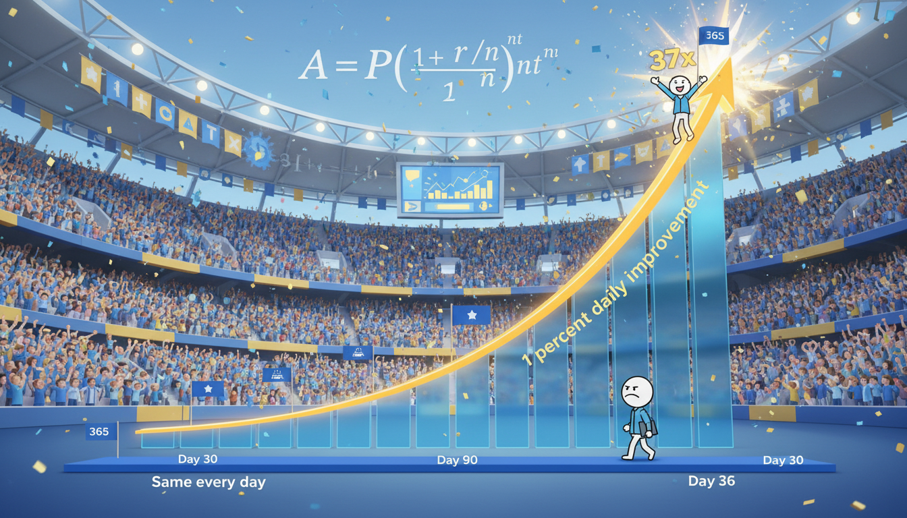

# Chapter 13: The Compound Effect

> [!IMPORTANT]
> [!NOTE]
> [!NOTE]
> 💡 **Key Insight**
> 💡 **Key Insight**
> **[🏠 Back to Home](../README.md)** | **[📚 All Chapters](../README.md#-the-chapters)**

---

> [!IMPORTANT]
> [!NOTE]
> [!NOTE]
> 💡 **Key Insight**
> 💡 **Key Insight**
> **[🏠 Back to Home](../README.md)** | **[📚 All Chapters](../README.md#-the-chapters)**

---

> [!IMPORTANT]
> [!NOTE]
> [!NOTE]
> [!NOTE]
> 💡 **Key Insight**
> 💡 **Key Insight**
> 💡 **Key Insight**
> [!NOTE]
> [!NOTE]
> [!NOTE]
> [!NOTE]
> 💡 **Key Insight**
> 💡 **Key Insight**
> **💡 Key Insight**
> **💡 Key Insight**
> [!NOTE]
> [!NOTE]
> [!NOTE]
> 💡 **Key Insight**
> 💡 **Key Insight**
> **💡 Key Insight**
> **[🏠 Back to Home](../README.md)** | **[📚 All Chapters](../README.md#-the-chapters)**

---

> [!NOTE]
> [!NOTE]
> [!NOTE]
> [!NOTE]
> 💡 **Key Insight**
> 💡 **Key Insight**
> 💡 **Key Insight**
> [!NOTE]
> [!NOTE]
> [!NOTE]
> [!NOTE]
> 💡 **Key Insight**
> 💡 **Key Insight**
> **💡 Key Insight**
> **💡 Key Insight**
> [!NOTE]
> [!NOTE]
> [!NOTE]
> 💡 **Key Insight**
> 💡 **Key Insight**
> **💡 Key Insight**
> **💡 Key Insight**
> [!NOTE]
> [!NOTE]
> [!NOTE]
> [!NOTE]
> 💡 **Key Insight**
> 💡 **Key Insight**
> **💡 Key Insight**
> **💡 Key Insight**
> [!NOTE]
> [!NOTE]
> [!NOTE]
> 💡 **Key Insight**
> 💡 **Key Insight**
> **💡 Key Insight**
> **Core Concept**: Small daily improvements compound exponentially over time - 1% better every day means you're 37x better in a year.
> [!NOTE]
> [!NOTE]
> [!NOTE]
> [!NOTE]
> 💡 **Key Insight**
> 💡 **Key Insight**
> 💡 **Key Insight**
> [!NOTE]
> [!NOTE]
> [!NOTE]
> [!NOTE]
> 💡 **Key Insight**
> 💡 **Key Insight**
> **💡 Key Insight**
> **💡 Key Insight**
> [!NOTE]
> [!NOTE]
> [!NOTE]
> 💡 **Key Insight**
> 💡 **Key Insight**
> **💡 Key Insight**
> **💡 Key Insight**
> [!NOTE]
> [!NOTE]
> [!NOTE]
> [!NOTE]
> 💡 **Key Insight**
> 💡 **Key Insight**
> **💡 Key Insight**
> **💡 Key Insight**
> [!NOTE]
> [!NOTE]
> [!NOTE]
> 💡 **Key Insight**
> 💡 **Key Insight**
> **💡 Key Insight**
> **The Output**: Build exponential results through relentless consistency while everyone else quits looking for shortcuts.

---

---

---

---

## The Gap That Changes Everything

Picture two basketball players. Same height. Same school. Same coach. Same starting skill level.

Player A shows up to practice, does what's required, goes home. Stays exactly the same every day.

Player B improves by just 1% every single day. Not 10%. Not 50%. Just 1%. So small you can barely see it.

After one year, Player B isn't 1% better than Player A.

They're 37 times better.

Let that sink in. Not 37% better. Thirty-seven TIMES better. Same gym. Same amount of time. Wildly different outcome.

Here's the math:

- Day 1: 1.00
- Day 30: 1.35 (barely noticeable)
- Day 90: 2.45 (starting to feel different)
- Day 180: 6.00 (momentum building)
- Day 365: 37.78 (completely different player)

This isn't theory. This is how champions actually get built.

While everyone else is scrolling through highlight reels looking for the secret, looking for the hack, looking for the shortcut - champions are banking daily deposits. Tiny improvements. Boring consistency. Exponential results.

Here's the uncomfortable truth: the fastest way to massive success is actually the slowest.

And almost nobody has the patience to find out.

---

---

---

---

## The Compound Curve Reality

You know that feeling when you've been working hard on something for weeks and it feels like nothing's changing?

Yeah. That's exactly where most people quit.

Right before everything explodes.

Let me show you what compound growth actually looks like. Not the Instagram version. The real version.

### The Timeline Nobody Talks About

> [!IMPORTANT]
> [!NOTE]
> [!NOTE]
> [!NOTE]
> 💡 **Key Insight**
> 💡 **Key Insight**
> 💡 **Key Insight**
> [!NOTE]
> [!NOTE]
> [!NOTE]
> [!NOTE]
> 💡 **Key Insight**
> 💡 **Key Insight**
> **💡 Key Insight**
> **💡 Key Insight**
> [!NOTE]
> [!NOTE]
> [!NOTE]
> 💡 **Key Insight**
> 💡 **Key Insight**
> **💡 Key Insight**
> **Days 1-30: The Invisible Phase**

You're showing up. You're doing the work. And honestly? It feels like you're getting nowhere.

1% improvement per day sounds good in theory. In practice, it's so small you literally can't see it. Your shot looks the same. Your speed feels the same. Your grades haven't moved.

This is where 90% of people quit.

They think: "I've been at this for a month and I'm basically the same person. This compound stuff is BS."

Wrong. The compound IS working. You just can't see it yet.

> [!IMPORTANT]
> [!NOTE]
> [!NOTE]
> [!NOTE]
> 💡 **Key Insight**
> 💡 **Key Insight**
> 💡 **Key Insight**
> [!NOTE]
> [!NOTE]
> [!NOTE]
> [!NOTE]
> 💡 **Key Insight**
> 💡 **Key Insight**
> **💡 Key Insight**
> **💡 Key Insight**
> [!NOTE]
> [!NOTE]
> [!NOTE]
> 💡 **Key Insight**
> 💡 **Key Insight**
> **💡 Key Insight**
> **Days 31-90: The Doubt Phase**

Now you're two or three months in. You might feel slightly different. Your routine is more natural. Things are marginally easier.

But it's still not dramatic. You're not suddenly amazing. You're not going viral. Nobody's noticing.

Your brain starts doing math: "I've been working this hard for three months. If this is all I get, is it even worth it?"

This is where another 8% quit.

Only 2% make it past this point.

> [!IMPORTANT]
> [!NOTE]
> [!NOTE]
> [!NOTE]
> 💡 **Key Insight**
> 💡 **Key Insight**
> 💡 **Key Insight**
> [!NOTE]
> [!NOTE]
> [!NOTE]
> [!NOTE]
> 💡 **Key Insight**
> 💡 **Key Insight**
> **💡 Key Insight**
> **💡 Key Insight**
> [!NOTE]
> [!NOTE]
> [!NOTE]
> 💡 **Key Insight**
> 💡 **Key Insight**
> **💡 Key Insight**
> **Days 91-180: The Momentum Phase**

Something's shifting. You're noticing real gains now. Things that used to be hard are getting easier. Skills are clicking. Results are showing up.

The compound curve is starting to bend upward.

But here's the trap - you compare yourself to where you want to be, not where you were. So it STILL feels slow.

> [!IMPORTANT]
> [!NOTE]
> [!NOTE]
> [!NOTE]
> 💡 **Key Insight**
> 💡 **Key Insight**
> 💡 **Key Insight**
> [!NOTE]
> [!NOTE]
> [!NOTE]
> [!NOTE]
> 💡 **Key Insight**
> 💡 **Key Insight**
> **💡 Key Insight**
> **💡 Key Insight**
> [!NOTE]
> [!NOTE]
> [!NOTE]
> 💡 **Key Insight**
> 💡 **Key Insight**
> **💡 Key Insight**
> **Days 181-365: The Exponential Phase**

This is where it gets wild.

All those tiny daily improvements start multiplying on each other. The curve goes vertical. Suddenly you're not just better - you're DRAMATICALLY better.

People who haven't seen you in six months are shocked. "What happened to you?" they ask.

Nothing happened. Everything happened. You just stayed consistent while the compound curve did its thing.

### Why Almost Nobody Makes It

The problem isn't that compound growth doesn't work. The problem is we expect linear results.

We think: If I work twice as hard, I should get twice the results. If I've been practicing for six months, I should be halfway to my goal.

That's not how compound works.

Compound is flat, flat, flat, flat, EXPLOSION.

Most people experience the flat part and assume the explosion isn't coming. So they quit. They switch strategies. They chase the next thing that promises faster results.

And they reset the compound clock back to zero.

The people who win at life? They're not smarter. They're not more talented.

They just stayed in the game long enough for the curve to go vertical.

---

---

---

---

## The 1% Rule That Changes Everything

Here's what Dave Brailsford did to British cycling. And it's one of the most insane turnarounds in sports history.

2003: British cycling had won ONE gold medal in 76 years. One. In almost eight decades.

They weren't just bad. They were so bad that top athletes wouldn't even ride British bikes. They brought their own equipment from other countries.

Brailsford became performance director and introduced one concept: improve everything by just 1%.

Not revolutionary changes. Not complete overhauls. One percent.

### What They Actually Improved

They didn't just improve cycling. They improved EVERYTHING around cycling:

- Bike seat comfort: 1% more comfortable
- Tire grip: 1% better traction
- Rider nutrition: 1% more optimal
- Sleep quality: 1% better recovery
- Massage techniques: 1% more effective
- Hand-washing protocol: 1% better (to reduce illness)
- Pillow quality: 1% better for sleep
- How they warmed up: 1% more efficient

Look at that list. None of those alone makes you a champion.

All of them compounded together? Total dominance.

2008 Olympics (five years later): British cycling won 7 out of 10 gold medals.

Tour de France: They went from never winning to complete domination. Multiple years. Multiple champions.

None of it was one big change. All of it was tiny changes compounding.

### Why 1% Improvements Actually Work

> [!IMPORTANT]
> [!NOTE]
> [!NOTE]
> [!NOTE]
> 💡 **Key Insight**
> 💡 **Key Insight**
> 💡 **Key Insight**
> [!NOTE]
> [!NOTE]
> [!NOTE]
> [!NOTE]
> 💡 **Key Insight**
> 💡 **Key Insight**
> **💡 Key Insight**
> **💡 Key Insight**
> [!NOTE]
> [!NOTE]
> [!NOTE]
> 💡 **Key Insight**
> 💡 **Key Insight**
> **💡 Key Insight**
> **They're sustainable.**

Nobody can improve 50% at something overnight. Your brain resists massive change. Your body can't adapt that fast. Life doesn't give you that much bandwidth.

But 1%? You can do 1% while you sleep. It doesn't require superhuman effort. It doesn't demand you overhaul your entire life. It just requires showing up and being slightly better than yesterday.

You can maintain 1% improvements forever.

> [!IMPORTANT]
> [!NOTE]
> [!NOTE]
> [!NOTE]
> 💡 **Key Insight**
> 💡 **Key Insight**
> 💡 **Key Insight**
> [!NOTE]
> [!NOTE]
> [!NOTE]
> [!NOTE]
> 💡 **Key Insight**
> 💡 **Key Insight**
> **💡 Key Insight**
> **💡 Key Insight**
> [!NOTE]
> [!NOTE]
> [!NOTE]
> 💡 **Key Insight**
> 💡 **Key Insight**
> **💡 Key Insight**
> **They're stackable.**

Here's where compound gets really powerful. You can improve multiple things by 1% at the same time.

1% better study habits + 1% better note-taking + 1% better at asking questions = you're not 3% better. You're exponentially better because they multiply with each other.

Better notes make studying easier. Better questions make notes better. The whole system amplifies.

> [!IMPORTANT]
> [!NOTE]
> [!NOTE]
> [!NOTE]
> 💡 **Key Insight**
> 💡 **Key Insight**
> 💡 **Key Insight**
> [!NOTE]
> [!NOTE]
> [!NOTE]
> [!NOTE]
> 💡 **Key Insight**
> 💡 **Key Insight**
> **💡 Key Insight**
> **💡 Key Insight**
> [!NOTE]
> [!NOTE]
> [!NOTE]
> 💡 **Key Insight**
> 💡 **Key Insight**
> **💡 Key Insight**
> **They're measurable.**

You can actually track 1% improvements. They give you feedback. They build confidence.

Trying to "get way better" is vague and discouraging. Adding 5 perfect-form reps to your workout? That's 1%. That's specific. That's doable. That's proof you're moving forward.

### The Aggregation of Marginal Gains in Your Life

Let's make this real for you.

> [!IMPORTANT]
> [!NOTE]
> [!NOTE]
> [!NOTE]
> 💡 **Key Insight**
> 💡 **Key Insight**
> 💡 **Key Insight**
> [!NOTE]
> [!NOTE]
> [!NOTE]
> [!NOTE]
> 💡 **Key Insight**
> 💡 **Key Insight**
> **💡 Key Insight**
> **💡 Key Insight**
> [!NOTE]
> [!NOTE]
> [!NOTE]
> 💡 **Key Insight**
> 💡 **Key Insight**
> **💡 Key Insight**
> **Academic example:**

You're decent at algebra but not great. Instead of grinding for four hours trying to make a massive leap, you improve three things by 1% every day:

- Understanding: Master one new concept thoroughly each day
- Focus: Add 2 minutes to your deep study sessions every week
- Application: Ask one high-quality question in class every day

Alone? Each feels small.

Compounded? In three months you're not the same student. In six months you're in a completely different league.

> [!IMPORTANT]
> [!NOTE]
> [!NOTE]
> [!NOTE]
> 💡 **Key Insight**
> 💡 **Key Insight**
> 💡 **Key Insight**
> [!NOTE]
> [!NOTE]
> [!NOTE]
> [!NOTE]
> 💡 **Key Insight**
> 💡 **Key Insight**
> **💡 Key Insight**
> **💡 Key Insight**
> [!NOTE]
> [!NOTE]
> [!NOTE]
> 💡 **Key Insight**
> 💡 **Key Insight**
> **💡 Key Insight**
> **Athletic example:**

You want to dominate your sport. You don't need to suddenly become superhuman. You improve by 1% daily:

- Technique: 5 more perfect-form reps per practice
- Recovery: Add 1 minute to your stretching routine daily
- Knowledge: Watch 10 minutes of game film every night
- Nutrition: Replace one bad snack with one good one each day

None of those is dramatic. All of them together compound into performance that looks like natural talent.

But it's not talent. It's the aggregation of marginal gains.

### The Output vs. Task Reframe

Here's the trap most people fall into with improvement:

❌ **Task-focused thinking:**

- "I need to practice more"
- "I should study harder"
- "I have to work out more often"

Those are inputs. They're vague. They don't tell you what you're building toward.

✅ **Output-focused thinking:**

- "Build game-changing skills through 1% daily improvements"
- "Master the material so well that tests feel easy"
- "Become strong enough to dominate physically"

See the difference? You're not just doing more. You're becoming something specific.

The compound effect isn't about the hours you put in. It's about what those hours build.

Focus on the output. The 1% improvements take care of themselves.

---

---

---

---

## The Patience Problem (And Why You'll Win Because of It)

Let's be real about something: patience feels impossible right now.

Not because you're weak. Not because you lack discipline.

Because the entire world is designed to destroy your ability to be patient.

### Your Brain vs. Modern Life

Your brain evolved to survive immediate threats. See danger? React now. Find food? Eat now. The cavemen who thought "I'll deal with that tiger eventually" didn't make it.

So your dopamine system rewards quick wins. Immediate results. Fast feedback.

Which worked great for survival. Works terribly for building anything valuable.

Meanwhile, you're living in 2025 where:

- Social media gives you instant likes and instant comparison
- Food arrives in 30 minutes or less
- Entertainment streams instantly (and you can skip the intro)
- Text messages demand immediate responses
- YouTube lets you watch at 2x speed
- TikTok has trained your brain for 15-second hits

You're not impatient by choice. You're impatient by design.

The world has systematically destroyed your patience muscle through thousands of tiny instant-gratification hits every single day.

And here's the opportunity: almost nobody can be patient anymore.

Which means patience is the ultimate competitive advantage.

### The Marshmallow Test 2.0

Stanford did this famous study in the 1970s. They put a marshmallow in front of a kid and said: "You can eat it now, or wait 15 minutes and get two marshmallows."

Some kids grabbed it immediately. Some waited.

The researchers followed these kids for decades.

The ones who waited? Better grades. Better careers. Better relationships. Better life outcomes across the board.

Not because marshmallows are magical. Because delayed gratification is the gateway to compound returns.

Here's your version:

Can you skip the shortcut and trust the process?

Can you keep showing up when the results aren't visible yet?

Can you delay gratification today for exponential returns later?

That's not a willpower test. That's a life outcomes test.

### The Uncomfortable Truth About Patience

"The sooner you learn to be comfortable with being uncomfortable, the sooner you will win in life."

Patience IS uncomfortable. Brutally uncomfortable.

It feels like nothing's happening. It feels like you're falling behind. It feels like everyone else found a faster way.

That discomfort? That's the feeling of compound growth working.

That doubt? That's the price of admission for exponential results.

Champions don't avoid that discomfort. They become comfortable with it.

They know the flat part of the curve is temporary. They know the explosion is coming. They trust the math.

And they show up anyway.

---

---

---

---

## The Marc Andreessen Decades Framework

Marc Andreessen built Netscape at 22. Sold it for billions. Then became one of the most successful tech investors in history.

His approach? Think in decades, not days.

### How He Thinks About Building Valuable Things

> [!IMPORTANT]
> [!NOTE]
> [!NOTE]
> [!NOTE]
> 💡 **Key Insight**
> 💡 **Key Insight**
> 💡 **Key Insight**
> [!NOTE]
> [!NOTE]
> [!NOTE]
> [!NOTE]
> 💡 **Key Insight**
> 💡 **Key Insight**
> **💡 Key Insight**
> **💡 Key Insight**
> [!NOTE]
> [!NOTE]
> [!NOTE]
> 💡 **Key Insight**
> 💡 **Key Insight**
> **💡 Key Insight**
> **Year 1: Plant seeds, nobody notices**

You're putting in work that feels invisible. Learning fundamentals. Building foundation. No results to show.

Most people quit here because there's nothing to screenshot. Nothing to post. Nothing to prove.

> [!IMPORTANT]
> [!NOTE]
> [!NOTE]
> [!NOTE]
> 💡 **Key Insight**
> 💡 **Key Insight**
> 💡 **Key Insight**
> [!NOTE]
> [!NOTE]
> [!NOTE]
> [!NOTE]
> 💡 **Key Insight**
> 💡 **Key Insight**
> **💡 Key Insight**
> **💡 Key Insight**
> [!NOTE]
> [!NOTE]
> [!NOTE]
> 💡 **Key Insight**
> 💡 **Key Insight**
> **💡 Key Insight**
> **Years 2-3: Nurture growth, still mostly invisible**

You're getting better but it's not dramatic. Skills are developing. Knowledge is compounding. But you're not famous yet. Not recognized yet.

More people quit here. "I've been at this for THREE YEARS and I'm still not where I want to be."

> [!IMPORTANT]
> [!NOTE]
> [!NOTE]
> [!NOTE]
> 💡 **Key Insight**
> 💡 **Key Insight**
> 💡 **Key Insight**
> [!NOTE]
> [!NOTE]
> [!NOTE]
> [!NOTE]
> 💡 **Key Insight**
> 💡 **Key Insight**
> **💡 Key Insight**
> **💡 Key Insight**
> [!NOTE]
> [!NOTE]
> [!NOTE]
> 💡 **Key Insight**
> 💡 **Key Insight**
> **💡 Key Insight**
> **Years 4-7: Momentum builds, people start noticing**

Now things are happening. Results are showing up. People are taking notice. Opportunities appear.

You're not lucky. You're just far enough along the compound curve that it's starting to bend upward.

> [!IMPORTANT]
> [!NOTE]
> [!NOTE]
> [!NOTE]
> 💡 **Key Insight**
> 💡 **Key Insight**
> 💡 **Key Insight**
> [!NOTE]
> [!NOTE]
> [!NOTE]
> [!NOTE]
> 💡 **Key Insight**
> 💡 **Key Insight**
> **💡 Key Insight**
> **💡 Key Insight**
> [!NOTE]
> [!NOTE]
> [!NOTE]
> 💡 **Key Insight**
> 💡 **Key Insight**
> **💡 Key Insight**
> **Years 8-10: Exponential results, "overnight success"**

Suddenly you're everywhere. Suddenly you're the best. Suddenly everyone wants to know your secret.

The secret? You stayed patient for eight years while everyone else quit at year two.

### Applied to Your Life Right Now

Stop asking: "How good can I get in one year?"

Start asking: "How good could I be in ten years if I improve 1% every single day?"

Do the math:

- 1% daily improvement = 37x better in Year 1
- Compound that over 10 years?

You'd be unrecognizably better. So far ahead of your current self you wouldn't believe it's possible.

But nobody sees year ten. They only see year one. And they quit because year one doesn't look dramatic enough.

> [!IMPORTANT]
> [!NOTE]
> [!NOTE]
> [!NOTE]
> 💡 **Key Insight**
> 💡 **Key Insight**
> 💡 **Key Insight**
> [!NOTE]
> [!NOTE]
> [!NOTE]
> [!NOTE]
> 💡 **Key Insight**
> 💡 **Key Insight**
> **💡 Key Insight**
> **💡 Key Insight**
> [!NOTE]
> [!NOTE]
> [!NOTE]
> 💡 **Key Insight**
> 💡 **Key Insight**
> **💡 Key Insight**
> **Andreessen's insight:**

- Most people overestimate what they can do in 1 year
- Most people underestimate what they can do in 10 years
- The people who actually make it to 10 years have almost zero competition

Because everyone else already quit.

### Why This Changes Your Game

Life is a sport where patience is the ultimate performance enhancer.

Think about it: If you're competing for anything valuable - college spots, team positions, career opportunities, building a business, mastering a skill - who are you competing against?

In Year 1: Everyone. Hundreds or thousands of people trying.

In Year 3: Maybe 50 people left. Most already quit.

In Year 5: Maybe 10 people still going. Everyone else found an "easier path."

In Year 10: You and maybe 2 other people who had the same patience.

You don't have to be the most talented. You just have to outlast the others.

Patience is your cheat code.

---

---

---

---

## Building Your Patience System

You can't just "be more patient." That's like telling yourself to "be taller." Patience isn't willpower - it's a system.

Here's how to build it.

### System 1: Focus on Daily Input, Not Total Output

> [!IMPORTANT]
> [!NOTE]
> [!NOTE]
> [!NOTE]
> 💡 **Key Insight**
> 💡 **Key Insight**
> 💡 **Key Insight**
> [!NOTE]
> [!NOTE]
> [!NOTE]
> [!NOTE]
> 💡 **Key Insight**
> 💡 **Key Insight**
> **💡 Key Insight**
> **💡 Key Insight**
> [!NOTE]
> [!NOTE]
> [!NOTE]
> 💡 **Key Insight**
> 💡 **Key Insight**
> **💡 Key Insight**
> **The trap:**

"Am I a great basketball player yet?" (Outcome focus - kills motivation when answer is "not yet")

"Am I smart enough yet?" (Outcome focus - vague and discouraging)

"Have I made it yet?" (Outcome focus - always feels like no)

> [!IMPORTANT]
> [!NOTE]
> [!NOTE]
> [!NOTE]
> 💡 **Key Insight**
> 💡 **Key Insight**
> 💡 **Key Insight**
> [!NOTE]
> [!NOTE]
> [!NOTE]
> [!NOTE]
> 💡 **Key Insight**
> 💡 **Key Insight**
> **💡 Key Insight**
> **💡 Key Insight**
> [!NOTE]
> [!NOTE]
> [!NOTE]
> 💡 **Key Insight**
> 💡 **Key Insight**
> **💡 Key Insight**
> **The system:**

"Did I do my shooting drills today?" (Input focus - yes or no, controllable)

"Did I master one new concept today?" (Input focus - specific, achievable)

"Did I show up and improve 1% today?" (Input focus - repeatable)

You can't always control the outcome. You can ALWAYS control today's input.

So track the input. Let the outcome take care of itself.

### System 2: Celebrate Consistency, Not Results

> [!IMPORTANT]
> [!NOTE]
> [!NOTE]
> [!NOTE]
> 💡 **Key Insight**
> 💡 **Key Insight**
> 💡 **Key Insight**
> [!NOTE]
> [!NOTE]
> [!NOTE]
> [!NOTE]
> 💡 **Key Insight**
> 💡 **Key Insight**
> **💡 Key Insight**
> **💡 Key Insight**
> [!NOTE]
> [!NOTE]
> [!NOTE]
> 💡 **Key Insight**
> 💡 **Key Insight**
> **💡 Key Insight**
> **What most people celebrate:**

- Won the game
- Got an A
- Placed first

Those are great. But they're outcomes you only partially control.

> [!IMPORTANT]
> [!NOTE]
> [!NOTE]
> [!NOTE]
> 💡 **Key Insight**
> 💡 **Key Insight**
> 💡 **Key Insight**
> [!NOTE]
> [!NOTE]
> [!NOTE]
> [!NOTE]
> 💡 **Key Insight**
> 💡 **Key Insight**
> **💡 Key Insight**
> **💡 Key Insight**
> [!NOTE]
> [!NOTE]
> [!NOTE]
> 💡 **Key Insight**
> 💡 **Key Insight**
> **💡 Key Insight**
> **What champions celebrate:**

- 100 days of practice in a row
- 50 consecutive days of deep study
- 6 months without missing a workout

Consistency is 100% in your control. And consistency is what triggers compound growth.

Celebrate the streak. The outcome becomes inevitable.

### System 3: Make Progress Visible

The problem with compound growth? The daily changes are too small to see.

Solution: Document at intervals.

> [!IMPORTANT]
> [!NOTE]
> [!NOTE]
> [!NOTE]
> 💡 **Key Insight**
> 💡 **Key Insight**
> 💡 **Key Insight**
> [!NOTE]
> [!NOTE]
> [!NOTE]
> [!NOTE]
> 💡 **Key Insight**
> 💡 **Key Insight**
> **💡 Key Insight**
> **💡 Key Insight**
> [!NOTE]
> [!NOTE]
> [!NOTE]
> 💡 **Key Insight**
> 💡 **Key Insight**
> **💡 Key Insight**
> **Every 30 days:**

- Video your performance (shoot free throws, give a presentation, play your instrument)
- Photo your progress (if physique is relevant)
- Test yourself (timed mile, practice quiz, skill assessment)
- Review your journal (patterns in 30 days of 1% improvements)

Day to day? Nothing visible.

30 days? Changes emerge.

90 days? Undeniable progress.

This gives your brain the proof it needs to stay patient. The compound IS working. Here's the evidence.

### System 4: Trust the Plateau

You're going to hit plateaus. Long stretches where you feel stuck. Where improvement seems to stop.

This is normal. This is expected. This is NOT failure.

> [!IMPORTANT]
> [!NOTE]
> [!NOTE]
> [!NOTE]
> 💡 **Key Insight**
> 💡 **Key Insight**
> 💡 **Key Insight**
> [!NOTE]
> [!NOTE]
> [!NOTE]
> [!NOTE]
> 💡 **Key Insight**
> 💡 **Key Insight**
> **💡 Key Insight**
> **💡 Key Insight**
> [!NOTE]
> [!NOTE]
> [!NOTE]
> 💡 **Key Insight**
> 💡 **Key Insight**
> **💡 Key Insight**
> **What's actually happening:**

Your body and brain are consolidating gains. Like installing a software update. It looks like nothing's happening. But behind the scenes, everything is integrating.

The breakthrough follows the plateau. Always.

But only if you don't quit.

> [!IMPORTANT]
> [!NOTE]
> [!NOTE]
> [!NOTE]
> 💡 **Key Insight**
> 💡 **Key Insight**
> 💡 **Key Insight**
> [!NOTE]
> [!NOTE]
> [!NOTE]
> [!NOTE]
> 💡 **Key Insight**
> 💡 **Key Insight**
> **💡 Key Insight**
> **💡 Key Insight**
> [!NOTE]
> [!NOTE]
> [!NOTE]
> 💡 **Key Insight**
> 💡 **Key Insight**
> **💡 Key Insight**
> **Plateau survival strategy:**

1. Remind yourself: "Plateaus are part of the process, not evidence that compound stopped working"
2. Trust the data: Look at your 30/60/90 day snapshots. You ARE progressing.
3. Keep showing up: The breakthrough comes to people who don't quit during the flat part
4. Adjust ONE variable: Maybe change your approach 1%, but don't overhaul everything

The plateau isn't the end. It's the last phase before the explosion.

---

---

---

---

## The Compound Tracking System

You can't improve what you don't measure.

Here's exactly how to track compound growth and stay motivated through the invisible phases.

### The Daily 1% Tracker

Design your tracker around INPUTS (what you control), not OUTCOMES (what you hope for).

> [!IMPORTANT]
> [!NOTE]
> [!NOTE]
> [!NOTE]
> 💡 **Key Insight**
> 💡 **Key Insight**
> 💡 **Key Insight**
> [!NOTE]
> [!NOTE]
> [!NOTE]
> [!NOTE]
> 💡 **Key Insight**
> 💡 **Key Insight**
> **💡 Key Insight**
> **💡 Key Insight**
> [!NOTE]
> [!NOTE]
> [!NOTE]
> 💡 **Key Insight**
> 💡 **Key Insight**
> **💡 Key Insight**
> **Academic example:**

❌ Don't track: GPA (outcome, lagging indicator, only updates every semester)

✅ Track:

- Minutes of focused study (input, daily)
- Concepts fully understood (input, daily)
- Questions asked in class (input, daily)

> [!IMPORTANT]
> [!NOTE]
> [!NOTE]
> [!NOTE]
> 💡 **Key Insight**
> 💡 **Key Insight**
> 💡 **Key Insight**
> [!NOTE]
> [!NOTE]
> [!NOTE]
> [!NOTE]
> 💡 **Key Insight**
> 💡 **Key Insight**
> **💡 Key Insight**
> **💡 Key Insight**
> [!NOTE]
> [!NOTE]
> [!NOTE]
> 💡 **Key Insight**
> 💡 **Key Insight**
> **💡 Key Insight**
> **Athletic example:**

❌ Don't track: Win/loss record (outcome, partially luck, other people involved)

✅ Track:

- Reps completed with perfect form (input, daily)
- Recovery protocol followed (input, daily)
- Film study minutes (input, daily)

> [!IMPORTANT]
> [!NOTE]
> [!NOTE]
> [!NOTE]
> 💡 **Key Insight**
> 💡 **Key Insight**
> 💡 **Key Insight**
> [!NOTE]
> [!NOTE]
> [!NOTE]
> [!NOTE]
> 💡 **Key Insight**
> 💡 **Key Insight**
> **💡 Key Insight**
> **💡 Key Insight**
> [!NOTE]
> [!NOTE]
> [!NOTE]
> 💡 **Key Insight**
> 💡 **Key Insight**
> **💡 Key Insight**
> **Personal development example:**

❌ Don't track: "Am I confident yet?" (outcome, vague, subjective)

✅ Track:

- Times I spoke up in class (input, countable)
- Social situations I engaged in (input, specific)
- Risks I took despite fear (input, measurable)

Inputs compound into outcomes. Track the inputs.

### The Compound Journal Method

This takes 2 minutes a day and changes everything.

> [!IMPORTANT]
> [!NOTE]
> [!NOTE]
> [!NOTE]
> 💡 **Key Insight**
> 💡 **Key Insight**
> 💡 **Key Insight**
> [!NOTE]
> [!NOTE]
> [!NOTE]
> [!NOTE]
> 💡 **Key Insight**
> 💡 **Key Insight**
> **💡 Key Insight**
> **💡 Key Insight**
> [!NOTE]
> [!NOTE]
> [!NOTE]
> 💡 **Key Insight**
> 💡 **Key Insight**
> **💡 Key Insight**
> **Daily entry (at night, 2 minutes):**

Three questions:

1. What did I improve by 1% today?
2. What small action did I take toward my long-term goal?
3. Did I show up even though I didn't feel like it?

Be specific. "Did 10 more shooting reps." "Understood quadratic equations." "Asked a question even though I was nervous."

> [!IMPORTANT]
> [!NOTE]
> [!NOTE]
> [!NOTE]
> 💡 **Key Insight**
> 💡 **Key Insight**
> 💡 **Key Insight**
> [!NOTE]
> [!NOTE]
> [!NOTE]
> [!NOTE]
> 💡 **Key Insight**
> 💡 **Key Insight**
> **💡 Key Insight**
> **💡 Key Insight**
> [!NOTE]
> [!NOTE]
> [!NOTE]
> 💡 **Key Insight**
> 💡 **Key Insight**
> **💡 Key Insight**
> **Weekly review (Sunday night, 5 minutes):**

Flip through the last 7 days. Look for:

- Patterns: What's compounding fastest?
- Gaps: What needs more attention?
- Wins: What consistency streaks are building?

> [!IMPORTANT]
> [!NOTE]
> [!NOTE]
> [!NOTE]
> 💡 **Key Insight**
> 💡 **Key Insight**
> 💡 **Key Insight**
> [!NOTE]
> [!NOTE]
> [!NOTE]
> [!NOTE]
> 💡 **Key Insight**
> 💡 **Key Insight**
> **💡 Key Insight**
> **💡 Key Insight**
> [!NOTE]
> [!NOTE]
> [!NOTE]
> 💡 **Key Insight**
> 💡 **Key Insight**
> **💡 Key Insight**
> **Monthly review (first day of month, 15 minutes):**

Compare to last month. This is where compound becomes visible:

- "Last month I struggled with this concept. This month it's automatic."
- "30 days ago I couldn't hit 10 free throws in a row. Today I hit 25."
- "I've shown up 30 days straight. That's a different identity."

The journal doesn't just track progress. It proves the compound is working when your brain wants to quit.

### The 30-60-90 Snapshot Method

Make the invisible visible.

> [!IMPORTANT]
> [!NOTE]
> [!NOTE]
> [!NOTE]
> 💡 **Key Insight**
> 💡 **Key Insight**
> 💡 **Key Insight**
> [!NOTE]
> [!NOTE]
> [!NOTE]
> [!NOTE]
> 💡 **Key Insight**
> 💡 **Key Insight**
> **💡 Key Insight**
> **💡 Key Insight**
> [!NOTE]
> [!NOTE]
> [!NOTE]
> 💡 **Key Insight**
> 💡 **Key Insight**
> **💡 Key Insight**
> **Every 30 days, take a snapshot:**

- **Video**: Record yourself performing the skill (shooting, presenting, playing music, whatever)
- **Photo**: If physique matters for your goal, document it
- **Test**: Benchmark yourself (timed mile, practice exam, skill assessment)
- **Written**: Save a sample of your work (essay, code, art)

Store these in a folder. Label them: "Day 30," "Day 60," "Day 90," etc.

> [!IMPORTANT]
> [!NOTE]
> [!NOTE]
> [!NOTE]
> 💡 **Key Insight**
> 💡 **Key Insight**
> 💡 **Key Insight**
> [!NOTE]
> [!NOTE]
> [!NOTE]
> [!NOTE]
> 💡 **Key Insight**
> 💡 **Key Insight**
> **💡 Key Insight**
> **💡 Key Insight**
> [!NOTE]
> [!NOTE]
> [!NOTE]
> 💡 **Key Insight**
> 💡 **Key Insight**
> **💡 Key Insight**
> **Why this is powerful:**

You can't see yourself changing day to day. Your brain adjusts your baseline automatically.

But put Day 1 next to Day 90? The difference is shocking.

This gives you proof when patience gets hard. "Look how far I've come. The compound is working. Keep going."

### The Streak Calendar

Visual motivation for your consistency.

Get a calendar. Physical or digital, doesn't matter.

Every day you do your 1% improvement, mark an X.

Your only goal: Don't break the chain.

> [!IMPORTANT]
> [!NOTE]
> [!NOTE]
> [!NOTE]
> 💡 **Key Insight**
> 💡 **Key Insight**
> 💡 **Key Insight**
> [!NOTE]
> [!NOTE]
> [!NOTE]
> [!NOTE]
> 💡 **Key Insight**
> 💡 **Key Insight**
> **💡 Key Insight**
> **💡 Key Insight**
> [!NOTE]
> [!NOTE]
> [!NOTE]
> 💡 **Key Insight**
> 💡 **Key Insight**
> **💡 Key Insight**
> **What happens:**

- Days 1-7: Building the habit
- Days 8-21: Habit feels more natural
- Days 22-66: Habit is forming (takes 66 days on average)
- Days 67-100: You're not someone trying to improve. You're someone who improves daily.

That's an identity shift. That's compound working at the psychological level.

After 100 days, the streak itself becomes motivation. You're not going to break a 100-day streak over one lazy moment.

Consistency compounds into identity.

---

---

---

---

## When Compound Feels Broken

It's going to happen.

You're going to hit a wall where you've been doing everything right and it feels like nothing's working.

This is the moment that separates champions from everyone else.

### The "Nothing is Happening" Phase (It Will Hit You)

> [!IMPORTANT]
> [!NOTE]
> [!NOTE]
> [!NOTE]
> 💡 **Key Insight**
> 💡 **Key Insight**
> 💡 **Key Insight**
> [!NOTE]
> [!NOTE]
> [!NOTE]
> [!NOTE]
> 💡 **Key Insight**
> 💡 **Key Insight**
> **💡 Key Insight**
> **💡 Key Insight**
> [!NOTE]
> [!NOTE]
> [!NOTE]
> 💡 **Key Insight**
> 💡 **Key Insight**
> **💡 Key Insight**
> **Week 4:**

"I've been busting my ass for a month. I'm maybe 5% better? This is supposed to be exponential?"

> [!IMPORTANT]
> [!NOTE]
> [!NOTE]
> [!NOTE]
> 💡 **Key Insight**
> 💡 **Key Insight**
> 💡 **Key Insight**
> [!NOTE]
> [!NOTE]
> [!NOTE]
> [!NOTE]
> 💡 **Key Insight**
> 💡 **Key Insight**
> **💡 Key Insight**
> **💡 Key Insight**
> [!NOTE]
> [!NOTE]
> [!NOTE]
> 💡 **Key Insight**
> 💡 **Key Insight**
> **💡 Key Insight**
> **Week 8:**

"Two months of this. I should be way further along. Everyone else seems to be progressing faster."

> [!IMPORTANT]
> [!NOTE]
> [!NOTE]
> [!NOTE]
> 💡 **Key Insight**
> 💡 **Key Insight**
> 💡 **Key Insight**
> [!NOTE]
> [!NOTE]
> [!NOTE]
> [!NOTE]
> 💡 **Key Insight**
> 💡 **Key Insight**
> **💡 Key Insight**
> **💡 Key Insight**
> [!NOTE]
> [!NOTE]
> [!NOTE]
> 💡 **Key Insight**
> 💡 **Key Insight**
> **💡 Key Insight**
> **Week 12:**

"Three months. I've put in so much work. The results are not matching the effort. Maybe this compound thing is overhyped."

> [!IMPORTANT]
> [!NOTE]
> [!NOTE]
> [!NOTE]
> 💡 **Key Insight**
> 💡 **Key Insight**
> 💡 **Key Insight**
> [!NOTE]
> [!NOTE]
> [!NOTE]
> [!NOTE]
> 💡 **Key Insight**
> 💡 **Key Insight**
> **💡 Key Insight**
> **💡 Key Insight**
> [!NOTE]
> [!NOTE]
> [!NOTE]
> 💡 **Key Insight**
> 💡 **Key Insight**
> **💡 Key Insight**
> **The reality you need to hear:**

The compound IS working. You're just in the flat part of the exponential curve. The part that comes right before it goes vertical.

Everyone feels this. Everyone doubts. Everyone questions.

The people who make it don't avoid this phase. They expect it. They trust it. They push through it.

### The Plateau Survival Strategies

> [!IMPORTANT]
> [!NOTE]
> [!NOTE]
> [!NOTE]
> 💡 **Key Insight**
> 💡 **Key Insight**
> 💡 **Key Insight**
> [!NOTE]
> [!NOTE]
> [!NOTE]
> [!NOTE]
> 💡 **Key Insight**
> 💡 **Key Insight**
> **💡 Key Insight**
> **💡 Key Insight**
> [!NOTE]
> [!NOTE]
> [!NOTE]
> 💡 **Key Insight**
> 💡 **Key Insight**
> **💡 Key Insight**
> **Strategy 1: Zoom Out Your Timeline**

When you're in the middle of the work, progress feels slow because your standards keep rising.

You forget where you started.

Pull up your Day 1 benchmark. Compare it to today.

The difference is there. You've been living the gradual improvement so you don't notice it. But the data doesn't lie.

You're better than you were. Your brain just moved the goalposts on what "better" means.

> [!IMPORTANT]
> [!NOTE]
> [!NOTE]
> [!NOTE]
> 💡 **Key Insight**
> 💡 **Key Insight**
> 💡 **Key Insight**
> [!NOTE]
> [!NOTE]
> [!NOTE]
> [!NOTE]
> 💡 **Key Insight**
> 💡 **Key Insight**
> **💡 Key Insight**
> **💡 Key Insight**
> [!NOTE]
> [!NOTE]
> [!NOTE]
> 💡 **Key Insight**
> 💡 **Key Insight**
> **💡 Key Insight**
> **Strategy 2: Trust the Process (With Evidence)**

This isn't blind faith. This is trusting the math.

1.01 to the power of 365 = 37.78

That's not opinion. That's arithmetic. It works whether you feel it or not.

The British cycling team improved by 1% across dozens of variables. Five years later they dominated the Olympics.

Mr. Beast made videos for years when nobody watched. Now he's the biggest creator on the planet.

Steph Curry shot 500 shots a day for a decade. Now he's the greatest shooter in history.

The process works. You just have to stay in it long enough.

> [!IMPORTANT]
> [!NOTE]
> [!NOTE]
> [!NOTE]
> 💡 **Key Insight**
> 💡 **Key Insight**
> 💡 **Key Insight**
> [!NOTE]
> [!NOTE]
> [!NOTE]
> [!NOTE]
> 💡 **Key Insight**
> 💡 **Key Insight**
> **💡 Key Insight**
> **💡 Key Insight**
> [!NOTE]
> [!NOTE]
> [!NOTE]
> 💡 **Key Insight**
> 💡 **Key Insight**
> **💡 Key Insight**
> **Strategy 3: Refocus on Controllables**

You can't control:

- When the compound curve goes vertical
- How fast other people progress
- When opportunities appear
- External validation and recognition

You CAN control:

- Showing up today
- Doing today's 1% improvement
- Being consistent with your inputs
- Trusting the math

When compound feels broken, you're focusing on what you can't control.

Shift back to what you can control: today. Just today. The compound takes care of the rest.

> [!IMPORTANT]
> [!NOTE]
> [!NOTE]
> [!NOTE]
> 💡 **Key Insight**
> 💡 **Key Insight**
> 💡 **Key Insight**
> [!NOTE]
> [!NOTE]
> [!NOTE]
> [!NOTE]
> 💡 **Key Insight**
> 💡 **Key Insight**
> **💡 Key Insight**
> **💡 Key Insight**
> [!NOTE]
> [!NOTE]
> [!NOTE]
> 💡 **Key Insight**
> 💡 **Key Insight**
> **💡 Key Insight**
> **Strategy 4: Connect With Your Why**

Why did you start this?

Not the surface reason. The deep reason.

Are you trying to get recruited? Make your family proud? Prove something to yourself? Build a life you love? Become someone you respect?

That "why" is your fuel when patience runs out.

Write it down. Read it when compound feels slow.

Is the person you'll become worth the wait?

If yes, keep going.

### The Marc Andreessen "Decades Not Days" Mindset

Here's what Andreessen knows that most people don't:

Most people quit in Year 2.

The people who make it to Year 5 have almost no competition left.

By Year 10, you're basically alone at the top.

**It's not that the others weren't talented.** It's that they weren't patient.

They expected faster results. They got discouraged during plateaus. They switched strategies too early.

Meanwhile, you stayed consistent. Not because you're more talented. Because you understood compound requires time.

Outlasting people is easier than outperforming them.

Patience is the filter that separates pretenders from champions.

### The Compound Identity Shift

Here's what happens when you stay consistent:

**Day 1-30:** "I'm trying to get better at basketball"

You're experimenting. Testing. You haven't fully committed. It's still external to your identity.

**Day 30-90:** "I'm someone who practices basketball daily"

You've built the habit. The consistency is becoming part of who you are. Still not your core identity, but moving in.

**Day 90-365:** "I'm a basketball player"

It's not something you do. It's who you are.

The compound effect isn't just about skills improving. It's about identity transforming.

You don't just get better at the thing. You become the kind of person who does the thing.

That's when compound becomes unstoppable. Because now you're not relying on motivation. You're operating from identity.

---

---

---

---

## Real-World Compound Proof

Theory is great. Let's see how compound actually plays out in the real world.

> [!TIP]
> [!NOTE]
> [!NOTE]
> [!NOTE]
> 💡 **Key Insight**
> 💡 **Key Insight**
> 💡 **Key Insight**
> [!NOTE]
> [!NOTE]
> [!NOTE]
> [!NOTE]
> 💡 **Key Insight**
> 💡 **Key Insight**
> **💡 Key Insight**
> **💡 Key Insight**
> [!NOTE]
> [!NOTE]
> [!NOTE]
> 💡 **Key Insight**
> 💡 **Key Insight**
> **💡 Key Insight**
> **Example 1: Mr. Beast - The Decade of Invisible Work**
>

Jimmy Donaldson posted his first YouTube video at 13 years old.

It got 30 views.

Most people would quit. He didn't. He uploaded another. And another. And another.

**First 4 years:** Barely any views. No money. No recognition. Most videos got under 1,000 views.

He'd study YouTube analytics for hours. Improve his thumbnails by 1%. Test different video formats. Optimize titles. A/B test everything.

1% better per video. Compounding over hundreds of videos.

**Year 5-6:** Finally breaking 100K subscribers. Still not a massive channel. But momentum building.

**Year 7-8:** Exponential takeoff. Millions of subscribers. Viral videos.

**Now:** Over 200 million subscribers. Highest-paid creator on the platform. Changed the entire YouTube game.

> [!IMPORTANT]
> [!NOTE]
> [!NOTE]
> [!NOTE]
> 💡 **Key Insight**
> 💡 **Key Insight**
> 💡 **Key Insight**
> [!NOTE]
> [!NOTE]
> [!NOTE]
> [!NOTE]
> 💡 **Key Insight**
> 💡 **Key Insight**
> **💡 Key Insight**
> **💡 Key Insight**
> [!NOTE]
> [!NOTE]
> [!NOTE]
> 💡 **Key Insight**
> 💡 **Key Insight**
> **💡 Key Insight**
> **What he focused on (OUTPUT):**

Not: "Upload videos every day" (task)

Instead: "Become so good at making videos that I redefine what's possible on YouTube" (output)

> [!IMPORTANT]
> [!NOTE]
> [!NOTE]
> [!NOTE]
> 💡 **Key Insight**
> 💡 **Key Insight**
> 💡 **Key Insight**
> [!NOTE]
> [!NOTE]
> [!NOTE]
> [!NOTE]
> 💡 **Key Insight**
> 💡 **Key Insight**
> **💡 Key Insight**
> **💡 Key Insight**
> [!NOTE]
> [!NOTE]
> [!NOTE]
> 💡 **Key Insight**
> 💡 **Key Insight**
> **💡 Key Insight**
> **The lesson:**

He didn't go viral and THEN get good. He got good through years of compound improvement, THEN went viral.

The "overnight success" was actually 10 years of 1% improvements compounding.

People see the explosion. They don't see the flat part where he kept showing up when nobody was watching.

> [!TIP]
> [!NOTE]
> [!NOTE]
> [!NOTE]
> 💡 **Key Insight**
> 💡 **Key Insight**
> 💡 **Key Insight**
> [!NOTE]
> [!NOTE]
> [!NOTE]
> [!NOTE]
> 💡 **Key Insight**
> 💡 **Key Insight**
> **💡 Key Insight**
> **💡 Key Insight**
> [!NOTE]
> [!NOTE]
> [!NOTE]
> 💡 **Key Insight**
> 💡 **Key Insight**
> **💡 Key Insight**
> **Example 2: Steph Curry - The Shooting Revolution**
>

Steph Curry in college: Good shooter. Not elite.

Early NBA years: Decent starter. Injury concerns. Not a superstar.

Age 25-28: Became the greatest shooter in basketball history. Changed how the entire sport is played.

> [!IMPORTANT]
> [!NOTE]
> [!NOTE]
> [!NOTE]
> 💡 **Key Insight**
> 💡 **Key Insight**
> 💡 **Key Insight**
> [!NOTE]
> [!NOTE]
> [!NOTE]
> [!NOTE]
> 💡 **Key Insight**
> 💡 **Key Insight**
> **💡 Key Insight**
> **💡 Key Insight**
> [!NOTE]
> [!NOTE]
> [!NOTE]
> 💡 **Key Insight**
> 💡 **Key Insight**
> **💡 Key Insight**
> **What happened?**

500 shots per practice. Every single practice. For years.

Slight form adjustments (1% improvements to his release).

Conditioning work to create stamina for fourth quarter shooting.

Mental training to handle pressure situations.

None of those alone = transformation.

All of them compounding over 10+ years = greatest shooter ever.

> [!IMPORTANT]
> [!NOTE]
> [!NOTE]
> [!NOTE]
> 💡 **Key Insight**
> 💡 **Key Insight**
> 💡 **Key Insight**
> [!NOTE]
> [!NOTE]
> [!NOTE]
> [!NOTE]
> 💡 **Key Insight**
> 💡 **Key Insight**
> **💡 Key Insight**
> **💡 Key Insight**
> [!NOTE]
> [!NOTE]
> [!NOTE]
> 💡 **Key Insight**
> 💡 **Key Insight**
> **💡 Key Insight**
> **What he focused on (OUTPUT):**

Not: "Practice shooting more" (task)

Instead: "Become so deadly from three-point range that defenses have to redesign their entire strategy around me" (output)

> [!IMPORTANT]
> [!NOTE]
> [!NOTE]
> [!NOTE]
> 💡 **Key Insight**
> 💡 **Key Insight**
> 💡 **Key Insight**
> [!NOTE]
> [!NOTE]
> [!NOTE]
> [!NOTE]
> 💡 **Key Insight**
> 💡 **Key Insight**
> **💡 Key Insight**
> **💡 Key Insight**
> [!NOTE]
> [!NOTE]
> [!NOTE]
> 💡 **Key Insight**
> 💡 **Key Insight**
> **💡 Key Insight**
> **The lesson:**

The "sudden" transformation at age 27 wasn't sudden. It was a decade of compound work becoming visible.

Everyone wants to be Steph Curry after the explosion. Almost nobody wants to put in the 500 daily reps during the flat part.

> [!TIP]
> [!NOTE]
> [!NOTE]
> [!NOTE]
> 💡 **Key Insight**
> 💡 **Key Insight**
> 💡 **Key Insight**
> [!NOTE]
> [!NOTE]
> [!NOTE]
> [!NOTE]
> 💡 **Key Insight**
> 💡 **Key Insight**
> **💡 Key Insight**
> **💡 Key Insight**
> [!NOTE]
> [!NOTE]
> [!NOTE]
> 💡 **Key Insight**
> 💡 **Key Insight**
> **💡 Key Insight**
> **Example 3: The C-Student to Full-Ride Scholarship**
>

Real student. Started sophomore year with C's and D's.

Decided to use compound improvement:

> [!IMPORTANT]
> [!NOTE]
> [!NOTE]
> [!NOTE]
> 💡 **Key Insight**
> 💡 **Key Insight**
> 💡 **Key Insight**
> [!NOTE]
> [!NOTE]
> [!NOTE]
> [!NOTE]
> 💡 **Key Insight**
> 💡 **Key Insight**
> **💡 Key Insight**
> **💡 Key Insight**
> [!NOTE]
> [!NOTE]
> [!NOTE]
> 💡 **Key Insight**
> 💡 **Key Insight**
> **💡 Key Insight**
> **Daily 1% improvements:**

- Study efficiency: Eliminated distractions, improved focus by 2 minutes per week
- Concept mastery: Fully understood 1 new concept per day instead of superficial cramming
- Active learning: Asked 1 thoughtful question per class daily
- Note system: Improved organization by 1% per week

> [!IMPORTANT]
> [!NOTE]
> [!NOTE]
> [!NOTE]
> 💡 **Key Insight**
> 💡 **Key Insight**
> 💡 **Key Insight**
> [!NOTE]
> [!NOTE]
> [!NOTE]
> [!NOTE]
> 💡 **Key Insight**
> 💡 **Key Insight**
> **💡 Key Insight**
> **💡 Key Insight**
> [!NOTE]
> [!NOTE]
> [!NOTE]
> 💡 **Key Insight**
> 💡 **Key Insight**
> **💡 Key Insight**
> **The math:**

Year 1: 1.01^365 = 37x better study approach
Year 2: Compound on compound (multiplier effect)

> [!IMPORTANT]
> [!NOTE]
> [!NOTE]
> [!NOTE]
> 💡 **Key Insight**
> 💡 **Key Insight**
> 💡 **Key Insight**
> [!NOTE]
> [!NOTE]
> [!NOTE]
> [!NOTE]
> 💡 **Key Insight**
> 💡 **Key Insight**
> **💡 Key Insight**
> **💡 Key Insight**
> [!NOTE]
> [!NOTE]
> [!NOTE]
> 💡 **Key Insight**
> 💡 **Key Insight**
> **💡 Key Insight**
> **Result:**

Not just "better grades." Complete transformation:

- Junior year: 3.6 GPA
- Senior year: 4.0 GPA, class rank top 10%
- Full scholarship to state university

> [!IMPORTANT]
> [!NOTE]
> [!NOTE]
> [!NOTE]
> 💡 **Key Insight**
> 💡 **Key Insight**
> 💡 **Key Insight**
> [!NOTE]
> [!NOTE]
> [!NOTE]
> [!NOTE]
> 💡 **Key Insight**
> 💡 **Key Insight**
> **💡 Key Insight**
> **💡 Key Insight**
> [!NOTE]
> [!NOTE]
> [!NOTE]
> 💡 **Key Insight**
> 💡 **Key Insight**
> **💡 Key Insight**
> **What they focused on (OUTPUT):**

Not: "Study harder for better grades" (task)

Instead: "Build knowledge so deep that tests become easy" (output)

> [!IMPORTANT]
> [!NOTE]
> [!NOTE]
> [!NOTE]
> 💡 **Key Insight**
> 💡 **Key Insight**
> 💡 **Key Insight**
> [!NOTE]
> [!NOTE]
> [!NOTE]
> [!NOTE]
> 💡 **Key Insight**
> 💡 **Key Insight**
> **💡 Key Insight**
> **💡 Key Insight**
> [!NOTE]
> [!NOTE]
> [!NOTE]
> 💡 **Key Insight**
> 💡 **Key Insight**
> **💡 Key Insight**
> **The lesson:**

Grades are lagging indicators. They tell you about past performance.

Daily 1% improvements are leading indicators. They create future performance.

The compound worked invisibly for months. Then suddenly everyone noticed. But it wasn't sudden. It was consistent.

> [!TIP]
> [!NOTE]
> [!NOTE]
> [!NOTE]
> 💡 **Key Insight**
> 💡 **Key Insight**
> 💡 **Key Insight**
> [!NOTE]
> [!NOTE]
> [!NOTE]
> [!NOTE]
> 💡 **Key Insight**
> 💡 **Key Insight**
> **💡 Key Insight**
> **💡 Key Insight**
> [!NOTE]
> [!NOTE]
> [!NOTE]
> 💡 **Key Insight**
> 💡 **Key Insight**
> **💡 Key Insight**
> **Example 4: The Skill Stack Multiplier**
>

This one's powerful because it shows how compound effects multiply when you stack skills.

Person who decided to learn three skills simultaneously:

> [!IMPORTANT]
> [!NOTE]
> [!NOTE]
> [!NOTE]
> 💡 **Key Insight**
> 💡 **Key Insight**
> 💡 **Key Insight**
> [!NOTE]
> [!NOTE]
> [!NOTE]
> [!NOTE]
> 💡 **Key Insight**
> 💡 **Key Insight**
> **💡 Key Insight**
> **💡 Key Insight**
> [!NOTE]
> [!NOTE]
> [!NOTE]
> 💡 **Key Insight**
> 💡 **Key Insight**
> **💡 Key Insight**
> **Year 1 focus:**

- Coding: 1 hour daily, improving 1% per session
- Design: 1 hour daily, improving 1% per session
- Writing: 1 hour daily, improving 1% per session

> [!IMPORTANT]
> [!NOTE]
> [!NOTE]
> [!NOTE]
> 💡 **Key Insight**
> 💡 **Key Insight**
> 💡 **Key Insight**
> [!NOTE]
> [!NOTE]
> [!NOTE]
> [!NOTE]
> 💡 **Key Insight**
> 💡 **Key Insight**
> **💡 Key Insight**
> **💡 Key Insight**
> [!NOTE]
> [!NOTE]
> [!NOTE]
> 💡 **Key Insight**
> 💡 **Key Insight**
> **💡 Key Insight**
> **The multiplication effect:**

After 1 year of compound improvement in each:

- Not just "good at three things"
- At the INTERSECTION of three compounded skills

That intersection is exponentially more valuable:

- Can design AND code their own apps
- Can write compelling copy for their designs
- Can explain technical concepts clearly

> [!IMPORTANT]
> [!NOTE]
> [!NOTE]
> [!NOTE]
> 💡 **Key Insight**
> 💡 **Key Insight**
> 💡 **Key Insight**
> [!NOTE]
> [!NOTE]
> [!NOTE]
> [!NOTE]
> 💡 **Key Insight**
> 💡 **Key Insight**
> **💡 Key Insight**
> **💡 Key Insight**
> [!NOTE]
> [!NOTE]
> [!NOTE]
> 💡 **Key Insight**
> 💡 **Key Insight**
> **💡 Key Insight**
> **Result:**

Most people have one developed skill. This person has three compounded skills that multiply with each other.

They're not competing against people who code OR design OR write. They're in a category of their own.

> [!IMPORTANT]
> [!NOTE]
> [!NOTE]
> [!NOTE]
> 💡 **Key Insight**
> 💡 **Key Insight**
> 💡 **Key Insight**
> [!NOTE]
> [!NOTE]
> [!NOTE]
> [!NOTE]
> 💡 **Key Insight**
> 💡 **Key Insight**
> **💡 Key Insight**
> **💡 Key Insight**
> [!NOTE]
> [!NOTE]
> [!NOTE]
> 💡 **Key Insight**
> 💡 **Key Insight**
> **💡 Key Insight**
> **The lesson:**

Compound effects multiply when you stack skills. 1% daily in three areas creates exponential value at the intersection.

---

---

---

---

## Your Compound Game Plan

Time to make this real for your life.

Everything you've read is useless if you don't implement it. Here's your system for starting today.

### Step 1: Choose Your Compound Area (Build Exponential Results)

Be ruthlessly specific. Vague goals create vague results.

> [!IMPORTANT]
> [!NOTE]
> [!NOTE]
> [!NOTE]
> 💡 **Key Insight**
> 💡 **Key Insight**
> 💡 **Key Insight**
> [!NOTE]
> [!NOTE]
> [!NOTE]
> [!NOTE]
> 💡 **Key Insight**
> 💡 **Key Insight**
> **💡 Key Insight**
> **💡 Key Insight**
> [!NOTE]
> [!NOTE]
> [!NOTE]
> 💡 **Key Insight**
> 💡 **Key Insight**
> **💡 Key Insight**

> [!NOTE]
> [!NOTE]
> 💡 **Key Insight**
> 💡 **Key Insight**

> [!NOTE]
> 💡 **Key Insight**
> **❌ Too vague:**

- "Get better at school"
- "Get in shape"
- "Be more productive"

> [!IMPORTANT]
> [!NOTE]
> [!NOTE]
> [!NOTE]
> 💡 **Key Insight**
> 💡 **Key Insight**
> 💡 **Key Insight**
> [!NOTE]
> [!NOTE]
> [!NOTE]
> [!NOTE]
> 💡 **Key Insight**
> 💡 **Key Insight**
> **💡 Key Insight**
> **💡 Key Insight**
> [!NOTE]
> [!NOTE]
> [!NOTE]
> 💡 **Key Insight**
> 💡 **Key Insight**
> **💡 Key Insight**

> [!NOTE]
> [!NOTE]
> 💡 **Key Insight**
> 💡 **Key Insight**

> [!NOTE]
> 💡 **Key Insight**
> **✅ Specific compound area (output-focused):**

- "Master calculus through 1% daily improvements in problem-solving"
- "Build explosive power that dominates on the court"
- "Become fluent in Spanish through daily 1% vocabulary gains"

Pick ONE primary area. You can compound multiple things, but pick one that matters most right now.

> [!IMPORTANT]
> [!NOTE]
> [!NOTE]
> [!NOTE]
> 💡 **Key Insight**
> 💡 **Key Insight**
> 💡 **Key Insight**
> [!NOTE]
> [!NOTE]
> [!NOTE]
> [!NOTE]
> 💡 **Key Insight**
> 💡 **Key Insight**
> **💡 Key Insight**
> **💡 Key Insight**
> [!NOTE]
> [!NOTE]
> [!NOTE]
> 💡 **Key Insight**
> 💡 **Key Insight**
> **💡 Key Insight**
> **Write it down:**

"I'm building exponential results in: _________________________________"

### Step 2: Define Your Daily 1% (Master Your Craft)

What does 1% improvement actually look like in your area?

It has to be specific. It has to be measurable. It has to be small enough that you can do it daily.

> [!IMPORTANT]
> [!NOTE]
> [!NOTE]
> [!NOTE]
> 💡 **Key Insight**
> 💡 **Key Insight**
> 💡 **Key Insight**
> [!NOTE]
> [!NOTE]
> [!NOTE]
> [!NOTE]
> 💡 **Key Insight**
> 💡 **Key Insight**
> **💡 Key Insight**
> **💡 Key Insight**
> [!NOTE]
> [!NOTE]
> [!NOTE]
> 💡 **Key Insight**
> 💡 **Key Insight**
> **💡 Key Insight**
> **Academic 1% examples:**

- Fully understand 1 new concept per day (not just memorize - UNDERSTAND)
- Add 2 minutes to your focused study session every week
- Ask 1 high-quality question in each class
- Teach one concept to someone else (teaching = deep understanding)

> [!IMPORTANT]
> [!NOTE]
> [!NOTE]
> [!NOTE]
> 💡 **Key Insight**
> 💡 **Key Insight**
> 💡 **Key Insight**
> [!NOTE]
> [!NOTE]
> [!NOTE]
> [!NOTE]
> 💡 **Key Insight**
> 💡 **Key Insight**
> **💡 Key Insight**
> **💡 Key Insight**
> [!NOTE]
> [!NOTE]
> [!NOTE]
> 💡 **Key Insight**
> 💡 **Key Insight**
> **💡 Key Insight**
> **Athletic 1% examples:**

- Add 5 perfect-form reps to your routine
- Improve flexibility by holding stretches 5 seconds longer
- Watch 10 minutes of game film daily
- Add 1 minute to your warmup routine for injury prevention

> [!IMPORTANT]
> [!NOTE]
> [!NOTE]
> [!NOTE]
> 💡 **Key Insight**
> 💡 **Key Insight**
> 💡 **Key Insight**
> [!NOTE]
> [!NOTE]
> [!NOTE]
> [!NOTE]
> 💡 **Key Insight**
> 💡 **Key Insight**
> **💡 Key Insight**
> **💡 Key Insight**
> [!NOTE]
> [!NOTE]
> [!NOTE]
> 💡 **Key Insight**
> 💡 **Key Insight**
> **💡 Key Insight**
> **Skill development 1% examples:**

- Code for 30 focused minutes daily, completing 1 small project per week
- Practice your instrument 20 minutes with deliberate focus on one technique
- Read 10 pages of a quality book on your field
- Create one piece of work (design, writing, video) daily

> [!IMPORTANT]
> [!NOTE]
> [!NOTE]
> [!NOTE]
> 💡 **Key Insight**
> 💡 **Key Insight**
> 💡 **Key Insight**
> [!NOTE]
> [!NOTE]
> [!NOTE]
> [!NOTE]
> 💡 **Key Insight**
> 💡 **Key Insight**
> **💡 Key Insight**
> **💡 Key Insight**
> [!NOTE]
> [!NOTE]
> [!NOTE]
> 💡 **Key Insight**
> 💡 **Key Insight**
> **💡 Key Insight**
> **Social/personal 1% examples:**

- Have 1 intentional conversation daily (not just small talk)
- Practice public speaking for 5 minutes in front of a mirror
- Do 1 thing that scares you socially each day
- Journal for 5 minutes on your growth and learning

> [!IMPORTANT]
> [!NOTE]
> [!NOTE]
> [!NOTE]
> 💡 **Key Insight**
> 💡 **Key Insight**
> 💡 **Key Insight**
> [!NOTE]
> [!NOTE]
> [!NOTE]
> [!NOTE]
> 💡 **Key Insight**
> 💡 **Key Insight**
> **💡 Key Insight**
> **💡 Key Insight**
> [!NOTE]
> [!NOTE]
> [!NOTE]
> 💡 **Key Insight**
> 💡 **Key Insight**
> **💡 Key Insight**
> **Define yours:**

"My daily 1% improvement is: _________________________________"

### Step 3: Build Your Tracking System (Stay Patient Through the Invisible Phase)

Set this up TODAY. Not tomorrow. Today.

You need three tracking elements:

> [!IMPORTANT]
> [!NOTE]
> [!NOTE]
> [!NOTE]
> 💡 **Key Insight**
> 💡 **Key Insight**
> 💡 **Key Insight**
> [!NOTE]
> [!NOTE]
> [!NOTE]
> [!NOTE]
> 💡 **Key Insight**
> 💡 **Key Insight**
> **💡 Key Insight**
> **💡 Key Insight**
> [!NOTE]
> [!NOTE]
> [!NOTE]
> 💡 **Key Insight**
> 💡 **Key Insight**
> **💡 Key Insight**
> **Element 1: Compound Journal (2 minutes daily)**

Get a notebook or open a notes app. Answer three questions every night:

1. What did I improve by 1% today? (Be specific)
2. What small action did I take toward my long-term goal?
3. Did I show up even when I didn't feel like it?

> [!IMPORTANT]
> [!NOTE]
> [!NOTE]
> [!NOTE]
> 💡 **Key Insight**
> 💡 **Key Insight**
> 💡 **Key Insight**
> [!NOTE]
> [!NOTE]
> [!NOTE]
> [!NOTE]
> 💡 **Key Insight**
> 💡 **Key Insight**
> **💡 Key Insight**
> **💡 Key Insight**
> [!NOTE]
> [!NOTE]
> [!NOTE]
> 💡 **Key Insight**
> 💡 **Key Insight**
> **💡 Key Insight**
> **Element 2: Streak Calendar (visual motivation)**

Print a calendar or use a habit tracking app. Mark an X every day you do your 1% improvement.

Goal: Don't break the chain.

After 30 days, that streak becomes its own motivation. After 100 days, it's part of your identity.

> [!IMPORTANT]
> [!NOTE]
> [!NOTE]
> [!NOTE]
> 💡 **Key Insight**
> 💡 **Key Insight**
> 💡 **Key Insight**
> [!NOTE]
> [!NOTE]
> [!NOTE]
> [!NOTE]
> 💡 **Key Insight**
> 💡 **Key Insight**
> **💡 Key Insight**
> **💡 Key Insight**
> [!NOTE]
> [!NOTE]
> [!NOTE]
> 💡 **Key Insight**
> 💡 **Key Insight**
> **💡 Key Insight**
> **Element 3: 30-Day Snapshots (proof that compound works)**

Take your Day 1 measurement TODAY:

- Video yourself performing the skill
- Take a benchmark test or timed trial
- Write down your current level/stats
- Save a sample of your current work

Set a reminder for 30 days from now to do it again. And again at 60 days. And 90 days.

This is how you make invisible progress visible.

### Step 4: Create Your Patience Mantra (Dominate Long-Term)

Write this down. Put it somewhere you'll see daily. Read it every morning.

> [!IMPORTANT]
> [!NOTE]
> [!NOTE]
> [!NOTE]
> 💡 **Key Insight**
> 💡 **Key Insight**
> 💡 **Key Insight**
> [!NOTE]
> [!NOTE]
> [!NOTE]
> [!NOTE]
> 💡 **Key Insight**
> 💡 **Key Insight**
> **💡 Key Insight**
> **💡 Key Insight**
> [!NOTE]
> [!NOTE]
> [!NOTE]
> 💡 **Key Insight**
> 💡 **Key Insight**
> **💡 Key Insight**
> **Your Patience Mantra (customize it):**

"I'm not looking for quick wins. I'm building exponential results.

1% daily improvement compounds to 37x better in a year.

I trust the process. I trust the math. I don't quit during the flat part.

I'm playing the long game that most people don't have the patience for.

While they're looking for shortcuts, I'm banking compound interest.

I will show up today and let the curve do its work."

When compound feels slow, read this. Then do today's 1%.

### Step 5: Start Your 7-Day Compound Challenge (Prove It Works)

This week is your proof of concept.

> [!IMPORTANT]
> [!NOTE]
> [!NOTE]
> [!NOTE]
> 💡 **Key Insight**
> 💡 **Key Insight**
> 💡 **Key Insight**
> [!NOTE]
> [!NOTE]
> [!NOTE]
> [!NOTE]
> 💡 **Key Insight**
> 💡 **Key Insight**
> **💡 Key Insight**
> **💡 Key Insight**
> [!NOTE]
> [!NOTE]
> [!NOTE]
> 💡 **Key Insight**
> 💡 **Key Insight**
> **💡 Key Insight**
> **7-Day Challenge:**

1. **Today:** Choose your compound area and define your daily 1%
2. **Today:** Take your Day 1 benchmark (so you can measure progress)
3. **Day 1-7:** Show up all 7 days and do your 1% improvement (start your streak)
4. **Daily:** Journal your improvement (prove you're consistent)
5. **Day 7:** Review your week and celebrate consistency

> [!IMPORTANT]
> [!NOTE]
> [!NOTE]
> [!NOTE]
> 💡 **Key Insight**
> 💡 **Key Insight**
> 💡 **Key Insight**
> [!NOTE]
> [!NOTE]
> [!NOTE]
> [!NOTE]
> 💡 **Key Insight**
> 💡 **Key Insight**
> **💡 Key Insight**
> **💡 Key Insight**
> [!NOTE]
> [!NOTE]
> [!NOTE]
> 💡 **Key Insight**
> 💡 **Key Insight**
> **💡 Key Insight**
> **What you're building:**

Not dramatic results yet (it's only 7 days). You're building the HABIT of consistency.

The habit is what triggers compound. Without consistency, there's no compound.

Nail 7 days. Then go for 30. Then 90. Then 365.

That's how you get 37x better.

---

---

---

---

## Post-Game Review

---

---

---

### Key Takeaways

1. **Small actions compound exponentially**: 1% better daily = 37x better in a year. Not linear growth. Exponential growth.

2. **Most people quit before the curve goes vertical**: Days 1-90 feel flat. Days 180-365 is where the explosion happens. Champions stay patient.

3. **Patience is the ultimate competitive advantage**: Almost nobody has it anymore. The world destroyed everyone's patience muscle. Yours can be your superpower.

4. **Track inputs, not outcomes**: You control daily 1% improvements. You don't fully control results. Focus on what you control.

5. **Compound requires proof systems**: Journal + streak calendar + 30-day snapshots = evidence that compound is working when your brain wants to quit.

### Reflection Questions

1. What's one area of your life where you've been looking for a shortcut instead of trusting compound growth?

2. If you improved just 1% every day for the next year, what would change about your life?

3. What's your biggest obstacle to patience? (Hint: it's probably comparing yourself to others' highlight reels)

4. What does "37x better in one year" actually mean for your specific goal?

5. Are you willing to do the boring, consistent work during the flat part of the curve? Why or why not?

### The Output Mindset

---

---

---

Remember: Don't think about "being patient" or "working hard."

Think about building exponential results that compound into something extraordinary.

Don't focus on the daily grind. Focus on who you're becoming through the compound effect.

You're not just practicing. You're becoming the kind of person whose skills compound into mastery.

You're not just studying. You're becoming the kind of person whose knowledge compounds into expertise.

You're not just showing up. You're becoming the kind of person who others look at and think "How did they get so far ahead?"

The secret? You stayed consistent while they quit looking for faster ways.

---

### Next Level

You've learned the power of compound growth. You know that 1% daily improvements create 37x results.

But here's the thing: compound effects don't happen in isolation.

Who you surround yourself with compounds too. The people around you multiply your growth or divide it.

Next chapter: **Choose Your Team** - Because the compound effect works both ways, and you need to be strategic about who's in your circle.

---

> [!IMPORTANT]
> [!NOTE]
> [!NOTE]
> [!NOTE]
> 💡 **Key Insight**
> 💡 **Key Insight**
> 💡 **Key Insight**
> [!NOTE]
> [!NOTE]
> [!NOTE]
> [!NOTE]
> 💡 **Key Insight**
> 💡 **Key Insight**
> **💡 Key Insight**
> **💡 Key Insight**
> [!NOTE]
> [!NOTE]
> [!NOTE]
> 💡 **Key Insight**
> 💡 **Key Insight**
> **💡 Key Insight**
> **Coach's Corner:**

> The compound effect is the closest thing to a superpower you'll ever get. But it requires something most people can't give: patience during the invisible phase.
>
> Everyone wants Year 10 results. Almost nobody wants to put in Years 1-9.
>
> Be the one who does. That's how you win at life.

---

---

---

---

## Your Compound Action Items

Don't just read this. DO this.

1. **Choose ONE area for compound growth** (be specific - write it down now)

2. **Define what 1% improvement looks like daily** (make it measurable)

3. **Set up your tracking system today** (journal + streak calendar + Day 1 benchmark)

4. **Take your Day 1 measurement** (so you have proof when compound kicks in)

5. **Commit to 7-day challenge** (start building the consistency habit)

Start today. Not Monday. Not next month. Today.

The compound clock starts ticking the moment you begin.

Every day you delay is exponential growth you're leaving on the table.

Show up today. Trust the math. Let the compound curve do its thing.

You've got this.

---

---

---

---

**Remember the math:** 1.01^365 = 37.78

---

---

---

**Remember the truth:** Champions aren't more talented. They're more patient.

---

---

---

**Remember your mission:** Build exponential results through relentless consistency.

Now go compound.

---

[⬅️ Previous: Chapter 12 - Time is Your Currency](chapter_12_time_is_your_currency.md) | [📚 All Chapters](../README.md#-the-chapters) | [🏠 Back to Home](../README.md)

---

[⬅️ Previous: Chapter 12 - Time is Your Currency](chapter_12_time_is_your_currency.md) | [📚 All Chapters](../README.md#-the-chapters) | [🏠 Back to Home](../README.md)

---

[⬅️ Previous: Chapter 12 - Time is Your Currency](chapter_12_time_is_your_currency.md) | [📚 All Chapters](../README.md#-the-chapters) | [Next: Chapter 14 - Choose Your Teammates ➡️](chapter_14_choose_your_teammates.md)

