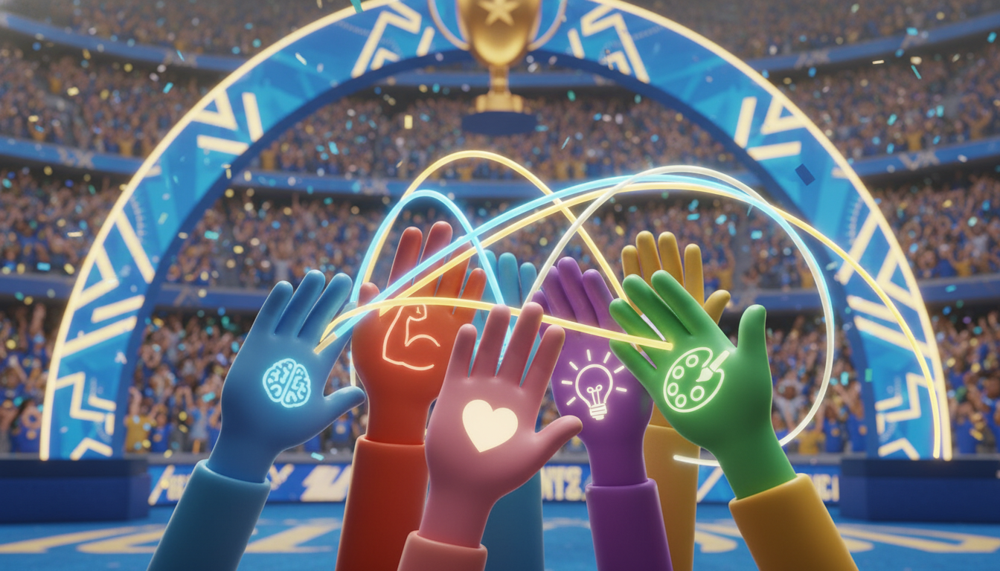

# Chapter 14: Choose Your Teammates

**[🏠 Back to Home](../README.md)** | **[📚 All Chapters](../README.md#-the-chapters)**

---

> 💡 **Key Insight**
> 💡 **Key Insight**
> 💡 **Key Insight**
> **Core Concept**: Your peer group determines your trajectory. Strategic relationship choices accelerate growth.
> 💡 **Key Insight**
> **The Output**: Surround yourself with people who raise your game so you become exceptional.

---

---

---

---

---

## The Two Friend Groups

It's Saturday morning. Two students wake up with the exact same talent, same grades, same potential.

**Student A** scrolls through his phone. Group chat is popping off. "Yo, who's trying to hang later?" His friends are talking about binge-watching shows all weekend. Someone suggests shooting hoops, but the consensus is "nah, too much effort." By noon, he's still in bed. His friends aren't judging him—they're all doing the same thing.

When he mentions wanting to make varsity next year, the group roasts him. "Tryhard." "Why you stressing?" "Relax, dude." He laughs it off. Doesn't want to seem weird.

One year later? Same place. Same habits. Same bench position.

**Student B** gets a text from her friend group. "Morning workout at 8?" She doesn't really feel like it—her bed is comfortable. But she knows if she says no, they'll hold her accountable. Not in a mean way. They just expect more from each other.

They train together. Push each other. When someone hits a new personal best, the whole group celebrates. When she tells them she wants to make varsity, they ask what her training plan is. They offer to help.

One year later? Varsity starter. Straight A's because her friends turned studying into a competition. Leading a community service club because one friend invited her and it stuck.

Same starting point. Same potential. Completely different outcomes.

The only variable? Who they chose as teammates.

Here's what nobody tells you: your friends aren't just nice people to hang out with. They're either your competitive advantage or your anchor.

There's no in-between.

---

---

---

---

## The Problem: Friendship by Default

Let's be honest about how most people choose friends.

**Proximity**: "They sit next to me in class."

**History**: "We've been friends since elementary school."

**Convenience**: "They live on my street."

None of these are bad reasons. But they're not strategic reasons.

You wouldn't pick your basketball team based on who lives closest to the gym, would you? You'd pick the players who make the team better. The ones who push you in practice. The ones who show up when it matters.

But with friendships? Most people let it happen by accident.

Here's what actually happens when you choose friends by default: your peer group sets invisible standards that you unconsciously match.

Their effort level becomes your effort level. Their beliefs about what's possible become your beliefs. Their habits become your habits.

If your friends think reading is boring, you'll probably stop reading. If your friends think trying hard is cringe, you'll probably start half-assing things. If your friends celebrate mediocrity, you'll start accepting it.

Not because you're weak. Because you're human.

> 💡 **Key Insight**
> 💡 **Key Insight**
> 💡 **Key Insight**
> **Coach's Corner:**

> Your brain is literally wired to match the energy of the people around you. Mirror neurons fire when you watch someone else do something, preparing your body to do the same. You're not choosing to become like your friends—your neurology is doing it automatically.

The science backs this up. Researchers Nicholas Christakis and James Fowler studied social networks for years. Their finding? Behaviors spread through friend groups like viruses.

If your friend gains weight, you're 57% more likely to gain weight. If your friend becomes happy, you're 15% more likely to become happy. If your friend quits smoking, you're 36% more likely to quit.

Three degrees of separation. Your friend's friend's friend affects your life.

Think about that. You're not just influenced by your direct friends. You're influenced by people you've never even met.

That's how powerful peer groups are.

---

---

---

---

## The Solution: Strategic Friendship

Here's the thing—this isn't about being fake or manipulative. This isn't about dropping everyone you know and becoming a social climber.

It's about being intentional instead of accidental.

Travis Kalanick, founder of Uber, built one of the fastest-growing companies in history. Love him or hate him, the guy knew how to build teams. His philosophy? "Get the right people on the bus, the wrong people off the bus, and the right people in the right seats."

Harsh? Maybe. But effective? Absolutely.

Here's the version that works for your life: Define your mission first. Understand what game you're playing. Then surround yourself with people who are playing the same game—or playing it better.

You're not building a company. You're building yourself. But the same principles apply.

**The Kalanick Principle** (constructive lessons):

1. **Know what game you're playing** - What do you actually want to achieve? Where do you want to be in two years?

2. **Identify who's playing at that level** - Who's already doing what you want to do? Who's grinding when everyone else is scrolling?

3. **Seek people who make you uncomfortable** - Not toxic uncomfortable. Growth uncomfortable. People who challenge you to be better.

4. **Build reciprocal value** - Don't just take. Be the friend you want to have.

Let's break down the three types of relationships in your life right now.

### Type 1: Drainers

These people take more energy than they give. They're not bad people. But they pull you toward comfortable instead of pushing you toward better.

**Drainers celebrate mediocrity.** When you get a good grade, they make a joke about you being a nerd. When you want to try out for something, they tell you it's not worth the effort. When you set a goal, they bring up all the reasons you'll fail.

They're invested in keeping you at their level because your growth makes them uncomfortable.

**After hanging with drainers**, you feel drained. Tired. Like your energy got vacuumed out. Like you're less motivated than when you started.

### Type 2: Maintainers

These are neutral relationships. Fine people. Not pulling you down, but not pushing you up either.

**Maintainers keep you where you are.** They're comfortable. Safe. They won't challenge you, but they won't drag you down either. You can have fun with them, but you won't grow with them.

**After hanging with maintainers**, you feel... the same. Not worse, not better. Just comfortable.

### Type 3: Elevators

These are the relationships that change everything.

**Elevators push you higher.** When you get a good grade, they ask how you studied so they can level up too. When you want to try out for something, they offer to train with you. When you set a goal, they hold you accountable.

They're genuinely invested in your success because they understand that great teammates make each other better.

**After hanging with elevators**, you feel energized. Motivated. Like you can do more than you thought. Like your standards just got raised.

Here's your job: Minimize drainers. Appreciate maintainers. Maximize elevators.

Not by being ruthless. By being intentional.

---

---

---

---

## Why This Changes Everything

You've probably heard the quote: "You are the average of the five people you spend the most time with."

Let's do the math.

If your five closest friends are averaging 6 out of 10 in effort, ambition, and growth, you'll trend toward 6. If your five closest friends are averaging 9 out of 10, you'll trend toward 9.

Same you. Different peer group. Different trajectory.

Research from Dartmouth economist Bruce Sacerdote studied college roommate pairs. His finding? Students randomly assigned to high-achieving roommates improved their own grades significantly. The reverse was also true—students paired with low-performers saw their grades drop.

It wasn't about tutoring. It wasn't about studying together. It was about standards.

When your roommate is grinding, you grind. When your roommate is slacking, you slack. The invisible standard gets set by the people around you.

> 💡 **Key Insight**
> 💡 **Key Insight**
> 💡 **Key Insight**
> **Coach's Corner:**

> The crazy part? This happens unconsciously. You don't decide "I'm going to match my friends' effort level." Your brain just does it automatically. Which means if you want different results, you need different people around you.

This isn't just about school. It's about everything.

Want to get in shape? Hang with people who work out. Want to build something? Hang with people who create. Want to level up your skills? Hang with people who are obsessed with improvement.

Your peer group is either your competitive advantage or your anchor. Choose wisely.

---

---

---

---

## Real-World Examples

> 💡 **Key Insight**
> 💡 **Key Insight**
> 💡 **Key Insight**
> **Example 1: The Williams Sisters**
>

Venus and Serena Williams didn't just happen to become the two greatest female tennis players of all time. They trained together. Pushed each other. Competed with each other.

When Venus got better, Serena had to get better. When Serena dominated, Venus had to level up. They made each other uncomfortable—in the best way.

Their dad, Richard Williams, built this intentionally. He knew that having a peer at your level who pushes you is more valuable than any coach.

**The Output**: 30 Grand Slam singles titles between them. They didn't just beat everyone else—they pushed each other to become the best versions of themselves.

**Lesson**: The right teammate makes you better than you could ever be alone.

> 💡 **Key Insight**
> 💡 **Key Insight**
> 💡 **Key Insight**
> **Example 2: Emma's Study Group**
>

Emma was a decent student. B's, occasional A's. Nothing special. Her freshman year friends were fine—they'd study together sometimes, but mostly they complained about homework and watched TikTok.

Sophomore year, she joined an honors class. Met a group of students who were different. They didn't complain about homework—they got excited about understanding the material. They formed a study group.

Not to just get through assignments. To actually master the content.

At first, Emma felt intimidated. These kids were intense. They'd debate concepts. Quiz each other. Challenge each other's understanding.

But something shifted. She started preparing more because she didn't want to show up unprepared. She started asking better questions because that's what everyone else did. She started caring about actually learning, not just passing.

**The Output**: GPA went from 3.1 to 3.9. Got into her dream college. But more importantly—she became someone who loves learning. The friend group changed her standards.

**Lesson**: Sometimes you need to join a different peer group to become a different person.

> 💡 **Key Insight**
> 💡 **Key Insight**
> 💡 **Key Insight**
> **Example 3: The PayPal Mafia**
>

In the late 1990s, a group of young entrepreneurs worked together at a startup called PayPal. They were intense. Competitive. Pushed each other relentlessly.

The crew included: Elon Musk, Peter Thiel, Reid Hoffman, Steve Chen, and Jawed Karim.

After PayPal sold, they could have all retired. Instead, they kept pushing each other to build bigger things.

**The Output They Created**:
- Elon Musk: Tesla, SpaceX
- Peter Thiel: Palantir, early Facebook investor
- Reid Hoffman: LinkedIn
- Steve Chen & Jawed Karim: YouTube

Same friend group. Five companies that changed the world.

Think that's a coincidence? They chose teammates who raised their game. When everyone around you is building billion-dollar companies, your standards adjust.

**Lesson**: Surround yourself with people who are playing at the level you want to reach.

---

---

---

---

## Your Game Plan

Ready to build your championship team? Here's how.

### Step 1: Audit Your Current Team

You can't change what you don't measure. Time to get honest about who you're spending time with.

**The 5-Person Exercise**:

List the five people you spend the most time with. Not who you wish you spent time with. Not who you follow on social media. Who you actually spend hours with each week.

1. _____________
2. _____________
3. _____________
4. _____________
5. _____________

Now answer these questions for each person:

- **Do they push me toward better, or pull me toward comfortable?**
- **Do they celebrate my wins, or subtly diminish them?**
- **When I leave time with them, do I feel energized or drained?**
- **Are they playing the game I want to play?**
- **Do they hold me accountable, or make excuses with me?**

Be ruthlessly honest. No judgment—just data.

Now categorize each person: **Drainer**, **Maintainer**, or **Elevator**.

Look at your list. What percentage of your time are you spending with each type?

**The Target**: 60% or more of your social time with Elevators within 90 days.

Right now, you might be at 20% Elevators, 50% Maintainers, 30% Drainers. That's okay. Awareness is step one.

**The Output**: Crystal-clear picture of who's on your team right now.

### Step 2: Define Your Championship Team

Now that you know where you are, define where you're going.

Strategic friendship starts with knowing what game you're playing. You can't build the right team if you don't know what you're building toward.

**Ask yourself**:

1. **What game am I playing?** (What do I want to achieve in the next year? Two years?)

2. **What kind of people are playing at that level?** (What do they value? How do they spend their time?)

3. **What qualities do I need in my inner circle?** (Ambitious? Creative? Athletic? Intellectually curious?)

**Write Your Ideal Teammate Profile**:

- They're working on: _____________
- They value: _____________
- They challenge me to: _____________
- They celebrate: _____________
- They spend time on: _____________

This isn't shallow. It's strategic. NBA coaches don't build rosters by accident—they identify what they need and go get it. You're doing the same thing with your peer group.

**The Output**: Clear criteria for who belongs in your inner circle.

### Step 3: Expand Your Elevator Circle

You've audited your current team. You know what you're looking for. Now go find them.

**Where Elevators hang out**:

- High-performing teams (sports, robotics, debate, theater, esports)
- Competitive environments (honors classes, advanced programs, selective clubs)
- Skill-building groups (coding clubs, art studios, maker spaces, entrepreneurship clubs)
- Ambitious projects (student government, startups, competitions, community service)

Notice the pattern? Elevators are wherever the standards are high. They're not hiding—they're busy working on stuff that matters.

**How to Build Relationships with Elevators**:

**1. Show up consistently** - You can't build relationships through occasional appearances. Be present where elevators hang out. Join the club. Take the class. Show up to the workshop.

**2. Add value first** - Don't show up asking for favors. Show up offering help. Ask "What are you working on?" Then find ways to contribute. Elevators respect people who give before taking.

**3. Share your game** - Be honest about what you're working toward. "I'm trying to make varsity next year." "I'm building an app." "I'm aiming for a 4.0 this semester." Elevators respect clear goals.

**4. Create together** - The fastest way to bond with elevators? Work on something together. Collaborate on a project. Study for the same test. Train for the same competition. Shared struggle builds deep bonds.

**5. Celebrate wins** - Be genuinely happy when they succeed. Not jealous. Not competitive in a toxic way. Actually excited for them. Elevators attract more elevators—and they want teammates who celebrate wins, not resent them.

**The Output**: A growing network of people who raise your game.

### Step 4: Set Boundaries with Drainers

This is the hardest part. But it's necessary.

You don't have to be mean. You don't have to burn bridges. But you do have to protect your energy.

**The Uncomfortable Truth**: Some people in your life right now are keeping you from becoming who you could be. Not on purpose. They're not villains. But their low standards are contagious, and you're catching them.

**Strategies for Creating Distance**:

**Gradual Distance** - You don't need to go from hanging out every day to never talking. Reduce from five hours a week to two hours. Then to one. Eventually to occasional check-ins. It's not cruel—it's intentional.

**Invite Them Up** - Sometimes drainers just need an invitation to become elevators. "Want to train with me?" "Want to join this study group?" "Want to work on this project?" Some will say yes and level up with you. Give them the chance.

**Set Clear Boundaries** - When they want to hang out and you have priorities, be honest. "I can't—I'm training for tryouts." "I'm focusing on bringing my grades up this semester." "I'm working on this project that's important to me."

**Be Kind but Firm** - You're not being mean by prioritizing your goals. You're being intentional. There's a difference.

**Script Examples**:

- "I love hanging out, but I'm really focused on [goal] right now. Can we catch up in a few weeks?"
- "I'm cutting back on [activity] to make time for [priority]. Hope you understand."
- "I'm trying to spend more time with people who are working toward [shared goal]. Want to join?"

**The Hardest Part**: Some friends won't understand. Some will judge you. Some will feel left behind or even betrayed.

That's uncomfortable. Really uncomfortable.

But here's the thing: staying stuck with the wrong peer group for years because you don't want one uncomfortable conversation is more uncomfortable in the long run.

You're not abandoning people. You're choosing yourself. There's a difference.

> 💡 **Key Insight**
> 💡 **Key Insight**
> 💡 **Key Insight**
> **Coach's Corner:**

> Real friends want you to win. If someone's threatened by your growth, they're not your friend—they're your anchor. You don't need permission to outgrow relationships that no longer serve you.

**The Output**: Time and energy freed up for the people who will help you become exceptional.

### Step 5: Be the Elevator

Here's the ultimate move: don't just seek elevators. Become one.

The best way to attract high-performers? Be a high-performer. The best way to build a championship team? Be a championship teammate.

**How to Be an Elevator**:

**Celebrate others' wins genuinely** - When your friend gets a good grade, makes the team, or achieves something—be the first one hyping them up. No jealousy. No competition. Pure support.

**Push friends to be their best** - Hold people accountable with love. "You said you wanted to try out—are you training?" Not as a judgment. As a reminder that you believe in them.

**Share what you're learning** - Found a study technique that works? Share it. Discovered a great resource? Pass it along. Read something valuable? Tell your friends about it.

**Be the culture you want to be in** - If you want friends who work hard, work hard. If you want friends who celebrate growth, celebrate growth. You set the standard.

**The Reciprocity Principle**: People naturally gravitate toward those who make them better. When you become an elevator, you become magnetic to other elevators.

And here's the secret: being an elevator makes you better too. When you hold others accountable, you hold yourself accountable. When you celebrate their wins, you raise your own standards. When you push them higher, you rise with them.

**The Output**: You become magnetic to other elevators. Your peer group becomes a competitive advantage.

---

---

---

---

## Practice Drills

### Exercise 1: The 7-Day Time Audit

**This Week's Challenge**: Track every hour of social time for seven days.

Create a simple log in your phone or notebook:

**Daily Log Template**:
- **Monday**: 2 hours with _______ (Drainer/Maintainer/Elevator)
- **Tuesday**: 3 hours with _______ (Drainer/Maintainer/Elevator)
- **Wednesday**: 1 hour with _______ (Drainer/Maintainer/Elevator)
- [Continue for full week]

**End of Week**: Calculate your percentages.
- _____% with Drainers
- _____% with Maintainers
- _____% with Elevators

**Goal**: 60%+ of social time with Elevators within 90 days.

**Right now**, you're just building awareness. No judgment—just data.

### Exercise 2: The Elevator Expansion Plan

**Identify 3 Potential Elevators** you want to build relationships with:

**Person 1**:
- Name: _____________
- Why they're an elevator: _____________
- Where they hang out: _____________
- How I'll add value first: _____________
- First step this week: _____________

**Person 2**:
- Name: _____________
- Why they're an elevator: _____________
- Where they hang out: _____________
- How I'll add value first: _____________
- First step this week: _____________

**Person 3**:
- Name: _____________
- Why they're an elevator: _____________
- Where they hang out: _____________
- How I'll add value first: _____________
- First step this week: _____________

**Action This Week**:
- Reach out to at least one potential Elevator
- Offer value first (help with something, ask about their project, invite them to collaborate)
- Follow up consistently

### Exercise 3: The Boundary Practice

**Pick 1 Drainer** relationship to create distance from:

- **Person**: _____________
- **Current time spent**: _______ hours/week
- **Target time spent**: _______ hours/week
- **My boundary script**: _____________
- **How I'll redirect that time**: _____________

**This Week's Challenge**: Practice saying no to three invitations that don't align with your goals.

Not mean. Not harsh. Just honest.

"Can't make it—I'm focusing on [priority] right now."

The first no is the hardest. The second is easier. By the third, you'll realize that protecting your time isn't selfish—it's necessary.

---

---

---

---

## Post-Game Review

---

---

---

---

### Key Takeaways

1. **Your peer group is your competitive advantage or your anchor** - The five people you spend the most time with determine your trajectory. Choose wisely.

2. **Friendship by intention beats friendship by default** - Most people choose friends by proximity, history, or convenience. Winners choose friends by values, standards, and shared goals.

3. **Know your ratios** - Drainers pull you down. Maintainers keep you comfortable. Elevators push you higher. Target 60%+ of your time with Elevators.

4. **Be the teammate you want to have** - Don't just seek elevators—become one. Celebrate wins, push people to be their best, share what you learn, hold people accountable with love.

5. **Short-term discomfort, long-term winning** - Yes, changing friend groups is uncomfortable. But staying stuck with the wrong people for years is more uncomfortable. Choose growth discomfort over stuck comfort.

### Reflection Questions

1. When I look at my current five-person inner circle, am I proud of who I'm becoming around them?

2. What's one friendship that's been keeping me comfortable instead of pushing me toward better? Am I ready to create some distance?

3. Who's one Elevator I admire? What's one specific way I can add value to them this week?

4. Am I being the kind of teammate I want to have? Where can I improve—celebrating others' wins, holding people accountable, or sharing what I learn?

5. What's scarier: the discomfort of changing my peer group, or the regret of staying stuck at my current level for the next two years?

### The Championship Team Mindset

Don't think: "I need to make friends."

Think: "I'm building my championship team."

Don't think: "I should be nice to everyone."

Think: "I'm strategic about my inner circle."

Don't think: "My friends are just for fun."

Think: "My friends are my competitive advantage."

You're not just hanging out. You're building the peer group that will help you become exceptional. That's not selfish—that's strategic.

---

---

---

---

**Remember**: Life is a sport. You wouldn't pick your basketball team based on who lives closest to the gym. You'd pick the players who make you better. Do the same with your peer group.

### Next Level Preview

Now that you're building your peer team—people at your level who push you higher—Chapter 15 will show you how to find mentors. People five to ten years ahead who've already won the game you're playing.

Elevators are your lateral support. Mentors are your vertical advantage.

You need both to become unstoppable.

---

**Final Thought**:

The uncomfortable truth? You might need to outgrow some people you care about. Some relationships that worked in middle school won't work in high school. Some friends who were great last year might not fit who you're becoming this year.

That's not mean. That's growth.

And the people who truly care about you will either grow with you or celebrate your growth from a distance.

Your job isn't to drag people along who don't want to come. Your job is to become the best version of yourself—and surround yourself with people who help you get there.

Choose your teammates wisely. They'll determine how far you go.

---

[⬅️ Previous: Chapter 13 - The Compound Effect](chapter_13_the_compound_effect.md) | [📚 All Chapters](../README.md#-the-chapters) | [Next: Chapter 15 - The Mentor Advantage ➡️](chapter_15_the_mentor_advantage.md)

