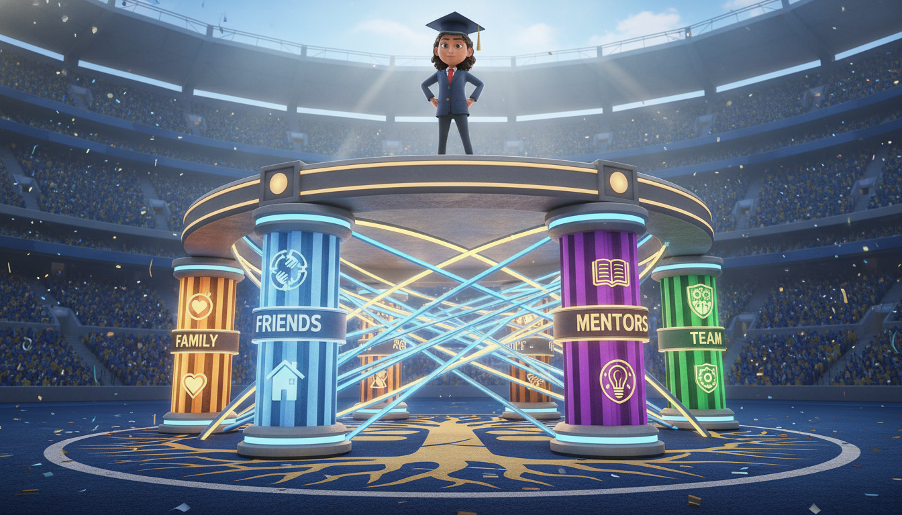

# Chapter 16: Building Your Support System

**[🏠 Back to Home](../README.md)** | **[📚 All Chapters](../README.md#-the-chapters)**

---

> 💡 **Key Insight**
> 💡 **Key Insight**
> 💡 **Key Insight**
> **Core Concept**: You can't win alone. Every champion has a support system—people who believe in you, catch you when you fall, and celebrate when you win.
> 💡 **Key Insight**
> **The Output**: Build genuine support → Navigate challenges with resilience, solve problems faster, take bigger risks, and rise together.

---

---

---

---

---

## $${\color{blue}The \space Breaking \space Point}$$

It's 9:47pm on a Tuesday.

Maya sits in her car in the school parking lot, crying so hard she can barely breathe.

She should be home by now. Her parents think she's at a student government meeting. Her friends think she's at soccer practice. Her teammates think she's studying. Nobody knows where she actually is right now: totally alone, totally overwhelmed, totally falling apart.

Here's what Maya's life looks like from the outside:

- Straight A's in all AP classes
- Varsity soccer captain
- Student government VP
- Perfect Instagram feed
- Always smiling
- Always "fine"

Here's what Maya's life actually looks like:

- Failing AP Calc and too embarrassed to ask for help
- Playing soccer on a stress fracture because she doesn't want to let her team down
- Spending student government meetings fighting panic attacks in the bathroom
- Parents fighting constantly at home (might be getting divorced)
- Hasn't slept more than four hours a night in weeks
- Crying in her car because it's the only place nobody can see her

The worst part? Everyone thinks she has it all together.

Her friends text: "You're so lucky, you're crushing it!"

Her teachers say: "Maya never needs help with anything."

Her coach brags: "Maya's the toughest player I've ever coached."

And Maya keeps smiling. Keeps saying "I'm fine." Keeps the mask on tight.

Because asking for help feels like admitting you're failing. Like you're not strong enough. Like you're the only one who can't handle what everyone else seems to handle just fine.

So she handles it alone. Until she can't anymore.

---

Wednesday morning, Maya limps into practice. Her ankle is swollen. She can barely put weight on it.

Coach Williams pulls her aside. "Maya, sit down. What's going on?"

"I'm good, Coach. Just a little sore."

"Maya." Coach's voice is firm but kind. "I've been coaching for twenty years. You're not good. Talk to me."

And something in Maya breaks.

The mask cracks.

The truth floods out.

"I can't do this anymore. I'm failing calculus. My ankle's been messed up for weeks. My parents are getting divorced and I'm the only one holding my little sister together. I haven't slept. I can't eat. And everyone thinks I'm fine because I keep pretending I am."

Coach sits next to her. Doesn't try to fix it. Just listens.

Then she says something Maya will never forget:

"Maya, why are you trying to carry all this alone?"

"Because... I should be able to handle it."

"Says who?"

Maya doesn't have an answer.

"You know what I see?" Coach continues. "I see someone so afraid of looking weak that she's about to break. That's not strength, Maya. That's pride. And pride will destroy you faster than any weakness ever could."

---

Here's what happened next.

Coach helped Maya tell her parents about the injury. They got her to a doctor (stress fracture—she'd been playing on a broken ankle for three weeks).

The school counselor helped Maya adjust her course load and connected her with a calculus tutor.

Maya's friends, when they finally found out what was really going on, rallied around her. Turns out two of them were also dealing with parents divorcing. Nobody was "fine."

Her soccer team stepped up to support her—not just on the field, but checking in on her mental health.

And Maya learned the hardest, most important lesson of her life:

> 💡 **Key Insight**
> 💡 **Key Insight**
> 💡 **Key Insight**
> **You don't have to carry everything alone.**

---

One year later, Maya's thriving.

Not because all her problems disappeared. Her parents did get divorced. Calculus is still hard. Her ankle still bothers her sometimes.

But she's not drowning anymore.

She has a support system now. Real people who know the real her. Who she can be honest with. Who catch her when she's falling.

And she's learned something that changed everything:

> 💡 **Key Insight**
> 💡 **Key Insight**
> 💡 **Key Insight**
> **Asking for help isn't weakness. It's strategy.**

---

---

---

---

---

## $${\color{blue}The \space Problem: \space The \space "I'll \space Handle \space It \space Alone" \space Trap}$$

Let's talk about the biggest lie your generation has been sold.

Social media shows you everyone's highlight reel. Perfect grades, perfect bodies, perfect lives. Everyone's crushing it. Everyone's got it together.

And you? You're struggling. Stressed. Overwhelmed. Barely keeping your head above water.

So you think: "Everyone else can handle this. What's wrong with me?"

> [!NOTE]
> **🎯 Core Principle**
> Here's the truth: **Everyone else is struggling too.** They're just not showing it.

We've created a culture where admitting you need help feels like admitting you're failing.

Where vulnerability looks like weakness.

Where asking for support means you're not strong enough to make it alone.

So everyone suffers in silence. Everyone pretends they're fine. Everyone drowns alone while looking like they're winning.

It's the loneliest game you can play.

---

### $${\color{blue}What \space Happens \space When \space You \space Try \space to \space Win \space Alone}$$

**Isolation**: Your problems feel bigger than they actually are. When you're inside your own head, everything gets magnified. That test you're stressing about? Feels impossible. That conflict with your friend? Feels permanent. That future you're worried about? Feels hopeless.

Without perspective from people you trust, your brain spirals. Anxiety compounds. Fear grows. And you start believing the worst version of every story your mind tells you.

**Burnout**: You can only carry so much alone. Eventually, the weight breaks you. Your performance suffers. Your mental health crashes. Your relationships strain. And by the time you ask for help, you're already in crisis mode.

**Missed Opportunities**: You don't know what help is available. Tutoring programs. Counseling services. Scholarships. Internships. Mentorship programs. They're all there—you just never thought to ask anyone about them.

Support systems don't just catch you when you fall. They show you paths you didn't know existed.

**Slower Recovery**: When you hit a setback—and you will—recovering alone takes forever. You ruminate. You spiral. You stay stuck. With support, you bounce back three times faster because you have people who help you process, reframe, and move forward.

**The Dangerous Belief**: "If I ask for help, people will think I'm weak. They'll think I can't handle it. They'll think I'm failing."

**The Reality**: People who ask for help are the strongest people in the room. They're smart enough to know that going alone is actually pride, not strength.

---

### $${\color{blue}The \space Truth \space Nobody \space Tells \space You}$$

Every person you think is crushing it alone? They're not.

That straight-A student who makes it look effortless? They have a tutor and a study group.

That athlete who dominates every game? They have coaches, trainers, sports psychologists, and teammates who push them.

That creator with millions of followers? They have editors, managers, collaborators, and a whole team behind the scenes.

> 💡 **Key Insight**
> 💡 **Key Insight**
> 💡 **Key Insight**
> **Nobody wins alone.**

The people who look like they're doing it solo? They just don't post about their support system on Instagram.

They're smart enough to build their team before they need it. Strategic enough to ask for help before they're drowning. Humble enough to know that strength isn't about doing everything yourself—it's about knowing when to bring in reinforcements.

---

---

---

---

---

## $${\color{blue}The \space Solution: \space Building \space Your \space Strategic \space Ohana}$$

Here's what champions know that everyone else is still learning:

> 💡 **Key Insight**
> 💡 **Key Insight**
> 💡 **Key Insight**
> **Your support system isn't a safety net for when you fail. It's the foundation you build success on.**

Marc Benioff, the CEO who built Salesforce into a $250 billion company, calls this "Ohana"—a Hawaiian word meaning family. Not just blood family, but your chosen family. The people you rise with.

He's said this over and over: "Business isn't about doing it alone. It's about building a community that lifts everyone up. That's how you create something that lasts."

And Oprah? She's spent her entire career proving that vulnerability isn't weakness—it's power.

"You don't have to do it alone," she says. "The strongest people I know are the ones brave enough to ask for help."

Let's build your Ohana. Your strategic support system. Your team.

---

### $${\color{blue}What \space a \space Support \space System \space Actually \space IS}$$

Not some vague "positive vibes" circle. Not people who just tell you what you want to hear.

A real support system is:

---

---

---

---

**People who believe in you when you don't believe in yourself.** When you're doubting everything, they remind you who you are. When you can't see the path forward, they help you remember where you're going.

**A safe space to be honest about your struggles.** No masks. No performance. No pretending you're fine when you're not. Real talk about real problems.

**Practical help when you need it.** Not just emotional support (though that matters). Actual help. Study sessions. Rides to practice. Connections to opportunities. Solutions to problems.

**Celebration when you win.** People who are genuinely happy for your success. Not jealous. Not competitive. Just proud of you.

**Reciprocal relationships.** This isn't one-way. You support them, they support you. Everyone rises together.

---

### $${\color{blue}The \space Three \space Layers \space of \space Support}$$

Think of your support system like a championship team. Different positions, different roles, all essential.

#### Layer 1: Your Inner Circle (2-5 People)

This is your starting lineup. Your core team.

These are the people who know the REAL you. Not the Instagram version. Not the "I'm fine" version. The messy, struggling, imperfect, real you.

You can call them at 2am when you're falling apart. You don't have to perform for them. You don't have to have it together. They love you anyway.

Usually this includes:

- Family members you trust
- Your absolute closest friends
- A mentor or coach who really knows you
- Maybe a therapist or counselor

**The key characteristic**: Unconditional support. These people are ride-or-die.

**Your job**: Be real with them. Let them see you struggle. Let them help.

---

#### Layer 2: Your Extended Network (10-20 People)

This is your bench. Your specialist players.

These are people you trust and respect, but in more specific contexts. You might not call them at 2am, but you'd definitely text them when you need their specific expertise or support.

Examples:

- Teammates who push you in your sport
- Study group members who help you academically
- Club members who share your interests
- Friends who you're close with but not Inner Circle
- Teachers or coaches who mentor you in specific areas

**The key characteristic**: Situational support. Reliable but not necessarily unconditional.

**Your job**: Build reciprocal relationships. Help them, let them help you.

---

#### Layer 3: Your Community (Broader)

This is your league. Your wider ecosystem.

School community. Teams. Organizations. Church. Clubs. Online communities around shared interests.

You're not close with everyone here, but you share identity and values. There's a sense of belonging. When something happens to someone in this community, you feel it.

**The key characteristic**: Shared identity and general belonging.

**Your job**: Show up. Contribute. Be part of something bigger than yourself.

---

> 💡 **Key Insight**
> 💡 **Key Insight**
> 💡 **Key Insight**
> **Coach's Corner:**

> Don't try to make everyone your Inner Circle. That's not how support systems work. You need different layers for different needs. Your Inner Circle is small and deep. Your Extended Network is broader and situational. Your Community is wide and gives you a sense of belonging. All three matter.

---

### $${\color{blue}The \space Strategic \space Vulnerability \space Playbook}$$

Here's where it gets real.

Building a support system requires vulnerability. And vulnerability feels scary as hell.

Brené Brown, who's spent decades researching this, found something powerful: **People with strong support systems aren't less afraid of vulnerability. They're just willing to be vulnerable anyway.**

Because they've learned what you're about to learn:

> 💡 **Key Insight**
> 💡 **Key Insight**
> 💡 **Key Insight**
> **Vulnerability isn't weakness. It's courage.**

When you show up as your real self—struggles and all—you give other people permission to do the same. That's when real connection happens.

Oprah's built her entire empire on this principle. "The moment you start telling the truth," she says, "you find out you're not alone. Everyone's been there. Everyone's struggled. We're all just pretending we haven't."

---

#### The Three Rules of Strategic Vulnerability

> 💡 **Key Insight**
> 💡 **Key Insight**
> 💡 **Key Insight**
> **Rule 1: Be Vulnerable With the Right People**

Not everyone deserves access to your struggles. Some people will use your vulnerability against you. Some people aren't safe.

Start with your Inner Circle. People who've proven they're trustworthy. People who've been there for you before.

Test the waters. Share something small. See how they respond. If they're supportive, share more. If they're judgmental or dismissive, that's information—they might not be Inner Circle material.

> 💡 **Key Insight**
> 💡 **Key Insight**
> 💡 **Key Insight**
> **Rule 2: Be Specific About What You Need**

"I'm struggling" is vague. "I'm falling behind in AP Bio and I need help understanding cellular respiration before Friday's test" is specific.

The more specific you are, the easier you make it for people to help you.

"I'm stressed" → hard to help with
"I'm overwhelmed by college apps and need someone to help me create a timeline" → easy to help with

> 💡 **Key Insight**
> 💡 **Key Insight**
> 💡 **Key Insight**
> **Rule 3: Vulnerability Creates Connection, Not Burden**

You're not burdening people by asking for help. You're giving them the gift of being useful. Of mattering to you. Of being part of your success story.

People want to help. They just need to know you need it.

---

### $${\color{blue}Why \space This \space Works: \space The \space Science \space of \space Support}$$

Let's get real about why support systems aren't just "nice to have." They're essential.

**The Harvard Grant Study** followed people for 80+ years—one of the longest studies on human happiness ever conducted. The #1 predictor of happiness and success? Not money. Not fame. Not achievements.

Quality of relationships.

The people with strong support systems lived longer, stayed healthier, recovered from setbacks faster, and reported higher life satisfaction at every age.

**Resilience research** shows that people with support systems bounce back from failures three times faster than people trying to recover alone. Three times. That's not marginal. That's game-changing.

**Neuroscience** tells us that social connection reduces cortisol (your stress hormone) and increases oxytocin (your bonding and trust hormone). Your brain literally works better when you're connected to supportive people.

**Performance psychology** in sports shows that athletes with strong support systems perform better under pressure. Why? Because they know someone's got their back. That safety net allows them to take bigger swings.

---

### $${\color{blue}The \space Support \space System \space Multiplier \space Effect}$$

Here's what happens when you build real support:

**Better Problem-Solving**: Ten people thinking about your problem will find solutions you'd never see alone. Different perspectives. Different experiences. Different ideas.

**Faster Emotional Recovery**: When you're spiraling, talking to someone who cares about you helps regulate your emotions. You process faster. You gain perspective. You don't stay stuck.

**Built-In Accountability**: When people know your goals, they check in on you. "How's that project going?" "Did you talk to that coach?" That gentle accountability keeps you moving forward.

**Motivation When You're Doubting**: You'll have moments when you want to quit. When you don't believe in yourself anymore. Your support system believes in you until you can believe in yourself again.

**Network Effects**: Your Inner Circle has their own networks. Opportunities come through connections. Jobs. Internships. Scholarships. Introductions. You don't get those when you're isolated.

**Compounding Growth**: When everyone in your support system is growing, you all rise together. Your success inspires them. Their success inspires you. It compounds.

---

> 💡 **Key Insight**
> 💡 **Key Insight**
> 💡 **Key Insight**
> **Coach's Corner:**

> Marc Benioff says: "Success isn't about climbing a ladder. It's about building an elevator and bringing everyone up with you." That's Ohana. That's how real champions think. Not "How do I win alone?" but "How do we all win together?"

---

---

---

---

---

## $${\color{blue}Real \space Champions, \space Real \space Support \space Systems}$$

Let's look at people who've proven this works.

### $${\color{blue}Oprah \space Winfrey: \space The \space Power \space of \space Chosen \space Family}$$

You know Oprah as one of the most successful people on the planet. Billionaire. Media mogul. Cultural icon.

But Oprah's early life? Poverty. Abuse. Discrimination. Obstacles most people never overcome.

So how'd she do it?

She built her Ohana. Her support system. Her chosen family.

**Mrs. Duncan**, her fourth-grade teacher, was the first person to show her unconditional love. To believe in her when nobody else did.

**Vernon Winfrey**, her father, provided structure and high expectations when she needed discipline and direction.

**Gayle King**, her best friend for 40+ years, has been there through every high and every low. Unconditional support. No jealousy. Just genuine friendship.

**Stedman Graham**, her partner, supported her massive ambitions without trying to shrink her.

When her show was struggling early on, Oprah didn't tough it out alone. She asked for help. Mentors. Therapists. Spiritual advisors. Business strategists.

She built her empire on top of a foundation of support.

"I don't have to do it alone," she's said repeatedly. "I have people. That's the secret. Not talent. Not hard work. People who believe in me."

**The lesson**: Even the most successful person you can think of didn't do it alone. She built her team. And then she won.

---

### $${\color{blue}Simone \space Biles: \space Vulnerability \space on \space the \space World's \space Biggest \space Stage}$$

Tokyo Olympics, 2021.

Simone Biles—the greatest gymnast of all time—pulls out of competition to protect her mental health.

The world watches. Some people support her. Some people criticize her. The pressure is crushing.

And then her support system shows up.

Her teammates publicly support her decision. "We've got her back," they say. They compete without her and rally around her.

Her therapist—she's been open about going to therapy—helps her work through the mental block (the "twisties" that made it dangerous for her to compete).

Her family shows up in Tokyo. Unconditional love. They don't care about medals. They care about her.

Her boyfriend flies to Tokyo to be there for her. Not for the spotlight. Just for her.

And here's what happened:

Simone came back. Competed on balance beam. Won bronze.

But more importantly, she showed the entire world what strength actually looks like.

> 💡 **Key Insight**
> 💡 **Key Insight**
> 💡 **Key Insight**
> **Strength isn't pretending you're fine when you're not.**

> 💡 **Key Insight**
> 💡 **Key Insight**
> 💡 **Key Insight**
> **Strength is saying "I need help" even when everyone's watching.**

**The lesson**: The highest performers in the world know when to ask for support. That's not weakness. That's wisdom.

---

### $${\color{blue}Jordan: \space A \space Student \space Who \space Learned \space to \space Ask}$$

Jordan's not famous. He's a regular high school junior.

But his story matters because it could be your story.

Sophomore year, Jordan's parents announced they were getting divorced. His grades started slipping. He stopped hanging out with friends. Spent most of his time alone in his room, gaming, trying to escape.

His teachers noticed. His grades dropped from As and Bs to Ds and Fs.

But Jordan kept saying he was fine.

Until his English teacher, Mr. Rodriguez, pulled him aside after class.

"Jordan, I see you. And you're not fine. Let's talk."

That conversation changed everything.

Mr. Rodriguez connected Jordan with the school counselor. The counselor connected him with:

- A peer support group for students with divorced parents (turned out half his school was dealing with this)
- A tutor for the classes he was falling behind in
- His soccer coach, who started checking in weekly
- A family therapist his mom and dad could work with

Here's what Jordan learned:

He wasn't alone. Everyone's dealing with something. And asking for help doesn't make you weak—it makes you smart.

Within one semester, Jordan went from barely passing to honor roll.

Not because his problems disappeared. His parents still got divorced. It still hurt.

But he wasn't carrying it alone anymore.

**The lesson**: You don't need Oprah's resources. You just need to ask the people around you. They want to help. They're just waiting for you to let them.

---

> 💡 **Key Insight**
> 💡 **Key Insight**
> 💡 **Key Insight**
> **Coach's Corner:**

> 💡 **Key Insight**
> 💡 **Key Insight**
> 💡 **Key Insight**
> Notice the pattern? Oprah. Simone. Jordan. Different levels. Different contexts. Same principle: **Nobody wins alone.** The people who succeed aren't the ones who don't need help. They're the ones brave enough to ask for it.

---

---

---

---

---

## $${\color{blue}Your \space Game \space Plan: \space Building \space Your \space Support \space System}$$

Okay, enough theory. Let's build your actual support system.

This isn't vague. This isn't someday. This is your strategic playbook for the next 30 days.

### $${\color{blue}Step \space 1: \space Audit \space Your \space Current \space Support \space System}$$

Before you can build, you need to know what you're working with.

Take inventory. Who's in your corner right now?

> 💡 **Key Insight**
> 💡 **Key Insight**
> 💡 **Key Insight**
> **Grab a piece of paper or open your notes app. Do this exercise:**

#### The Three-Layer Map

> 💡 **Key Insight**
> 💡 **Key Insight**
> 💡 **Key Insight**
> **INNER CIRCLE (2-5 people)**

Who knows the real you? Who can you call at 2am? Who would you trust with your deepest struggles?

1. _______________
2. _______________
3. _______________
4. _______________
5. _______________

**What they support me with**: (unconditional love, listening, perspective, etc.)

---

> 💡 **Key Insight**
> 💡 **Key Insight**
> 💡 **Key Insight**
> **EXTENDED NETWORK (10-20 people)**

Who do you trust in specific areas? Who helps you with particular challenges?

Academic support:

- _______________
- _______________

Athletic/activity support:

- _______________
- _______________

Creative/interest support:

- _______________
- _______________

Future planning support:

- _______________
- _______________

General friendship:

- _______________
- _______________
- _______________
- _______________

---

> 💡 **Key Insight**
> 💡 **Key Insight**
> 💡 **Key Insight**
> **COMMUNITY (broader sense of belonging)**

What groups give you a sense of identity and belonging?

- School: _______________
- Teams/clubs: _______________
- Religious/cultural: _______________
- Online communities: _______________
- Other: _______________

---

> 💡 **Key Insight**
> 💡 **Key Insight**
> 💡 **Key Insight**
> **Now ask yourself these questions:**

- Do I have at least 2-3 people in my Inner Circle?
- When's the last time I was really honest with them about what I'm struggling with?
- Are these relationships reciprocal, or am I always the helper (or always the one being helped)?
- Where are the gaps? What areas of my life don't have support?

**The Output**: A clear picture of who you can lean on—and where you need to build.

---

### $${\color{blue}Step \space 2: \space Identify \space Your \space Support \space Gaps}$$

You can't build what you can't see. Let's find the gaps.

> 💡 **Key Insight**
> 💡 **Key Insight**
> 💡 **Key Insight**
> **Map your current challenges against your support system:**

| Challenge Area | Who Currently Helps Me? | Is This Working? (✓ / ✗) |
|----------------|-------------------------|---------------------------|
| Academic stress/grades | _________________ | _____ |
| Athletic/activity pressure | _________________ | _____ |
| Family issues at home | _________________ | _____ |
| Mental health/anxiety | _________________ | _____ |
| Friend drama/social stress | _________________ | _____ |
| Future planning/college | _________________ | _____ |
| Money/financial stress | _________________ | _____ |
| Identity/who I am | _________________ | _____ |

> 💡 **Key Insight**
> 💡 **Key Insight**
> 💡 **Key Insight**
> **Be brutally honest:**

- Where am I struggling alone right now?
- What help do I need but haven't asked for?
- Who in my life has offered support that I've been declining?
- What resources exist that I haven't tapped into? (School counselors, tutoring programs, coaches, mentors, community programs)

**The Output**: Crystal clear understanding of where you need to build or strengthen support.

---

### $${\color{blue}Step \space 3: \space Ask \space for \space Help \space (The \space Hardest \space and \space Most \space Important \space Step)}$$

This is where most people stop. They see the gaps. They know they need help. But asking feels impossible.

Let's make it possible.

#### The Ask Formula

Every good ask has three parts:

> 💡 **Key Insight**
> 💡 **Key Insight**
> 💡 **Key Insight**
> **1. Be Specific**

Not "I'm struggling." That's too vague to help with.
Instead: "I'm failing AP Calc. I don't understand limits and derivatives and I have a test Friday."

> 💡 **Key Insight**
> 💡 **Key Insight**
> 💡 **Key Insight**
> **2. Make It Easy**

Tell them exactly what would help.
"Could you explain how limits work or point me toward a good YouTube channel or study guide?"

> 💡 **Key Insight**
> 💡 **Key Insight**
> 💡 **Key Insight**
> **3. Show Vulnerability**

Let them see the real situation.
"I've been trying to figure this out alone for weeks and I'm just getting more confused. I need help."

---

#### Ask Scripts for Different Situations

> 💡 **Key Insight**
> 💡 **Key Insight**
> 💡 **Key Insight**
> **To a Parent/Guardian:**

"Hey, can we talk? I'm really overwhelmed right now. Between school, [activity], and everything else, I feel like I'm drowning. I've been trying to handle it alone but I don't think I can anymore. Can we figure out a plan together? Maybe I need a tutor, or maybe we need to adjust my schedule. I just need some help."

---

> 💡 **Key Insight**
> 💡 **Key Insight**
> 💡 **Key Insight**
> **To a Teacher:**

"Hi [Teacher name], I need to talk to you about your class. I'm falling behind and I'm overwhelmed trying to catch up. I've been too embarrassed to say anything, but I can't figure this out alone. Could we set up a time to go over what I'm struggling with and make a plan? I want to do well, I just need some guidance."

---

> 💡 **Key Insight**
> 💡 **Key Insight**
> 💡 **Key Insight**
> **To a School Counselor:**

"I need to talk to someone about what I'm dealing with. [Be specific: my parents are getting divorced / I'm having panic attacks / I'm behind in multiple classes / I'm feeling depressed]. I don't really know where to start or what help is available. Can you help me figure out a plan?"

---

> 💡 **Key Insight**
> 💡 **Key Insight**
> 💡 **Key Insight**
> **To a Friend:**

"Can I be real with you about something? I've been acting like I'm fine, but I'm actually really struggling with [specific thing]. I'm not asking you to fix it, I just need someone who knows what's actually going on. Can I talk to you about it?"

---

> 💡 **Key Insight**
> 💡 **Key Insight**
> 💡 **Key Insight**
> **To a Coach:**

"Coach, can we talk after practice? My [injury/family situation/mental health/academic stress] is really affecting my performance and I need help figuring out how to balance everything. I don't want to let the team down but I also can't keep pushing through this alone. Can we make a plan?"

---

> 💡 **Key Insight**
> 💡 **Key Insight**
> 💡 **Key Insight**
> **What to expect when you ask:**

Most people will be glad you told them. They'll want to help. They've probably noticed you were struggling.

Some people might not respond the way you hope. That's okay. That's information—they might not be Inner Circle material.

Try again with someone else.

The right people will show up.

**The Output**: The support you actually need, because you were brave enough to ask.

---

### $${\color{blue}Step \space 4: \space Build \space Reciprocity \space (Be \space the \space Support \space You \space Want \space to \space Have)}$$

Support systems work both ways.

You can't just take. You have to give.

The question isn't just "Who's there for me?" It's also "Who am I there for?"

> [!IMPORTANT]
> #### How to Be a Great Support Person

> 💡 **Key Insight**
> 💡 **Key Insight**
> 💡 **Key Insight**
> **1. Show Up When They Need You**

Not just when you need them. Check in on people proactively. Notice when they're off. Ask how they're really doing.

> 💡 **Key Insight**
> 💡 **Key Insight**
> 💡 **Key Insight**
> **2. Listen Without Judgment**

Don't immediately try to fix their problems or tell them what they should do. Sometimes people just need to be heard.

Ask: "Do you want advice or do you just need me to listen?"

> 💡 **Key Insight**
> 💡 **Key Insight**
> 💡 **Key Insight**
> **3. Check In Proactively**

Don't wait for people to tell you they're struggling. Text your friends. Ask real questions. "How are you actually doing?" not just "What's up?"

> 💡 **Key Insight**
> 💡 **Key Insight**
> 💡 **Key Insight**
> **4. Celebrate Their Wins**

Be genuinely happy when good things happen to your people. Not jealous. Not competitive. Just happy for them.

> 💡 **Key Insight**
> 💡 **Key Insight**
> 💡 **Key Insight**
> **5. Hold Them Accountable (With Love)**

Real support includes calling people on their BS. "You said you wanted to do this. What's stopping you?" That's not judgment. That's accountability.

---

> 💡 **Key Insight**
> 💡 **Key Insight**
> 💡 **Key Insight**
> **The critical question to ask yourself:**

"Am I the kind of support I want to have in my life?"

If not, start there. Build the habits of being a great teammate, friend, and support person.

You attract what you give.

**The Output**: You become magnetic to other supportive people because you're supportive too.

---

### $${\color{blue}Step \space 5: \space Maintain \space Your \space System \space (Don't \space Wait \space for \space Crisis)}$$

Here's what most people get wrong:

They only reach out to their support system when they're drowning.

That's like only talking to your teammates when you're losing. It doesn't work.

You maintain your support system when things are good so it's there when things get hard.

#### Weekly Maintenance

> 💡 **Key Insight**
> 💡 **Key Insight**
> 💡 **Key Insight**
> **Every week, do this:**

- Check in with 1-2 Inner Circle people (even when you're doing fine)
- Share wins, not just struggles ("I crushed that test" / "I had a great practice")
- Ask "How are YOU doing?" (not just talking about yourself)
- Express gratitude: "I'm glad you're in my corner" / "Thanks for being someone I can count on"

> 💡 **Key Insight**
> 💡 **Key Insight**
> 💡 **Key Insight**
> **This takes 10 minutes total. You have time.**

---

#### Monthly Maintenance

> 💡 **Key Insight**
> 💡 **Key Insight**
> 💡 **Key Insight**
> **Once a month, audit:**

- Is my support system working? Am I getting what I need?
- Who do I need to connect with more intentionally?
- Is there someone new I should add to my Extended Network?
- Have I been reciprocating the support I receive?
- What gaps have emerged? What new challenges am I facing?

> 💡 **Key Insight**
> 💡 **Key Insight**
> 💡 **Key Insight**
> **Adjust accordingly.**

---

#### What This Looks Like in Practice

Sunday evening: Text your best friend. "Hey, how was your week? Want to catch up?"

Tuesday after school: Check in with your study group. "How's everyone feeling about Friday's test?"

Thursday at practice: Ask a teammate, "How's your ankle feeling? Still bothering you?"

This isn't complicated. It's just intentional.

**The Output**: A support system that's active and strong, not just emergency-only. When crisis hits, they're already there because you've been maintaining the relationship all along.

---

> 💡 **Key Insight**
> 💡 **Key Insight**
> 💡 **Key Insight**
> **Coach's Corner:**

> Think about the best teams in sports. They don't just show up on game day. They practice together. They eat together. They hang out. They build chemistry when it doesn't matter so it's there when it does. Your support system is the same. Build it before you need it.

---

---

---

---

---

## $${\color{blue}Practice \space Drills}$$

Okay, enough reading. Time to practice.

These aren't optional. These are your assignments for the next week.

### $${\color{blue}Drill \space 1: \space The \space Three-Layer \space Map \space (Complete \space This \space Week)}$$

> 💡 **Key Insight**
> 💡 **Key Insight**
> 💡 **Key Insight**
> **What to do:**

Actually fill out the three-layer map from Step 1. Don't skip this. Write down actual names.

Inner Circle: 2-5 people who know the real you
Extended Network: 10-20 people you trust in specific areas
Community: Groups where you belong

> 💡 **Key Insight**
> 💡 **Key Insight**
> 💡 **Key Insight**
> **Why it works:**

You can't build what you can't see. This gives you visibility into what you're working with.

> 💡 **Key Insight**
> 💡 **Key Insight**
> 💡 **Key Insight**
> **This week's challenge:**

Reach out to ONE Inner Circle person this week. Not because you need something. Just to connect.

Text: "Hey, I was just thinking about you. How are you actually doing?"

Then listen.

> 💡 **Key Insight**
> 💡 **Key Insight**
> 💡 **Key Insight**
> **Track it:**

- Who I reached out to: _______________
- What we talked about: _______________
- How I felt afterward: _______________

---

### $${\color{blue}Drill \space 2: \space The \space Vulnerability \space Practice \space (Start \space Small)}$$

> 💡 **Key Insight**
> 💡 **Key Insight**
> 💡 **Key Insight**
> **What to do:**

Ask for help with something low-stakes this week.

Not your biggest, scariest problem. Something smaller. Practice the ask.

Examples:

- "Can you help me study for this quiz?"
- "I'm confused about this homework problem, will you explain it?"
- "I'm stressed about [thing], can I vent for a minute?"
- "Do you know anyone who can help me with [specific thing]?"

> 💡 **Key Insight**
> 💡 **Key Insight**
> 💡 **Key Insight**
> **Why it works:**

Asking for help is a skill. You build the skill with low-stakes practice so when high-stakes moments come, you know how to do it.

> 💡 **Key Insight**
> 💡 **Key Insight**
> 💡 **Key Insight**
> **Track it:**

- What I asked for: _______________
- Who I asked: _______________
- What happened: _______________
- How I felt before asking (1-10): _____
- How I felt after (1-10): _____

**Goal**: By the end of the week, asking for help should feel slightly less scary.

---

### $${\color{blue}Drill \space 3: \space The \space Support \space Audit \space (Reflect \space on \space Last \space 30 \space Days)}$$

> 💡 **Key Insight**
> 💡 **Key Insight**
> 💡 **Key Insight**
> **What to do:**

Look back at the last month. Be honest.

> 💡 **Key Insight**
> 💡 **Key Insight**
> 💡 **Key Insight**
> **Answer these questions:**

1. When did I struggle alone when I could have asked for help?

_______________________________________________________________

2. When did someone offer help and I said "I'm fine" (but I wasn't)?

_______________________________________________________________

3. Who showed up for me in the last month? Did I thank them?

_______________________________________________________________

4. Who needed support from me? Did I show up?

_______________________________________________________________

5. What pattern do I notice? (Do I always give but never receive? Do I always take but never give? Do I isolate when things get hard?)

_______________________________________________________________

> 💡 **Key Insight**
> 💡 **Key Insight**
> 💡 **Key Insight**
> **Why it works:**

You can't change patterns you don't see. This creates awareness of how you're currently operating.

**The Output**: Clear understanding of your support habits so you can change what's not working.

---

### $${\color{blue}Weekly \space Check-In}$$

Track your progress over the next 7 days:

- [ ] **Day 1**: Complete the Three-Layer Map (who's in my support system?)
- [ ] **Day 2**: Identify one support gap (where do I need help?)
- [ ] **Day 3**: Ask for help with something small (practice the ask)
- [ ] **Day 5**: Check in with one Inner Circle person (maintain the relationship)
- [ ] **Day 7**: Complete the Support Audit (reflect on patterns)

> 💡 **Key Insight**
> 💡 **Key Insight**
> 💡 **Key Insight**
> **Pro Tip:**

> Don't try to build your entire support system in one week. You're just taking first steps. Mapping what you have. Asking for help once. Checking in once. That's enough to start. Support systems are built over months and years, not days. Just start.

---

---

---

---

---

## $${\color{blue}Post-Game \space Review}$$

Let's lock in what matters.

---

---

---

---

> [!TIP]
> ### Key Takeaways

> 💡 **Key Insight**
> 💡 **Key Insight**
> 💡 **Key Insight**
> **1. Nobody wins alone—every champion has a support system.**

The people who look like they're crushing it solo? They're not. They just don't broadcast their support system on social media. Build yours strategically.

> 💡 **Key Insight**
> 💡 **Key Insight**
> 💡 **Key Insight**
> **2. Vulnerability is courage, not weakness.**

Asking for help is the strongest move you can make. It takes more courage to say "I need support" than to suffer in silence. The bravest people are the most honest about their struggles.

> 💡 **Key Insight**
> 💡 **Key Insight**
> 💡 **Key Insight**
> **3. Build your system BEFORE you're in crisis.**

Don't wait until you're drowning to reach out. Maintain relationships when things are good so they're there when things get hard.

> 💡 **Key Insight**
> 💡 **Key Insight**
> 💡 **Key Insight**
> **4. Support is reciprocal—give and receive.**

You can't just take. You can't just give. Healthy support systems flow both ways. Be the support you want to have.

> 💡 **Key Insight**
> 💡 **Key Insight**
> 💡 **Key Insight**
> **5. Three layers: Inner Circle (unconditional), Extended Network (specific), Community (belonging).**

You need all three. Your Inner Circle is small and deep. Your Extended Network is broader and situational. Your Community gives you identity and belonging. Different layers for different needs.

---

### $${\color{blue}Reflection \space Questions}$$

Take a few minutes. Really think about these.

> 💡 **Key Insight**
> 💡 **Key Insight**
> 💡 **Key Insight**
> **1. When's the last time I was truly vulnerable with someone? How did it feel?**

_______________________________________________________________

> 💡 **Key Insight**
> 💡 **Key Insight**
> 💡 **Key Insight**
> **2. What's one thing I'm currently handling alone that I should ask for help with?**

_______________________________________________________________

> 💡 **Key Insight**
> 💡 **Key Insight**
> 💡 **Key Insight**
> **3. Who in my life has shown up for me repeatedly? Have I thanked them?**

_______________________________________________________________

> 💡 **Key Insight**
> 💡 **Key Insight**
> 💡 **Key Insight**
> **4. Am I as good at receiving support as I am at giving it? Why or why not?**

_______________________________________________________________

> 💡 **Key Insight**
> 💡 **Key Insight**
> 💡 **Key Insight**
> **5. What would change in my life if I actually believed "asking for help is strength, not weakness"?**

_______________________________________________________________

---

---

---

---

---

> [!TIP]
> ### Remember: The Output Mindset

Don't think: "I need to ask more people for help" (task-focused).

Think: **"I'm building a support system that will make me unstoppable"** (output-focused).

You're not just asking for help. You're strategically building your Ohana. Your team. Your foundation for everything you're going to accomplish.

You're building the community that will rise with you.

---

> 💡 **Key Insight**
> 💡 **Key Insight**
> 💡 **Key Insight**
> **Coach's Corner:**

> Marc Benioff says success is about building an elevator and bringing everyone up with you. That's what you're doing. You're not building a support system just for yourself. You're building the kind of community where everyone wins. Where everyone grows. Where everyone becomes the best version of themselves. That's Ohana. That's how champions think.

---

### $${\color{blue}Next \space Level}$$

You've learned to manage your mindset (Part 1), master your habits (Part 2), perform under pressure (Part 3), and build your team (Part 4).

You've covered the fundamentals. You've built your foundation.

Now comes Part 5: **Championship Level.**

This is where we talk about sustaining excellence long-term. How to handle major setbacks without breaking. How to keep growing when you've already achieved what you thought was your goal. How to build the life you actually want to live, not just the life that looks good on paper.

You've got the skills. You've got the habits. You've got the team.

Now let's talk about going the distance.

---

> 💡 **Key Insight**
> 💡 **Key Insight**
> 💡 **Key Insight**
> **The truth is simple:**

You can't win alone.

But you don't have to.

Your team is out there. Your Ohana is waiting.

You just have to be brave enough to build it.

Start today.

Ask for help.

Show up for others.

Rise together.

That's how champions do it.

That's how you'll do it.

Let's go.

---

[⬅️ Previous: Chapter 15 - The Mentor Advantage](chapter_15_the_mentor_advantage.md) | [📚 All Chapters](../README.md#-the-chapters) | [Next: Chapter 17 - Level Up Your Skills ➡️](chapter_17_level_up_your_skills.md)

