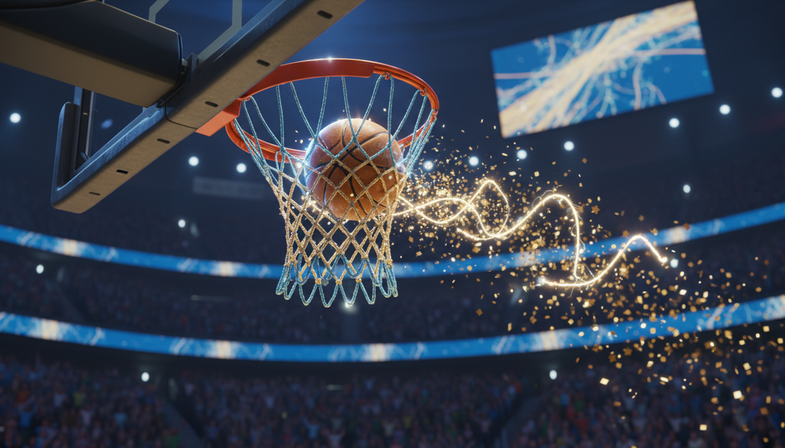

# Chapter 19: Clutch Moments

**[🏠 Back to Home](../README.md)** | **[📚 All Chapters](../README.md#-the-chapters)**

---

> 💡 **Key Insight**
> **Core Concept**: Champions aren't born—they're made in the moments when the pressure is highest. Clutch performance is a skill you can develop.
> **The Output**: Master high-pressure moments so you perform your best when stakes are highest.

---

---

---

## The Two Free Throws

Two basketball players. Same skill level. Same season. Both facing the exact same moment.

> [!NOTE]
> **💭 Key Insight**
> *Jordan's Championship Moment*

State championship game. Three seconds left. Tied score.

Jordan gets fouled driving to the basket. He's going to the line for two free throws. Make both, his team wins. Miss both, they lose. Simple math. Brutal pressure.

The entire season—every early morning practice, every grueling drill, every sacrifice—comes down to this. Ten seconds. Two shots. His whole team watching.

As Jordan walks to the free-throw line, his thoughts spiral:

"Everyone's watching. I can't miss. What if I blow it? What if I let everyone down? What if I'm not clutch enough?"

His hands start shaking. Heart hammering. Vision tunneling. The rim looks impossibly small.

He rushes the first shot. Clang off the rim.

The crowd gasps. Now he has to make the second one.

His mind races: "I just missed. Now I have to be perfect. Everyone saw me miss. Don't miss again."

Second shot—short. Doesn't even hit the rim.

Game over. Season over.

> [!NOTE]
> **💭 Key Insight**
> *What Happened After*

Jordan replays that moment in his head for months. Obsessively. Every night before sleep. Every time someone mentions basketball.

He starts avoiding free throw practice. It reminds him of the failure.

When the next season rolls around, he doesn't want the ball in big moments anymore. He passes to teammates when the game's on the line. Not because it's the right play—because he's scared.

One year later, he's still haunted. His confidence is shattered.

> [!NOTE]
> **💭 Key Insight**
> *Alex's Championship Moment*

Different game. Different team. Same scenario. Same stakes.

Alex gets fouled. Going to the line. Two free throws. Win or lose. Everything on the line.

Same pressure. Same crowd noise. Same weight of expectation.

But Alex's thoughts go somewhere different:

"I've practiced this ten thousand times. Same routine. Deep breath. Just like practice."

She goes through her pre-shot ritual. The exact same routine she's done thousands of times in the gym when nobody was watching.

Bounces the ball three times. Deep exhale. Focuses on the front of the rim. Nothing else exists.

First shot—swish.

She doesn't celebrate. Doesn't react. Same routine. Second shot. Bounce, bounce, bounce. Exhale. Focus.

Swish.

Game over. State champions.

> [!NOTE]
> **💭 Key Insight**
> *What Happened After*

The team celebrates. Alex is happy, but she's not surprised. She prepared for this moment. She trained for pressure.

The next day, she's in the gym reviewing film with her coach. "What can I improve for next time?"

She knows there will be a next time. Another big moment. Another clutch situation.

One year later, everyone on the team knows: when the game's on the line, get the ball to Alex. She's the most clutch player they've got.

**The Difference**

Same moment. Same stakes. Same physical skill level.

Different preparation. Different mindset. Different outcome.

Jordan froze. Alex executed.

Jordan avoided pressure after. Alex trained for more of it.

Here's what nobody tells you about clutch performance: it's not magic. It's not genetics. It's not some mysterious "clutch gene" that some people have and others don't.

It's a trainable skill.

You either prepare for big moments, or they eat you alive.

---

---

---

## The Pressure Paradox

Let's talk about what actually happens to your body in high-stakes moments.

You step up to take the game-winning shot. Or walk into the room for your big presentation. Or sit down for the final exam that determines your grade.

Suddenly, your body does this:

Heart rate spikes. Hands start sweating. Muscles tighten. Vision narrows. Breathing gets shallow.

This isn't weakness. This is biology.

Your brain has detected a threat. Not a physical threat like a lion chasing you, but a social threat that your ancient brain treats the same way.

It triggers your fight-or-flight response. Adrenaline floods your system. Your body is preparing you to either attack the threat or run from it.

The problem? Neither fighting nor fleeing helps you sink a free throw or ace an exam.

Your brain shifts into survival mode. And survival mode is the opposite of performance mode.

Skills you've mastered suddenly feel impossible. Your smooth shooting form feels jerky. Your clear thinking gets cloudy. One small mistake spirals into catastrophic thinking.

This is the pressure paradox: the moments that matter most are the moments when your body actively works against you.

> [!NOTE]
> **💭 Key Insight**
> *The Myths About Clutch Performance*

> [!NOTE]
> **💭 Key Insight**
> *Myth 1: "Some people are just born clutch"*

Reality: Nobody is born clutch. Clutch is built through specific preparation.

Michael Jordan missed 26 game-winning shots in his career. Twenty-six. He's considered the most clutch player in basketball history, and he failed 26 times in the biggest moments.

What made him clutch wasn't that he never felt pressure. It's that he trained for pressure better than everyone else.

> [!NOTE]
> **💭 Key Insight**
> *Myth 2: "You need to be calm and relaxed"*

Reality: The best performers don't eliminate arousal—they manage it.

There's a sweet spot between "too relaxed" and "too amped up." That's where peak performance lives. You need some arousal to perform your best. You just can't let it overwhelm you.

> [!NOTE]
> **💭 Key Insight**
> *Myth 3: "Try harder when it matters most"*

Reality: Trying harder causes choking. Trusting your training prevents it.

Researcher Sian Beilock spent years studying why experts choke under pressure. Her finding? Overthinking causes failure. When you try to consciously control something your body knows how to do automatically, you screw it up.

Elite performers automate their skills through practice, then trust their body in big moments. They don't try harder—they think less.

> [!NOTE]
> **💭 Key Insight**
> *Myth 4: "Winners never feel pressure"*

Reality: Winners feel pressure intensely. They just have systems to handle it.

Reed Hastings, founder of Netflix, made some of the biggest bets in business history. In 2007, he decided to bet the entire company on streaming when everyone thought he was crazy. In 2013, he dropped one hundred million dollars on a show without even seeing a pilot episode.

Think he didn't feel pressure? He felt massive pressure. But he had systems to handle it.

**Why People Choke**

**Overthinking**: Your brain gets in the way. "What if I mess up?" You're not focused on execution—you're focused on fear.

**Outcome Focus**: You're thinking about winning instead of executing. "I have to make this shot" instead of "Execute my routine."

**Lack of Routine**: You have no system to fall back on. When pressure hits, you're winging it.

**Insufficient Pressure Training**: You've never practiced under stress. Game conditions feel foreign because they are.

**Fear of Judgment**: "Everyone's watching me." You're performing for the crowd instead of performing period.

All of these are fixable.

---

---

---

## The Clutch Performance System

Here's the formula:

> [!NOTE]
> **💭 Key Insight**
> *CLUTCH PERFORMANCE = Preparation × Composure × Execution*

If any variable equals zero, the whole thing fails.

All three working together? That's when you deliver.

### Component 1: PREPARATION (Before the Moment)

In 2007, Netflix was primarily a DVD-by-mail service. Streaming existed, but it was clunky and most people didn't use it.

Reed Hastings looked at the data and saw something others didn't: streaming was going to replace DVDs. Not maybe. Not eventually. Soon.

So he made a call that board members thought was insane: pivot the entire company to streaming. Bet everything on a technology most consumers didn't even have the bandwidth for yet.

Impulsive? No.

Hastings didn't wake up one day and make that decision on a whim. He ran models. Analyzed trends. Studied the competition. Prepared for every possible outcome.

When the moment came to commit, he was ready. Not because he was fearless—because he was over-prepared.

Six years later, he did it again with House of Cards.

Traditional entertainment model: license content from studios. Netflix's model: produce original content themselves.

Nobody was doing this. A tech company producing its own shows? The industry laughed.

Hastings pitched House of Cards: one hundred million dollars for two seasons, sight unseen. No pilot. Just commit.

His board thought he'd lost his mind. Analysts said Netflix wasn't a production company—they were a tech platform. The risk was enormous. If it failed, the company could collapse.

But Hastings wasn't gambling.

He'd analyzed years of viewer data. He knew exactly what audiences wanted. His data told him this would work. He'd studied DVD rental patterns obsessively. He had conviction built on work, not gut feeling.

He made the bet. House of Cards succeeded beyond expectations. It opened the floodgates for Netflix originals and changed the entertainment industry forever.

> [!NOTE]
> **💭 Key Insight**
> *Preparation Principles*

> [!NOTE]
> **💭 Key Insight**
> *1. Over-Prepare for Big Moments*

Most people practice until they get it right. Champions practice until they can't get it wrong.

> [!NOTE]
> **💭 Key Insight**
> *2. Simulate Pressure in Practice*

Train harder than the game. Make practice conditions tougher than real conditions. When the actual moment arrives, it feels easier, not harder.

> [!NOTE]
> **💭 Key Insight**
> *3. Build Scenario Libraries*

"If X happens, I'll do Y." Game through possible scenarios before they happen. Hastings didn't just prepare for success with House of Cards—he prepared for failure. He knew what he'd do if it bombed.

> [!NOTE]
> **💭 Key Insight**
> *4. Study Past Clutch Moments*

Yours and others'. What worked? What didn't? Patterns emerge. Learn from them.

> [!NOTE]
> **💭 Key Insight**
> *5. Eliminate Variables You Can Control*

Routine removes uncertainty. Every variable you control is one less thing to think about when pressure hits.

**Coach's Corner:**

> Hope is not a strategy. Preparation is. You can't control outcomes, but you can control how ready you are for the moment.

### Component 2: COMPOSURE (During the Moment)

Let's be honest about what happens physiologically when pressure hits.

Your heart rate spikes. Adrenaline floods your system. Your muscles tense. Your breathing gets shallow.

You can't avoid this. It's hardwired into your biology.

The goal isn't to be calm like a monk meditating. The goal is to manage your arousal so it helps you instead of hurting you.

Think about the Yerkes-Dodson Law. It's a research principle that shows performance increases with arousal—up to a point. Too little arousal, you're bored and underperform. Too much arousal, you're overwhelmed and choke.

There's an optimal zone in the middle. That's where clutch happens.

> [!NOTE]
> **💭 Key Insight**
> *Composure Techniques*

> [!NOTE]
> **💭 Key Insight**
> *1. Controlled Breathing (Physiological Reset)*

Four seconds in through your nose. Six seconds out through your mouth.

Why this works: it activates your parasympathetic nervous system. That's the system that calms your body down. Your heart rate lowers. Your mind clears. You get out of fight-or-flight mode.

This isn't hippie nonsense. This is biology. Navy SEALs use this technique before combat. Surgeons use it before critical operations. It works.

> [!NOTE]
> **💭 Key Insight**
> *2. Pre-Performance Routine (Creates Control and Familiarity)*

Same sequence every time. Basketball players bounce the ball the same number of times. Tennis players tug their shirt in the same spot. Actors do the same warm-up before going on stage.

Why? Because it anchors you to practice, not pressure. Your body recognizes the routine and knows what comes next. It creates familiarity in an unfamiliar moment.

> [!NOTE]
> **💭 Key Insight**
> *3. Process Focus (Not Outcome Focus)*

Think: "Execute the shot."
Don't think: "Make the shot."

Think: "Say the next sentence."
Don't think: "Don't mess up this speech."

Focus on what you control. The process. Not the result.

> [!NOTE]
> **💭 Key Insight**
> *4. Positive Self-Talk (Reprogram Fear Response)*

Your brain listens to what you tell it.

Say: "I'm ready for this."
Don't say: "Don't mess up."

Say: "I've trained for this moment."
Don't say: "I hope I don't choke."

Approach language activates. Avoidance language paralyzes.

### Component 3: EXECUTION (The Moment)

Here's the paradox that trips people up:

Trying harder in clutch moments causes choking. Trusting your preparation causes flow.

You've practiced that free throw a thousand times. Your body knows what to do. Get out of your own way and let it work.

> [!NOTE]
> **💭 Key Insight**
> *Execution Principles*

**1. Simplify**

One thing at a time. Not everything at once.

Don't think: "I need to keep my elbow in, follow through, watch the rim, stay balanced, and nail this shot."

Think: "Front of the rim."

One cue. That's it.

> [!NOTE]
> **💭 Key Insight**
> *2. Trust the Process*

Your routine, not the outcome.

Do what you've practiced. The same way you've practiced. Trust that the result will follow.

> [!NOTE]
> **💭 Key Insight**
> *3. Act Decisively*

Hesitation kills clutch performance.

When the moment comes, commit. Don't second-guess. Don't overthink. Execute.

**4. Stay Present**

This moment. Not the last play. Not the next one.

Right here, right now.

> [!NOTE]
> **💭 Key Insight**
> *When Reed Hastings Made His Biggest Mistake*

2011. Netflix announced they were splitting their DVD and streaming services into two separate companies. DVDs would be "Qwikster." Streaming would stay Netflix.

Customers hated it. The stock crashed. They lost 800,000 subscribers in three months.

It was a disaster. Hastings' biggest failure.

He could have defended the decision. Doubled down. Blamed customers for not understanding the vision.

Instead, he did something different. He owned it. Apologized publicly. Reversed course. And then studied what went wrong obsessively.

The lesson he learned? "Move fast, but listen to your customers." He'd made the decision under pressure without enough customer research. Rushed it. Didn't prepare properly.

He never made that mistake again.

Here's what separates champions from everyone else: Champions blow clutch moments too. But they learn from them. They study their failures. They prepare for the next high-stakes situation differently.

Losing isn't the problem. Not learning from losing is.

---

---

---

## The Output Focus

Here's what you gain when you develop clutch skills:

> [!NOTE]
> **💭 Key Insight**
> *Confidence in High-Stakes Moments*

You're not winging it. You've trained for this. That changes everything.

> [!NOTE]
> **💭 Key Insight**
> *Consistent Performance Under Pressure*

It's not luck. It's a repeatable system. You can deliver again and again.

> [!NOTE]
> **💭 Key Insight**
> *Faster Recovery from Clutch Failures*

You don't spiral after blowing a big moment. You learn. Adjust. Prepare for the next one.

> [!NOTE]
> **💭 Key Insight**
> *Recognition as a "Clutch Player"*

Coaches, teachers, leaders notice who delivers when it matters. They trust you with more opportunities. Big moments start finding you.

**Competitive Edge**

Most people choke under pressure. When you don't, you win by default.

> [!NOTE]
> **💭 Key Insight**
> *Opportunity Magnet*

Big moments go to people who can handle them. When you've got a reputation for being clutch, opportunities come to you.

| Don't Think | Think |
|-------------|-------|
| "I hope I don't choke" | "I've trained for this moment" |
| "I have to be perfect" | "I need to execute my process" |
| "Everyone's watching me" | "I'm ready to show what I've practiced" |
| "This is so much pressure" | "Pressure creates diamonds" |
| "What if I fail?" | "What if I succeed?" |
| "I'm not clutch" | "Clutch is a skill I'm building" |

---

---

---

## Real-World Examples

> 💡 **Key Insight**
> **Example 1: Reed Hastings - The $100M Bet**
>

**The Moment**

2011. Netflix needed original content to compete. The traditional model—license shows from networks—wasn't sustainable long-term.

Hastings had an idea: produce their own shows. But nobody in streaming had done this successfully. It was unproven. Risky as hell.

He pitched House of Cards. One hundred million dollars for two seasons. No pilot. They'd have to commit sight unseen.

**The Pressure**

The board was skeptical. "That's insane. We're a tech company, not a studio."

Analysts agreed. "Netflix doesn't know how to make TV shows. They'll lose everything."

If it failed, the company could collapse. The future of Netflix was on the line.

**The Preparation**

Hastings didn't make this bet impulsively. He'd been preparing for years.

He analyzed mountains of viewer data. He knew what audiences wanted. Political thrillers. Complex characters. Kevin Spacey.

He'd studied DVD rental patterns obsessively. He understood viewer behavior better than the networks did.

He had conviction based on data, not gut feeling.

**The Execution**

He made the bet.

House of Cards premiered in 2013. It was a massive hit. It proved Netflix could compete with traditional studios.

It opened the floodgates. Netflix became a production powerhouse. They've now produced hundreds of shows and movies.

**The Output**

Netflix went from being a tech platform to dominating entertainment. Hastings delivered when everyone doubted.

**Lesson**: Big bets aren't reckless when you've done the preparation. Clutch decisions come from deep conviction built on work.

> 💡 **Key Insight**
> **Example 2: Simone Biles - Olympic Beam Final**
>

**The Moment**

2016 Rio Olympics. Balance Beam Final.

Simone had already won three gold medals. The pressure was on to sweep every event. Everyone expected it.

Beam is the most nerve-wracking event in gymnastics. Four inches wide. One wobble and you're done. Every tiny mistake is visible.

**The Pressure**

The entire world was watching.

The gymnast before her, Laurie Hernandez, had just scored high. The pressure intensified.

Expectations were crushing: "She HAS to win. She's Simone Biles."

**The Preparation**

Simone had trained that beam routine ten thousand times. More than that, probably.

She practiced with distractions. Coaches yelling. Music playing. People watching. She made practice chaotic on purpose so competition would feel calm.

She built a pre-routine ritual and did it the same way every single time.

She visualized perfect execution daily.

**The Execution**

She stepped up to the beam. Did her routine. The exact same pre-performance sequence she'd done thousands of times.

Blocked out the crowd noise. Focused on the beam. On her body. On the movements she'd practiced until they were automatic.

Executed a near-flawless routine. Stuck the landing.

**The Output**

Gold medal. Clutch performance on the biggest stage in sports.

**Lesson**: When pressure's highest, fall back on your routine. Your body knows what to do if you trust it.

> 💡 **Key Insight**
> **Example 3: Emma's Student Body President Speech**
>

**The Moment**

Emma was running for student body president. The final speeches were in front of the entire school—800 students in the auditorium.

She was terrified of public speaking. Always had been.

She was competing against a popular, charismatic opponent who seemed born for this.

**The Pressure**

First time speaking to the whole school. Ever.

She knew if she winged it, she'd mess up badly.

Her friends were counting on her. She wanted to prove to herself she could do hard things.

**The Preparation**

Emma wrote her speech. Then rewrote it five times.

She practiced in front of her mirror fifty-plus times. Recorded herself on her phone. Fixed the awkward parts.

She did mock speeches for her family, her friends, her favorite teacher. Got feedback. Adjusted.

She game-planned: "What if I forget a line?" She memorized key points, not word-for-word. That way a brain freeze wouldn't kill her.

She built a pre-speech routine: three deep breaths, smile, make eye contact with one friendly face in the crowd.

**The Execution**

Moments before walking on stage, her hands were shaking. Heart racing.

She used her routine. Three deep breaths. Centered herself.

Started speaking. Thirty seconds in, her mind went blank for two seconds. Complete white-out.

---

---

She didn't panic. She remembered: "Say the next key point." She did. Kept going.

Finished strong. The auditorium gave her a standing ovation.

**The Output**

She won the election.

Not because she was naturally confident. Not because she's a gifted public speaker. Because she prepared for the clutch moment.

**Lesson**: You don't have to be fearless. You need a system that works when fear shows up.

---

---

---

## Your Game Plan

### Step 1: Identify Your High-Stakes Moments

You can't prepare for pressure if you don't know where it's coming from.

Everyone faces pressure differently. What makes you nervous might not bother someone else. What feels low-stakes to others might feel massive to you.

Identify where YOU need clutch performance.

> [!NOTE]
> **💭 Key Insight**
> *Examples of High-Stakes Moments for Teens:*

**Academic**: Final exam, big presentation, college interview, SAT/ACT test, defending a thesis, leading a class discussion

**Athletic**: Championship game, penalty kick, free throw with game on the line, race finish, tournament match

**Social**: Public speaking, performance (music/theater), asking someone out, tough conversation, standing up for yourself or someone else

**Leadership**: Running a meeting, making a decision under pressure, conflict resolution, giving feedback

**Creative**: Audition, portfolio deadline, recital, opening night, showcasing your work

> [!NOTE]
> **💭 Key Insight**
> *Your Clutch Moment Inventory*

| Area | Upcoming High-Stakes Moment | Stakes (What's on the line?) | Pressure Level (1-10) |
|------|----------------------------|------------------------------|----------------------|
| Example: Sports | Championship game next month | Season on the line | 9/10 |
| Academic | __________ | __________ | ____ |
| Athletic | __________ | __________ | ____ |
| Social | __________ | __________ | ____ |
| Creative | __________ | __________ | ____ |

**The Output**: Clear picture of where you need to develop clutch skills.

### Step 2: Over-Prepare for Big Moments

The 10x Preparation Rule: Practice ten times more than you think you need to.

Most people practice until they get it right. Champions practice until they can't get it wrong.

> [!NOTE]
> **💭 Key Insight**
> *Preparation Framework*

> [!NOTE]
> **💭 Key Insight**
> *For a Big Game/Performance:*

> [!NOTE]
> **💭 Key Insight**
> *Two Weeks Out: Master the Fundamentals*

Perfect your technique when there's no pressure. Build muscle memory through repetition. Record yourself. Identify flaws. Fix them.

Become so automatic you could do it in your sleep.

> [!NOTE]
> **💭 Key Insight**
> *One Week Out: Simulate Game Conditions*

Practice with distractions. Noise. People watching. Time pressure.

Run through worst-case scenarios. "What if my first shot misses?" "What if I drop the ball?" "What if I forget my lines?"

Game through the chaos before it happens.

> [!NOTE]
> **💭 Key Insight**
> *Three Days Out: Pressure Train*

Invite people to watch practice. Make it uncomfortable.

Add consequences. "If I miss, I do twenty push-ups." "If I mess up, I start over."

Make practice harder than the real thing. When game day comes, it actually feels easier.

> [!NOTE]
> **💭 Key Insight**
> *For a Big Test/Presentation:*

> [!NOTE]
> **💭 Key Insight**
> *Two Weeks Out: Master Content*

Know the material cold. Not "pretty well." Cold.

Explain concepts to someone else. That's the test of whether you actually understand it.

Practice problems until they're automatic. No hesitation.

> [!NOTE]
> **💭 Key Insight**
> *One Week Out: Simulate Test Conditions*

Take practice tests under time pressure. Strict time limits. No notes. No help. Real conditions.

Review your mistakes obsessively. Figure out why you got things wrong. Fix the gaps.

> [!NOTE]
> **💭 Key Insight**
> *Three Days Out: Build Contingency Plans*

"What if my mind goes blank?" → Memorize key points to anchor yourself.

"What if I run out of time?" → Prioritize the most important sections.

"What if I forget a formula?" → Memorize the most critical ones.

> [!NOTE]
> **🎯 Core Principle**
> **The Hastings Principle**: "Hope is not a strategy. Preparation is."

When the moment arrives, you're over-prepared. Not winging it.

**The Output**: Confidence built on work, not wishful thinking.

### Step 3: Build Your Pre-Performance Routine

> [!NOTE]
> **💭 Key Insight**
> *Why Routines Work*

They give you something familiar when everything feels chaotic.

They activate muscle memory. Your body knows what comes next.

They shift your focus from outcome to process.

They create a sense of control in an uncontrollable moment.

> [!NOTE]
> **💭 Key Insight**
> *Components of a Clutch Routine*

> [!NOTE]
> **💭 Key Insight**
> *1. Physical Reset (Manage Arousal)*

Deep breathing: Four seconds in through nose, six seconds out through mouth. Repeat three times.

Muscle relaxation: Tense your shoulders, then release. Drops the tension.

Purposeful movement: Bounce, jump, shake out your hands. Physical release.

> [!NOTE]
> **💭 Key Insight**
> *2. Mental Anchor (Shift Focus)*

Positive self-talk: "I'm ready." "I've done this a thousand times."

Process cue: "Execute my shot." "Next play." "One word at a time."

Visualization: See yourself succeeding. Quick flash, not a long movie.

> [!NOTE]
> **💭 Key Insight**
> *3. Behavioral Cue (Trigger Preparation)*

Same sequence every time. Your body learns "this means go time."

Examples:

- **Basketball**: Bounce ball three times, deep breath, focus on rim
- **Public speaking**: Smile, scan the room, deep breath, start
- **Test-taking**: Close eyes for three seconds, exhale, read first question
- **Before competition**: Put on headphones, listen to same song, visualize success

> [!NOTE]
> **💭 Key Insight**
> *Create Your Routine*

**My High-Stakes Moment**: ___________________________

**My Pre-Performance Routine**:

1. **Physical**: ___________ (breathing, movement, tension release)
2. **Mental**: ___________ (self-talk, cue, visualization)
3. **Behavioral**: ___________ (specific action sequence)

> [!NOTE]
> **💭 Key Insight**
> *Practice Your Routine*

Do it fifty times in low-pressure situations. Just normal practice or studying.

Then do it twenty times in medium-pressure situations. Harder practices. Mock tests.

Then trust it when stakes are high.

**The Output**: A reliable system that works when pressure spikes.

### Step 4: Manage the Moment (Execute Under Pressure)

> [!NOTE]
> **💭 Key Insight**
> *When You're IN the Clutch Moment*

**The Three Ps**

> [!NOTE]
> **💭 Key Insight**
> *1. PROCESS (Not Outcome)*

Focus on: "What do I need to do right now?"

Don't focus on: "What if I fail?" "What happens if I win?"

One step at a time. Not ten steps ahead.

Examples:

- **Free throw**: Focus on routine, not score
- **Presentation**: Focus on next sentence, not audience reaction
- **Test question**: Focus on solving this problem, not final grade

> [!NOTE]
> **💭 Key Insight**
> *2. PRESENT (Not Past or Future)*

Be here now.

Last mistake is over. You can't change it.

Next play hasn't happened. You can't control it.

This moment is the only one that matters.

**Reset phrases when you get ahead of yourself**:
- "Next play"
- "Right here, right now"
- "This one"

> [!NOTE]
> **💭 Key Insight**
> *3. POSITIVE (Not Avoidance Language)*

Your brain doesn't process negatives well.

**Avoid this**:
- "Don't miss"
- "Don't mess up"
- "Don't think about failing"

**Say this instead**:
- "Make this shot"
- "Execute perfectly"
- "Win this moment"

> [!NOTE]
> **💭 Key Insight**
> *The Reed Hastings Move*

When making high-stakes decisions, he asks: "What's the worst that happens if I'm wrong?"

If you can survive the worst case, make the bold call.

> [!NOTE]
> **💭 Key Insight**
> *Emergency Reset (When You're Spiraling)*

If you feel yourself choking:

1. **Pause** (if possible)—take three seconds
2. **Breathe** (four in, six out)—physiological reset
3. **Refocus** ("Next play" / "My routine" / "I'm ready")
4. **Execute** (trust training, don't overthink)

**The Output**: You perform when it matters because you have a system.

### Step 5: Learn from Clutch Failures

Here's the truth: You WILL blow clutch moments sometimes. Everyone does.

Michael Jordan missed 26 game-winners. Serena Williams lost finals. Reed Hastings made hundred-million-dollar mistakes.

The difference? Champions study their failures and prepare for the next one.

> [!NOTE]
> **💭 Key Insight**
> *The Qwikster Lesson*

2011. Netflix announced they were splitting DVD and streaming into two companies. Customers hated it. Stock crashed. 800,000 subscribers lost.

Hastings could have defended the decision. Could have blamed customers for not understanding.

Instead: He apologized. Reversed course. Studied what went wrong.

He learned: "Move fast, but listen to customers." He'd rushed the decision under pressure. Didn't prepare properly. Didn't research enough.

He never made that mistake again.

> [!NOTE]
> **💭 Key Insight**
> *Post-Clutch Failure Protocol*

> [!NOTE]
> **💭 Key Insight**
> *Immediately After (Within 24 Hours)*

1. **Feel it** (don't suppress)—it's okay to be upset
2. **Separate identity from performance**—you're not a failure, you had a failure
3. **Avoid catastrophizing**—one moment doesn't define you

**Within One Week**

1. **Review what happened (objectively)**

   - What was in my control?
   - What wasn't in my control?
   - Where did my preparation fall short?
   - Where did my composure break down?
   - What would I do differently?

2. **Create a learning plan**

   - Skill to improve: ___________
   - Mental adjustment: ___________
   - Preparation change: ___________

3. **Get back in pressure situations ASAP**

   - Don't avoid the thing that scared you
   - Confidence comes from doing it again and succeeding

> [!NOTE]
> **💭 Key Insight**
> *Reframe the Failure*

| Instead of Thinking | Think |
|---------------------|-------|
| "I'm not clutch" | "I'm learning to be clutch" |
| "I always choke" | "I choked this time—next time I'll be ready" |
| "I let everyone down" | "I gave it my best and I'll learn from this" |
| "I can't handle pressure" | "Pressure reveals where I need more preparation" |

**The Growth Question**: "What's the training this failure is showing me I need?"

**The Output**: Every clutch failure becomes preparation for the next clutch success.

### Step 6: Seek Out Pressure (Become a Pressure Hunter)

**The Counterintuitive Move**: Don't avoid pressure—actively seek it.

**Why**:

Pressure is the only way to get better at pressure.

Each high-stakes rep builds clutch muscle.

You can't simulate real pressure in your comfort zone.

> [!NOTE]
> **💭 Key Insight**
> *How to Hunt Pressure*

**In Sports/Performance**:
- Ask coach: "Put me in high-pressure situations in practice"
- Volunteer to take the big shot, solo, or moment
- Compete in more games/tournaments (more reps)

**In School**:
- Take harder classes (more pressure, more growth)
- Present first (don't hide in the middle)
- Lead the group project (more responsibility)

**In Life**:
- Raise your hand when no one else does
- Have the tough conversation
- Try the thing that scares you

**The Hastings Mindset**: "If you're not taking big swings, you're playing it too safe."

> [!NOTE]
> **💭 Key Insight**
> *Practice Pressure Escalation*

- **Week 1**: Low stakes (practice with one person watching)
- **Week 2**: Medium stakes (practice with team/class watching)
- **Week 3**: High stakes (simulate game/performance exactly)
- **Week 4**: Real moment (trust your training)

**The Output**: Pressure stops feeling foreign. It becomes familiar.

---

---

---

## Practice Drills

### Exercise 1: The Pressure Simulation Lab

**Goal**: Create pressure in practice that matches or exceeds real moments.

**For Athletes**

**Free Throw Pressure Drill**:
- Ten free throws
- Miss one = whole team runs sprints
- Everyone watching
- Simulates end-of-game pressure

**Scrimmage with Consequences**:
- Losing team does conditioning
- Shot clock shorter than real game
- Coaches watching, taking notes

> [!NOTE]
> **💭 Key Insight**
> *For Students/Performers*

**Timed Practice Tests**:
- Strict time limits (15 percent less time than real test)
- No notes, no help
- Grade yourself harshly

**Mock Presentations**:
- Present to friends/family
- Ask them to ask tough questions
- Do Q&A after (simulate unexpected challenges)

**For Any Domain**

**The Distraction Drill**:
- Practice your skill with distractions
- Music playing, people talking, timers beeping
- Forces you to block out noise like in the real moment

**Track Progress**

| Week | Drill | Pressure Level (1-10) | Performance | Notes |
|------|-------|----------------------|-------------|-------|
| 1 | _____ | _____ | _____ | _____ |
| 2 | _____ | _____ | _____ | _____ |
| 3 | _____ | _____ | _____ | _____ |

**The Output**: When the real moment comes, you've been there before in practice.

### Exercise 2: The Routine Builder

**Goal**: Create and practice your pre-performance routine.

> [!NOTE]
> **💭 Key Insight**
> *Step 1: Design Your Routine (Week 1)*

Use this template:

1. **Physical** (breathing, movement): _________________
2. **Mental** (self-talk, focus cue): _________________
3. **Behavioral** (action sequence): _________________

> [!NOTE]
> **💭 Key Insight**
> *Step 2: Practice in Low-Pressure (Week 2)*

Do routine ten times before easy practices or study sessions. Make it automatic.

> [!NOTE]
> **💭 Key Insight**
> *Step 3: Practice in Medium-Pressure (Week 3)*

Do routine before harder practices or presentations. Notice how it centers you.

> [!NOTE]
> **💭 Key Insight**
> *Step 4: Trust in High-Pressure (Week 4+)*

Use routine before real clutch moments. Same routine, every time.

**Weekly Log**

| Day | Used Routine? | Situation | How It Felt (1-10) |
|-----|---------------|-----------|-------------------|
| Mon | ✓ / ✗ | _________ | _____ |
| Tue | ✓ / ✗ | _________ | _____ |
| Wed | ✓ / ✗ | _________ | _____ |
| Thu | ✓ / ✗ | _________ | _____ |
| Fri | ✓ / ✗ | _________ | _____ |
| Sat | ✓ / ✗ | _________ | _____ |
| Sun | ✓ / ✗ | _________ | _____ |

**The Output**: A reliable routine you can trust when stakes are highest.

### Exercise 3: The Clutch Film Study

**Goal**: Learn from clutch moments—yours and others'.

> [!NOTE]
> **💭 Key Insight**
> *Part 1: Study the Legends*

Watch three clutch performances in your domain:

- **Example (Sports)**: Michael Jordan's last shot (1998 Finals)
- **Example (Music)**: Beyoncé's Coachella performance
- **Example (Business)**: Steve Jobs' iPhone launch

**Analyze**:
- What did they do in preparation?
- How did they manage composure?
- What was their process versus outcome focus?

> [!NOTE]
> **💭 Key Insight**
> *Part 2: Review Your Own Clutch Moments*

**Best clutch moment**: When did you succeed under pressure?
- What did you do right?
- What preparation enabled it?
- How can you replicate it?

**Worst clutch moment**: When did you choke?
- What went wrong?
- Where did preparation fall short?
- What would you do differently?

**Learning Journal**

| Moment Studied | Key Lesson | How I'll Apply It |
|----------------|------------|-------------------|
| ______________ | __________ | _________________ |
| ______________ | __________ | _________________ |
| ______________ | __________ | _________________ |

**The Output**: Patterns you can replicate for your next clutch moment.

---

---

---

## Post-Game Review

> [!NOTE]
> **💭 Key Insight**
> *Reflection Questions*

1. When was the last time I had a clutch moment? How did I handle it? What would I do differently?

2. What's my next high-stakes moment? Have I started preparing yet?

3. Do I have a pre-performance routine? If not, what would mine look like?

4. When I feel pressure, what's my typical reaction? (Freeze / Overthink / Rush / Avoid)

5. Who's one person I know who's "clutch"? What can I learn from how they prepare?

6. Have I been avoiding pressure, or seeking it? What changes if I start hunting it?

---

---

**Key Takeaways**

- **Clutch isn't magic—it's preparation × composure × execution.** All three components working together create clutch performance.

- **Champions prepare 10x more than you think they do.** Over-preparation creates confidence. Winging it creates anxiety.

- **Pre-performance routines create consistency in chaos.** Your routine is your anchor when everything feels out of control.

- **Focus on process (what you do), not outcome (what you get).** You control the process. The outcome takes care of itself.

- **Pressure training in practice transfers to real moments.** Make practice harder than the game. Create pressure on purpose.

- **Everyone blows clutch moments—learn from them, prepare for next one.** Failure isn't the problem. Not learning from failure is.

- **Seek pressure, don't avoid it—that's how you build clutch muscle.** Comfort zone doesn't make you clutch. Pressure reps do.

**Coach's Corner:**

> Make practice harder than the game. If practice is easy, the game will feel impossible. If practice is brutal, the game feels manageable. Pressure training builds pressure confidence.

> [!NOTE]
> **💭 Key Insight**
> *Next Level Preview*

You've learned how to deliver in clutch moments. Now the final chapter will show you how to sustain championship-level performance long-term—how to keep winning year after year without burning out or losing yourself.

This is about building a life, not just a season.

---

---

---

**Remember**: Clutch isn't a gene you're born with. It's a skill you build.

Pressure reveals preparation. If you've done the work, you'll deliver. If you haven't, you'll fold.

So do the work. Build the routine. Train for pressure.

When your moment comes—and it will—you'll be ready.

---

[⬅️ Previous: Chapter 18 - Play Your Position](chapter_18_play_your_position.md) | [📚 All Chapters](../README.md#-the-chapters) | [Next: Chapter 20 - The Long Game ➡️](chapter_20_the_long_game.md)

