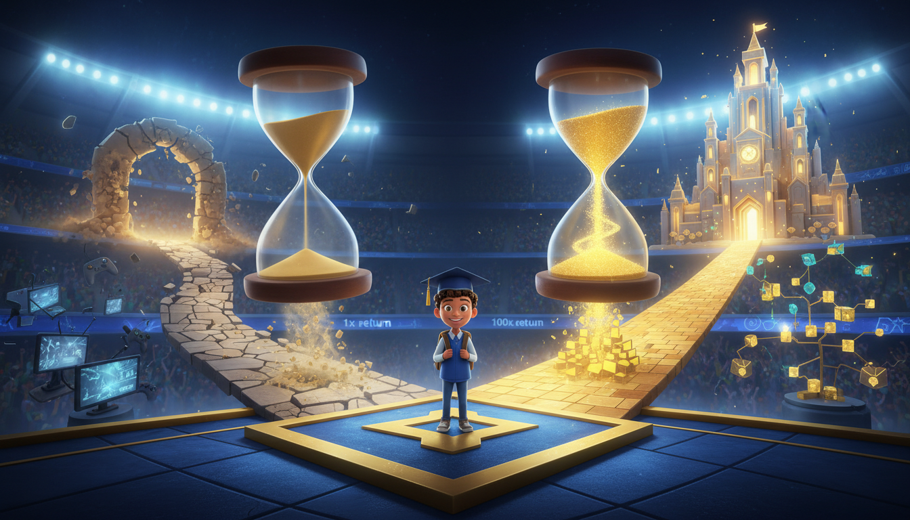

# 🏆 PERFECT EFFORT
### *Winning at the Game of Life*
#### by Professor Matty

**A practical playbook for middle and high school students mastering the fundamentals of success**

---

## 💎 What is Perfect Effort?

> **Nobody is perfect, but you can give your best effort. That's all we ask.**

Perfect Effort isn't about being flawless—it's about **showing up**, **putting in the work**, and **holding yourself accountable**. This book teaches you how to win at the game of life by mastering the fundamentals: powerful habits, output-focused mindset, and growth through discomfort.

### 🎯 Core Philosophy

<table>
<tr>
<td width="33%" align="center">

### 🏃 Life is a Sport
Master the fundamentals to level up your game

</td>
<td width="33%" align="center">

### 🎯 OUTPUT over Tasks
Focus on compelling end states, not grinding

</td>
<td width="33%" align="center">

### 📈 Embrace Discomfort
Growth happens outside your comfort zone

</td>
</tr>
</table>

---

## 📚 The Chapters

### Part 1: The Game (Foundation)

<table>
<tr>
<td width="25%" align="center">
 
<b>1. Life is a Sport</b> 
<a href="03_Book_Chapters/chapter_01_life_is_a_sport.md">Read Chapter →</a>
</td>
<td width="25%" align="center">
 
<b>2. Know Your Stats</b> 
<a href="03_Book_Chapters/chapter_02_know_your_stats.md">Read Chapter →</a>
</td>
<td width="25%" align="center">
 
<b>3. The Scoreboard That Matters</b> 
<a href="03_Book_Chapters/chapter_03_the_scoreboard_that_matters.md">Read Chapter →</a>
</td>
<td width="25%" align="center">
 
<b>4. Practice Like a Pro</b> 
<a href="03_Book_Chapters/chapter_04_practice_like_a_pro.md">Read Chapter →</a>
</td>
</tr>
</table>

### Part 2: Mental Game (Mindset)

<table>
<tr>
<td width="25%" align="center">
 
<b>5. Your Inner Coach</b> 
<a href="03_Book_Chapters/chapter_05_your_inner_coach.md">Read Chapter →</a>
</td>
<td width="25%" align="center">
 
<b>6. Losing is Learning</b> 
<a href="03_Book_Chapters/chapter_06_losing_is_learning.md">Read Chapter →</a>
</td>
<td width="25%" align="center">
 
<b>7. Focus Mode: On</b> 
<a href="03_Book_Chapters/chapter_07_focus_mode_on.md">Read Chapter →</a>
</td>
<td width="25%" align="center">
 
<b>8. The Pressure Test</b> 
<a href="03_Book_Chapters/chapter_08_the_pressure_test.md">Read Chapter →</a>
</td>
</tr>
</table>

### Part 3: Daily Training (Habits)

<table>
<tr>
<td width="20%" align="center">
 
<b>9. Morning Warm-Up</b> 
<a href="03_Book_Chapters/chapter_09_morning_warm_up.md">Read Chapter →</a>
</td>
<td width="20%" align="center">
 
<b>10. Fuel Your Engine</b> 
<a href="03_Book_Chapters/chapter_10_fuel_your_engine.md">Read Chapter →</a>
</td>
<td width="20%" align="center">
 
<b>11. The Recovery Room</b> 
<a href="03_Book_Chapters/chapter_11_the_recovery_room.md">Read Chapter →</a>
</td>
<td width="20%" align="center">
 
<b>12. Time is Your Currency</b> 
<a href="03_Book_Chapters/chapter_12_time_is_your_currency.md">Read Chapter →</a>
</td>
<td width="20%" align="center">
 
<b>13. The Compound Effect</b> 
<a href="03_Book_Chapters/chapter_13_the_compound_effect.md">Read Chapter →</a>
</td>
</tr>
</table>

### Part 4: Team Play (Relationships)

<table>
<tr>
<td width="33%" align="center">
 
<b>14. Choose Your Teammates</b> 
<a href="03_Book_Chapters/chapter_14_choose_your_teammates.md">Read Chapter →</a>
</td>
<td width="33%" align="center">
 
<b>15. The Mentor Advantage</b> 
<a href="03_Book_Chapters/chapter_15_the_mentor_advantage.md">Read Chapter →</a>
</td>
<td width="33%" align="center">
 
<b>16. Building Your Support System</b> 
<a href="03_Book_Chapters/chapter_16_building_your_support_system.md">Read Chapter →</a>
</td>
</tr>
</table>

### Part 5: Championship Level (Excellence)

<table>
<tr>
<td width="25%" align="center">
 
<b>17. Level Up Your Skills</b> 
<a href="03_Book_Chapters/chapter_17_level_up_your_skills.md">Read Chapter →</a>
</td>
<td width="25%" align="center">
 
<b>18. Play Your Position</b> 
<a href="03_Book_Chapters/chapter_18_play_your_position.md">Read Chapter →</a>
</td>
<td width="25%" align="center">
 
<b>19. Clutch Moments</b> 
<a href="03_Book_Chapters/chapter_19_clutch_moments.md">Read Chapter →</a>
</td>
<td width="25%" align="center">
 
<b>20. The Long Game</b> 
<a href="03_Book_Chapters/chapter_20_the_long_game.md">Read Chapter →</a>
</td>
</tr>
</table>

---

## 🎯 Who This Book Is For

**Middle & High School Students (Ages 12-18)** who want to:

- 🏆 Build powerful habits that compound over time
- 🎯 Develop an output-focused mindset
- 🚀 Master the fundamentals of success early
- 💪 Learn to embrace discomfort as growth
- 🎮 Understand life as a learnable game with rules to master

---

## 🔥 Key Quotes

> *"The sooner you learn to be comfortable with being uncomfortable, the sooner you will win in life."*

> *"You don't rise to the occasion. You fall to your level of preparation."*

> *"In God we trust. All others bring data."*

> *"Your inner voice is either your greatest coach or your worst enemy. You get to choose which one wins."*

> *"1% better every day means you're 37 times better in a year."*

---

## 📖 Start Reading

### Ready to level up?

**[📖 Start with Chapter 1: Life is a Sport](03_Book_Chapters/chapter_01_life_is_a_sport.md)**

Or jump to any chapter that speaks to you:
- Struggling with focus? → [Chapter 7: Focus Mode On](03_Book_Chapters/chapter_07_focus_mode_on.md)
- Need better habits? → [Chapter 9: Morning Warm-Up](03_Book_Chapters/chapter_09_morning_warm_up.md)
- Want to handle pressure? → [Chapter 8: The Pressure Test](03_Book_Chapters/chapter_08_the_pressure_test.md)
- Failing at something? → [Chapter 6: Losing is Learning](03_Book_Chapters/chapter_06_losing_is_learning.md)

---

## 📚 Research Foundation

This book is grounded in research from leading experts:

- **Steven Kotler & Flow Research Collective** — Peak performance science
- **Carol Dweck** — Growth Mindset research
- **Angela Duckworth** — Grit and perseverance
- **James Clear** — Atomic Habits methodology
- **BJ Fogg** — Behavioral design
- **Cal Newport** — Deep work and focus

---

## 🤝 Contributing

Feedback, suggestions, and contributions are welcome!

- 💬 **Questions?** [Open an issue](https://github.com/SquizAI/perfect_effort_book/issues)
- 📧 **Contact:** [GitHub Discussions](https://github.com/SquizAI/perfect_effort_book/discussions)

---

**Perfect Effort** is about giving your best—not being perfect.

*Let's win at the game of life together.*

---

**[📖 Start Reading Now](03_Book_Chapters/chapter_01_life_is_a_sport.md)**

